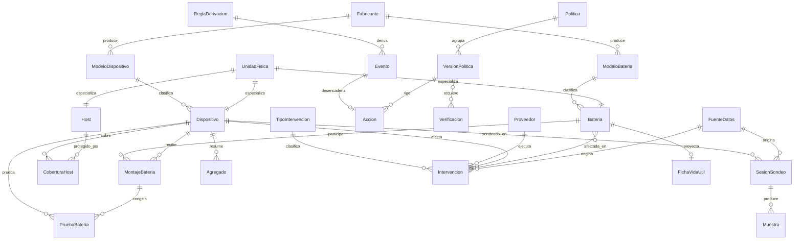

# Modelo conceptual de datos — Sai-Service-Core

**Proyecto:** Sai-Service-Core
**Documento:** Modelo-Conceptual-v1.0.md
**Versión:** 1.0
**Estado:** Borrador
**Fecha:** 2026-07-20
**Autor:** Orquestador SDD (AG-02)

Modelo conceptual de dominio, sin tipos físicos: solo nombre de entidad, semántica y relaciones. Los tipos y las decisiones de almacenamiento viven en 05-Arquitectura-Tecnica. Se organiza en cuatro capas: catálogo (qué es), inventario (cuál es), vínculos temporales (qué estuvo con qué y cuándo) e historia append-only (qué pasó). Las instancias de ejemplo provienen de los escenarios §20.E-1 a §20.E-8 del intake.

## 1. Entidades

### Capa de catálogo

#### 1.1 Fabricante
Marca o razón social que fabrica dispositivos o baterías. Ejemplo: `fab-apc` (APC) y `fab-generico` (Sin identificar), este último porque el descriptor del equipo no expone marca.

#### 1.2 ModeloDispositivo
El tipo de equipo de alimentación, independiente de la unidad concreta. Ejemplo: `mod-sai-desconocido`, línea interactiva 220V con potencia nominal no expuesta por el equipo.

#### 1.3 ModeloBateria
El tipo de batería, con su tecnología, capacidad y vida de flotación esperada. Ejemplo: `mod-bat-12v9ah-agm`, AGM de 12V 9Ah, vida esperada de 3 a 5 años a 20 grados de referencia.

#### 1.4 TipoIntervencion
La clase de servicio técnico posible, y a qué tipo de unidad afecta. Ejemplo: `ti-recambio-bat` (recambio de batería, planificable) y `ti-reparacion` (reparación de equipo, no planificable).

#### 1.5 Proveedor
Quien ejecuta intervenciones y puede ser receptor de la disposición final de una batería. Ejemplo: `prov-taller-electronica-sur`.

### Capa de inventario

#### 1.6 UnidadFisica
Supertipo conceptual de las unidades físicas del parque; aporta el ciclo de vida con estado, fecha de baja y motivo de baja, y la baja lógica. No se instancia por sí sola; la especializan Host, Dispositivo y Bateria.

#### 1.7 Host
El servidor protegido. Ejemplo: `host-i7infra`, criticidad alta, en servicio desde 2024-11-20.

#### 1.8 Dispositivo
Una unidad concreta de equipo de alimentación, de un modelo de dispositivo. Ejemplo: `ups-01` en servicio y `ups-02` de repuesto en stock, sin conexión ni cobertura.

#### 1.9 Bateria
Una unidad concreta de batería, de un modelo de batería. Ejemplo: `bat-2024-a` (dada de baja por fin de vida útil) y `bat-2026-a` (en servicio).

### Capa de vínculos temporales

#### 1.10 MontajeBateria
El período en que una batería estuvo montada en un dispositivo, en una posición, con intervalo desde y hasta. Ejemplo: `mnt-001` de `bat-2024-a` en `ups-01` desde 2024-11-20 hasta 2026-09-05; `mnt-002` de `bat-2026-a` desde ese mismo instante, con fin abierto.

#### 1.11 CoberturaHost
El período en que un dispositivo cubrió a un host, con intervalo desde y hasta. Ejemplo: `cob-001` de `ups-01` sobre `host-i7infra` desde 2024-11-20, con fin abierto.

### Capa de historia (append-only)

#### 1.12 FuenteDatos
El origen declarado de un conjunto de datos, con su confianza base. Ejemplo: `fd-poller-local` (confianza alta, valores medidos por el propio servicio), `fd-gmao-externo` (confianza media, sistema externo) y `fd-carga-manual` (confianza media).

#### 1.13 SesionSondeo
Un período de sondeo con un dispositivo bajo un mismo driver, versión y dialecto, y su mapa de variable a origen. Ejemplo: `ses-2026-07-19-a` sobre `ups-01`, intervalo de 5 segundos.

#### 1.14 Muestra
La lectura del estado del equipo en un instante, con su calidad (completa, parcial o perdida) y la procedencia de cada valor. Ejemplo: `mue-20260719T011500`, calidad completa, con tensión de entrada medida y carga de batería derivada.

#### 1.15 Agregado
El resumen de una ventana de tiempo de una variable, con función, cantidad de muestras y cobertura. Ejemplo: `agg-20260719T01-inputvoltage`, ventana de una hora, cobertura 0,997, con promedio, mínimo y máximo.

#### 1.16 ReglaDerivacion
La regla versionada que deriva eventos a partir de muestras. Ejemplo: `rd-transicion-ups-status` versión 2 (umbral de microcorte en 60 segundos), que conserva su versión 1 en el historial.

#### 1.17 Evento
Un hecho derivado de muestras por una regla, con su tipo, su duración y su incertidumbre, y la regla y versión que lo produjeron. Ejemplo: `evt-20260724T183012`, microcorte de 5 segundos con incertidumbre de 10 segundos; `evt-20260811T041500`, corte de suministro de 370 segundos.

#### 1.18 PruebaBateria
Una prueba de batería con muestreo denso, el montaje congelado, sus derivados y su veredicto de salud. Ejemplo: `prb-20260901T010000` sobre `ups-01`, montaje `mnt-001` congelado, caída de menos 0,47 voltios, veredicto sin degradación detectable con confianza baja.

#### 1.19 Politica
La política de apagado como agrupador lógico de sus versiones. Ejemplo: `pol-apagado-por-corte`.

#### 1.20 VersionPolitica
Una versión inmutable de una política, con su modalidad, umbral de disparo, tiempo reservado de apagado y verificaciones requeridas. Ejemplo: `vp-001` (solo aviso, sin verificaciones) y `vp-003` (host luego equipo con retorno, tiempo reservado 240 segundos).

#### 1.21 Accion
La decisión del planificador ante un evento de disparo, referida a una versión de política, con su modalidad solicitada, su modalidad efectiva y su resultado. Ejemplo: `acc-20260811T042000`, solicitada host luego equipo con retorno, efectiva solo aviso, resultado bloqueada por verificación.

#### 1.22 Verificacion
Un supuesto del que depende el apagado, con su evidencia, método, vigencia y estado (sin verificar, verificado, vencido, refutado). Ejemplo: `ver-bios-autoencendido`, `ver-shutdown-return`, `ver-presupuesto-apagado`, `ver-flag-ob`.

#### 1.23 Intervencion
Un servicio técnico registrado, con costos, hallazgos, mediciones, disposición final, clave de idempotencia y dos tiempos (cuándo ocurrió y cuándo se registró). Ejemplo: `int-20260905-001`, recambio de batería, total 67.000 pesos.

### Capa de proyección

#### 1.24 FichaVidaUtil
La proyección que cierra la historia de una batería: días en servicio, si cumplió la expectativa, eventos soportados, tendencia de salud y costo por año de servicio normalizado. Ejemplo: la ficha cerrada de `bat-2024-a`, 654 días, no cumplió la expectativa, costo por año de servicio de unos 29,50 dólares.

### Objetos de valor de dominio

#### 1.25 Valor con Origen
Objeto de valor que envuelve cualquier magnitud almacenada con su procedencia (medido, derivado, estimado por el driver, declarado, imputado, no calculable) y, si es derivado, las variables de las que deriva. Es transversal a casi todas las entidades de historia.

#### 1.26 Dinero
Objeto de valor que representa un importe con su moneda y su fecha, y opcionalmente su equivalente normalizado con la fuente de cotización. Ejemplo: 52.000 pesos con fecha 2026-09-05 y equivalente de 41 dólares.

### Actor persistido

#### 1.27 Usuario administrador
La cuenta única de administrador. Ejemplo: `usr-admin`. No hay gestión de usuarios ni de roles.

## 2. Atributos clave

Sin tipos físicos; solo nombre y semántica.

| Entidad | Atributo | Semántica | Restricción conceptual |
| --- | --- | --- | --- |
| ModeloBateria | vidaFlotacionEsperada | Rango de años esperados de vida en flotación | Inválida sin temperatura de referencia (RC-07 / RN-13) |
| UnidadFisica | estado, fechaBaja, motivoBaja | Ciclo de vida y baja lógica | Sin borrado físico; consultable tras la baja (RC-08) |
| Dispositivo | numeroSerie | Serie del equipo | Anulable a propósito: muchos equipos no lo exponen |
| Bateria | fechaFabricacion, fechaCompra | Origen temporal de la edad | La edad real se cuenta desde la fabricación; puede ser anterior a la compra |
| MontajeBateria | desde, hasta, posicion | Intervalo de montaje y posición | Sin solapamiento por dispositivo y posición; a lo sumo uno vigente (RC-02) |
| CoberturaHost | desde, hasta | Intervalo de cobertura del host | Sin solapamiento por host; a lo sumo una vigente (RC-02) |
| Muestra | calidad, valores con origen | Lectura con su calidad | Toda variable lleva origen; perdida tiene valores sin dato (RC-01) |
| Agregado | funcion, nMuestras, cobertura, advertencia | Resumen de ventana | Cobertura y advertencia obligatorias; no hereda de Muestra (RC-04) |
| Evento | tipo, duracion, incertidumbre, reglaDerivacion, reglaVersion | Hecho derivado | Referencia la regla y su versión (RC-09) |
| PruebaBateria | montajeBateria congelado, derivados, comparable, veredicto | Prueba y su veredicto | Congela el montaje; no comparable si la carga difiere (RC-06 aptitud) |
| VersionPolitica | modalidad, umbralDisparo, tiempoReservadoApagado, verificacionesRequeridas | Configuración inmutable | Tiempo reservado no mayor a 540 segundos (RN-04) |
| Accion | versionPolitica, modalidadSolicitada, modalidadEfectiva, resultado | Decisión del planificador | Referencia una versión de política, nunca la política (RC-05) |
| Verificacion | supuesto, estado, metodo, vigencia, evidencia | Supuesto verificable | Estados sin verificar, verificado, vencido, refutado |
| Intervencion | costos, claveIdempotencia, tiempoValido, tiempoRegistrado | Servicio técnico | Costos cuadran; clave idempotente única (RN-08, RN-09) |
| Dinero | monto, moneda, fecha, equivalenteNormalizado | Importe fechado | Moneda y fecha obligatorias (RN-07) |

## 3. Relaciones

- Un Fabricante produce muchos ModeloDispositivo y muchos ModeloBateria.
- Un ModeloDispositivo clasifica a muchos Dispositivo; un ModeloBateria clasifica a muchas Bateria.
- Host, Dispositivo y Bateria son especializaciones de UnidadFisica.
- Un MontajeBateria vincula una Bateria con un Dispositivo durante un intervalo.
- Una CoberturaHost vincula un Dispositivo con un Host durante un intervalo.
- Un Dispositivo tiene muchas SesionSondeo a lo largo del tiempo; una SesionSondeo produce muchas Muestra.
- Muchas Muestra se resumen en un Agregado por variable y ventana.
- Una ReglaDerivacion deriva muchos Evento a partir de las muestras de un Dispositivo.
- Un Evento puede desencadenar una Accion; una Accion referencia una VersionPolitica y evalúa muchas Verificacion.
- Una Politica agrupa muchas VersionPolitica.
- Una PruebaBateria se realiza sobre un Dispositivo y congela el MontajeBateria vigente, resolviendo la Bateria.
- Una Intervencion afecta a un Dispositivo y a una o varias Bateria, es ejecutada por un Proveedor, es de un TipoIntervencion, cierra y abre MontajeBateria o CoberturaHost, y cambia el estado de las unidades.
- Una Intervencion o una Muestra declaran su FuenteDatos.
- Una FichaVidaUtil proyecta el cierre de la historia de una Bateria por su ModeloBateria.
- Todo valor de cualquier entidad de historia se envuelve en un Valor con Origen; todo importe se envuelve en un Dinero.

## 4. Cardinalidades

| Relación | Cardinalidad |
| --- | --- |
| Fabricante — ModeloDispositivo | 1 — N |
| Fabricante — ModeloBateria | 1 — N |
| ModeloDispositivo — Dispositivo | 1 — N |
| ModeloBateria — Bateria | 1 — N |
| Bateria — MontajeBateria | 1 — N |
| Dispositivo — MontajeBateria | 1 — N |
| Dispositivo — CoberturaHost | 1 — N |
| Host — CoberturaHost | 1 — N |
| Dispositivo — SesionSondeo | 1 — N |
| SesionSondeo — Muestra | 1 — N |
| Dispositivo — Agregado | 1 — N |
| ReglaDerivacion — Evento | 1 — N |
| Evento — Accion | 1 — 0..1 |
| VersionPolitica — Accion | 1 — N |
| Politica — VersionPolitica | 1 — N |
| Dispositivo — PruebaBateria | 1 — N |
| MontajeBateria — PruebaBateria | 1 — N |
| TipoIntervencion — Intervencion | 1 — N |
| Proveedor — Intervencion | 0..1 — N |
| Dispositivo — Intervencion | 1 — N |
| Bateria — Intervencion | N — N |
| FuenteDatos — Intervencion | 1 — N |
| FuenteDatos — SesionSondeo | 1 — N |
| Bateria — FichaVidaUtil | 1 — 0..1 |
| VersionPolitica — Verificacion (requeridas) | N — N |

## 5. Reglas conceptuales

El modelo invoca las siguientes reglas conceptuales de integridad, detalladas en `reglas-conceptuales-de-modelo/`:

- RC-01 Procedencia por valor: todo valor almacenado se envuelve en un Valor con Origen.
- RC-02 Vigencia como entidad con intervalo: MontajeBateria y CoberturaHost no se solapan y admiten a lo sumo uno vigente por clave.
- RC-03 Sucesión sin hueco: al cerrar un vínculo y abrir otro en el mismo instante no queda hueco.
- RC-04 Agregado no hereda de Muestra: son entidades distintas y no intercambiables.
- RC-05 Acción referida a versión de política: Accion referencia VersionPolitica, nunca Politica.
- RC-06 Historia append-only: las entidades de historia no se actualizan ni se borran.
- RC-07 Resolución temporal de la batería: la métrica guarda dispositivo e instante; la batería se resuelve por MontajeBateria y se congela en PruebaBateria.
- RC-08 Baja lógica y coherencia temporal: la unidad física no se borra y no admite operaciones posteriores a su baja.
- RC-09 Evento referido a regla versionada: todo Evento referencia su ReglaDerivacion y la versión aplicada.

## 6. Glosario

Términos de dominio reutilizados por toda la categoría 02: procedencia (origen declarado de un valor), vínculo temporal (relación con intervalo modelada como entidad), baja lógica (retiro sin borrado), modalidad (qué hace el servicio ante la condición de disparo), supuesto o verificación (afirmación de la que depende el apagado, con estado y vigencia), agregado (resumen de una ventana con cobertura), ficha de vida útil (cierre proyectado de la historia de una batería), cobertura (fracción de ventanas o de días efectivamente representados o protegidos). Las definiciones extensas están en el glosario del intake §12 y se reutilizan aquí por referencia.

## 7. Diagrama

Objetos de valor Valor-con-Origen y Dinero no se dibujan como entidades: envuelven atributos de las entidades de historia y de costos.

## 8. Trazabilidad

| Entidad | CU que la consumen | RN o RC que la restringen |
| --- | --- | --- |
| Fabricante, ModeloDispositivo, ModeloBateria | CU-02, CU-12 | RN-13, RC-07 |
| TipoIntervencion, Proveedor | CU-08, CU-09, CU-11 | RN-12 |
| Host, Dispositivo, Bateria (UnidadFisica) | CU-02, CU-08, CU-09, CU-12 | RN-12, RC-08 |
| MontajeBateria | CU-02, CU-07, CU-08 | RC-02, RC-03, RC-07 |
| CoberturaHost | CU-02, CU-09, CU-12 | RC-02, RC-03 |
| SesionSondeo | CU-02, CU-04 | RN-05, RC-01 |
| Muestra | CU-04, CU-06 | RN-05, RC-01 |
| Agregado | CU-06, CU-12 | RN-10, RC-04 |
| ReglaDerivacion, Evento | CU-04, CU-06 | RC-09 |
| PruebaBateria | CU-07, CU-12 | RN-06, RC-06, RC-07 |
| Politica, VersionPolitica | CU-03, CU-05 | RN-04, RN-11, RC-05 |
| Accion | CU-05 | RN-02, RN-03, RN-11, RC-05 |
| Verificacion | CU-02, CU-05, CU-10 | RN-01, RN-02 |
| Intervencion | CU-08, CU-09, CU-11 | RN-07, RN-08, RN-09, RN-12 |
| FuenteDatos | CU-04, CU-11 | RN-09 |
| FichaVidaUtil | CU-08, CU-12 | RN-06, RN-07 |
| Valor con Origen | transversal | RN-05, RC-01 |
| Dinero | CU-08, CU-11, CU-12 | RN-07 |
| Usuario administrador | CU-01 | RN-01 (indirecta) |

## 9. Control de cambios

| Versión | Fecha | Cambios |
| --- | --- | --- |
| 1.0 | 2026-07-20 | Modelo conceptual inicial derivado de SOLUTION-INTAKE §17 P.4 y de las instancias de §20.E-1 a §20.E-8 |
