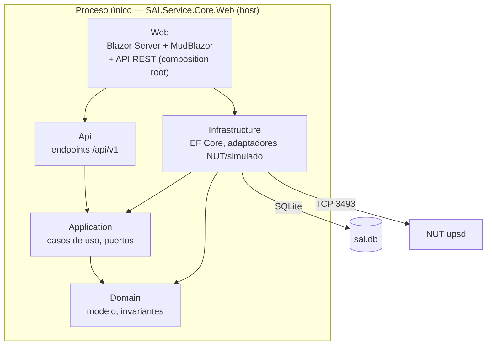

# Visión general del sistema — SAI.Service.Core

**Proyecto:** SAI.Service.Core
**Rol de intervención:** Integrador · Mantenedor · Operador
**Nivel:** Básico
**Tiempo estimado de lectura:** 10 min

## Resumen ejecutivo

SAI.Service.Core administra el ciclo de vida y el monitoreo de un SAI (sistema de alimentación ininterrumpida, UPS) que respalda a un host Linux, cubriendo lo que NUT deja afuera: inventario, historia trazable, salud de batería, apagado ordenado gobernado por verificación e informes de período. Es un único servicio web (`web-monolith`) en .NET 10 con panel Blazor Server, persistencia SQLite y una API REST de ingesta como única superficie hacia terceros. Este documento es el plano de entrada: qué hace, de qué partes está hecho y por dónde se recorre, sin bajar al detalle de arquitectura que vive en la categoría 05.

## 1. Qué hace la solución

El problema de origen no es monitorear el SAI —NUT ya lo hace— sino todo lo que NUT no modela: qué batería estaba montada cuando se registró cada métrica, cuántos días el host estuvo sin protección, si el equipo realmente vuelve a encenderse después de un corte, y cuánto cuesta por año de servicio cada marca de batería. SAI.Service.Core convierte esa historia dispersa en un modelo consultable y en decisiones operativas seguras.

El servicio sondea el estado del SAI a cadencia configurable, deriva eventos (cortes, microcortes, tensión fuera de rango) por reglas versionadas, y ante un corte sostenido decide un apagado ordenado del host. Esa decisión está gobernada por un **bloqueo por verificación**: mientras los cuatro supuestos de seguridad operativa no estén verificados y vigentes, la modalidad efectiva degrada a «solo aviso» y no se apaga nada. El estado base es seguro por diseño: el sistema no apaga un servidor sin haber probado antes que vuelve a encenderse.

Alrededor de ese núcleo, el servicio registra el ciclo de vida físico de los equipos —altas, recambios de batería, reparaciones y sustituciones del SAI— como historia append-only con procedencia obligatoria, proyecta la vida útil y el costo por año de servicio de cada batería, y cierra con informes de período y comparación de marcas. Un sistema externo de mantenimiento puede empujar intervenciones por la API de ingesta, de forma idempotente.

El operador humano es un administrador único que es a la vez propietario, implementador y beneficiario del servicio, sobre un host doméstico o de laboratorio de criticidad alta.

## 2. Diagrama de contexto

```mermaid
graph LR
    admin["Administrador único<br/>(panel web)"] -->|opera, verifica, configura| sai["SAI.Service.Core"]
    gmao["Sistema externo GMAO"] -->|POST /api/v1/intervenciones<br/>(idempotente)| sai
    sai -->|lee estado, ordena apagado| nut["NUT (upsd)<br/>127.0.0.1:3493"]
    nut -->|USB| ups["SAI físico (UPS)"]
    sai -.->|apaga / repone| host["Host Linux i7infra"]
```

El servicio es cliente de NUT, no lo reemplaza: NUT posee el USB y expone el SAI por su protocolo de red; SAI.Service.Core lee estado y ordena el apagado con retorno a través de él. La única superficie entrante desde un tercero es la API de ingesta.

## 3. Diagrama de contenedores

La solución es un solo proceso desplegable (el host web) más su base SQLite. Los cinco assemblies son capas de Clean Architecture dentro de ese proceso, no procesos separados.



## 4. Proyectos de la solución

| Proyecto | Tipo | Qué hace | Dónde vive | Depende de |
| --- | --- | --- | --- | --- |
| SAI.Service.Core.Domain | library | Modelo de dominio framework-free: inventario, vínculos temporales, monitoreo, políticas, invariantes | `src/SAI.Service.Core/SAI.Service.Core.Domain/` | — |
| SAI.Service.Core.Application | library | Casos de uso y puertos (interfaces de repositorio y de adaptador) | `.../SAI.Service.Core.Application/` | Domain |
| SAI.Service.Core.Infrastructure | library | EF Core + SQLite, interceptor append-only, adaptadores NUT y simulado, hosted services | `.../SAI.Service.Core.Infrastructure/` | Application |
| SAI.Service.Core.Api | library | Endpoints REST `/api/v1` (salud, token, ingesta) | `.../SAI.Service.Core.Api/` | Application |
| SAI.Service.Core.Web | web-monolith (host) | Composition root y único proceso que arranca: panel Blazor, autenticación, monta la API | `.../SAI.Service.Core.Web/` | Api, Infrastructure |

El grafo de dependencias apunta siempre hacia el dominio (regla de Clean Architecture, ADR-15). Solo `Web` referencia `Infrastructure`: es donde se cablea la inyección de dependencias. El detalle de capas, ADRs y contratos está en [05-Arquitectura-Tecnica](../05-Arquitectura-Tecnica/).

## 5. Recorrido del flujo principal

Sea un corte de energía prolongado con el sistema ya verificado. El `ServicioSondeo` (hosted service) lee el estado del SAI cada 5 segundos por el adaptador de conexión; cuando NUT reporta `ups.status = OB` (en batería), la muestra se persiste con su calidad y procedencia. Ronda a ronda, el `DerivadorEventos` evalúa la ventana reciente contra las reglas versionadas y, al superarse el umbral de tiempo en batería con la tensión de batería en rango (nunca por el flag de batería baja, ADR-12), deriva un evento `DisparoApagado`.

Ese disparo invoca al `ServicioApagadoOrdenado`. El servicio deriva la **modalidad efectiva**: consulta las cuatro verificaciones y, solo si las cuatro cuentan como verificadas y vigentes, mantiene la modalidad solicitada por la política vigente; en caso contrario degrada a solo aviso. Con la modalidad habilitada, ordena el apagado con retorno por el adaptador y registra la acción **por efecto observado** —la acción se da por ejecutada solo si el equipo admitió la orden, nunca por ausencia de excepción—. Toda decisión, incluido el bloqueo y el solo aviso, deja una `Accion` append-only. Cuando la energía vuelve, el host reenciende y el `ServicioRearmePruebas` interpreta ese arranque como la señal de que el host cicló.

## 6. Qué NO hace la solución

- No reemplaza a NUT ni habla USB directamente: es cliente del `upsd` de NUT (ADR-01, ADR-03).
- No apaga el host hasta que los cuatro supuestos estén verificados: el estado base es solo aviso (RN-01, RN-02).
- No presenta valores derivados como medidos: toda métrica declara su procedencia (RN-05).
- No documenta al usuario final no técnico: fuera de alcance del framework.
- No incluye todavía la imagen de contenedor de producción: es una ranura declarada (ver [Guia-Despliegue](Guia-Despliegue-v1.0.md) y ADR-20/ADR-25).
