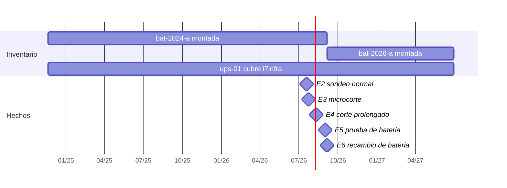

# SOLUTION-INTAKE — SAI.Service.Core

| Campo | Valor |
|---|---|
| Nombre de la solución | SAI.Service.Core |
| Cliente / Stakeholder principal | Administrador único del host Linux `i7infra` (proyecto interno, autopromovido) |
| Repositorio | `DEV/SAI.Service.Core` (workspace local; sin remoto declarado en las fuentes) |
| Lead técnico | Administrador único (rol combinado propietario / implementador / beneficiario) |
| Documento | `SOLUTION-INTAKE-Sai-Service-Core-v1.0.md` |
| Versión | 1.2 |
| Fecha | 2026-07-20 |
| Stack principal | .NET 10 + Blazor (interactive server) + Entity Framework Core + SQLite |
| Estado | Borrador |

> Este documento captura qué quiere el cliente, cómo se compone la solución y cómo se construye cada proyecto.
> El orquestador deriva de §13 el `SOLUTION-MANIFEST` canónico; no se completa el manifiesto a mano.

**Procedencia de este intake.** Todo el contenido de la Parte A y el modelo de dominio se derivan de `PROMPTs/Generar-SDD/Inputs/Planteo-Analisis-Unificado-Antecedente-SAI-Service.md` (4017 líneas, estado `draft`, 2026-07-19) del repositorio `SAI.Service.Core.Documentacion`. La Parte B y las decisiones de stack de la Parte C se derivan del tool-prompt `PROMPTs/Generar-SDD/Crear-SDD-Documento-Intake.md` y de los inputs `Topologia-Proyecto-Solucion.md` y `Entorno-Desarrollo.md`. Donde una afirmación no tiene respaldo en esas fuentes, se marca explícitamente como **[derivado]** (inferencia trazable a un dato de las fuentes) o **PENDIENTE** (sin respaldo, requiere respuesta del stakeholder). No se inventó información.

**Autocontención de los datos de ejemplo.** Los ocho escenarios de instancia con su JSON completo (`E-1`…`E-8`) y las matrices de cobertura del Anexo B, que el cuerpo cita por identificador, están **transcriptos íntegramente en la Parte D (§20 y §21)** de este mismo documento. El intake no depende de ningún archivo externo para resolver esas referencias: cada `E-x` que aparece en §2, §5, §6, §7 u §8 resuelve a su subsección `§20.E-x`. La procedencia original de cada escenario (archivo y líneas de la fuente) queda declarada dentro de cada subsección.

**Advertencia heredada de la fuente.** El documento antecedente se autodeclara: *"No es un diseño cerrado ni una especificación"*, *"No hay código, ni esquema SQL definitivo, ni contratos de API cerrados"*. Los flujos de usuario de §6 son **propuesta de diseño, no comportamiento verificado**. Lo que sí está verificado es el relevamiento del equipo físico (2026-07-19).

---

# Parte A — Negocio de la solución

## §1 Idea y problema

Un servidor Linux doméstico/de laboratorio (`i7infra`, criticidad alta, entre 3 y 8 contenedores según la semana) está respaldado por un SAI que se comunica por USB. El monitoreo básico y el apagado ordenado **ya están resueltos** por NUT (`upsmon` + `upssched`), y la fuente es taxativa al respecto: no hace falta reconstruir eso. El dolor está en todo lo que NUT no hace y ninguna herramienta —libre ni comercial— resuelve para este equipo:

- **No hay histórico de salud de batería.** El equipo relevado no expone ningún indicador de salud y su autotest *no devuelve veredicto*: 51 muestras consecutivas sin `TEST`, sin `RB` y sin `ups.alarm`. El estándar de facto del monitoreo de SAI es confiar en la bandera `RB` («replace battery») del firmware, y **en este equipo esa bandera nunca va a llegar**. Un monitoreo convencional acá no alerta nunca. La salud solo puede obtenerse midiendo la caída de tensión durante el autotest y guardando la serie temporal — y ningún proyecto de software libre lo hace: todos retransmiten la bandera del firmware.
- **No hay modelo de ciclo de vida.** Altas, recambios de batería, reparaciones, sustitución del SAI, asociación de cada métrica al período de la batería que estaba montada: NUT no tiene modelo de inventario. `upslog` produce texto plano.
- **No hay verificación viva de los supuestos.** Que el host reencienda solo tras un corte es un supuesto que puede volverse falso en silencio (pila CMOS agotada, un *clear CMOS*, alguien que cambió el ajuste sin documentarlo). Ninguna herramienta lo vigila.
- **No hay panel remoto ni API.** NUT expone variables, no una interfaz de administración; el software del fabricante (ViewPower) tiene un RCE sin parche y no es una alternativa.

Debajo de todo eso hay un **problema crítico y bien delimitado: garantizar el reencendido**. La BIOS solo dispara el autoencendido cuando detecta una *transición* de ausencia a presencia de energía; por lo tanto el SAI **debe cortar su salida aunque el host ya esté apagado**. Si vuelve la energía durante la cuenta regresiva y el SAI cancela su apagado, no hubo transición, la BIOS no tiene nada que detectar y —textual— *"el host queda apagado hasta que alguien apriete el botón"*. La fuente lo califica: *"Es el peor resultado posible: el sistema se protegió correctamente de un corte que resultó ser breve, y a cambio quedó fuera de servicio indefinidamente."*

**Qué pasa si NO se construye.** El host **no tiene backups** — es lo que da urgencia al apagado ordenado y lo que hace grave equivocarse. Sin esta solución: (a) un corte prolongado corrompe un servidor sin respaldo; (b) la batería se degrada sin que nada avise, porque la única bandera que el monitoreo convencional mira nunca se enciende; (c) no hay forma de saber cuánto duró de verdad una batería ni de decidir la próxima compra con datos.

**Por qué ahora.** El relevamiento del equipo ya está hecho y verificado (2026-07-19) y la línea base de salud de batería ya fue tomada (caída de −0,47 V, mínimo 12,94 V, recuperación a 13,24 V en ~35 s con carga 13 %). La reserva **O-M6** advierte que esa línea base *"llega tarde"*: la batería está en servicio desde 2024, así que cada trimestre que pasa sin registrar la tendencia es un punto de datos perdido.

---

## §2 Audiencia y stakeholders

La fuente no usa la taxonomía propietario/implementador/beneficiario; la clasificación de la columna «Categoría» es **[derivado]** a partir de los roles que sí describe.

| Rol | Nombre o cargo | Categoría | Responsabilidad principal |
|---|---|---|---|
| Administrador único | `usr-admin` — *"Un único usuario administrador. Autenticación mínima."* | Propietario **y** Implementador **y** Beneficiario (una sola persona) | Aprueba este intake. Da de alta los equipos (UF-1), configura políticas (UF-2), monitorea (UF-3), consulta históricos (UF-4), dispara pruebas manuales (UF-5), carga intervenciones (UF-6, UF-7), ejecuta la ventana de mantenimiento con presencia física (UF-8) y emite informes (UF-9). |
| Técnico externo / Proveedor | `Proveedor` (razón social, contacto, especialidad); en el escenario E-6 `"ejecutadaPor": "técnico externo"`, proveedor `prov-taller-electronica-sur` (ficticio) | Ejecutor externo (beneficiario indirecto) | Ejecuta recambios de batería, reparaciones e inspecciones preventivas. Retira las baterías agotadas y consta como `disposicionFinal.receptor` para trazabilidad ambiental. |
| Sistema externo GMAO | `fd-gmao-externo` — *"GMAO Corporativo v4"*, confianza base `media` | Integrador / consumidor de la API | Empuja intervenciones sin intervención humana vía `POST /api/v1/intervenciones` con `X-Idempotency-Key`. Es el actor de UF-10. |
| Host protegido | `i7infra`, criticidad `alta` | Beneficiario (sistema) | Es el objeto de la protección: el apagado ordenado y el reencendido automático son sobre él. Carga variable (de 3 a 8 contenedores en menos de una semana; `ups.load` de 13 % a 30 % al sumar dos contenedores de IA — observación **O-U8**). |
| Poller local | `fd-poller-local` — *"sai-service poller v1"*, confianza base `alta` | Componente del sistema | Sondeo y persistencia de métricas medidas. Es la fuente de datos de máxima confianza del sistema. |

**Gestión de usuarios y roles: fuera de alcance por decisión explícita** — *"Un solo administrador"* (§3.2 de la fuente). No hay jerarquía de usuarios que modelar más allá del administrador único.

---

## §3 Propuesta de valor y diferenciación

**Qué hace hoy el cliente y por qué no le alcanza.** Hoy corre NUT (`upsmon` + `upssched`) sobre el host. Eso monitorea y apaga ordenadamente, y nada más: no tiene inventario, expone variables en vez de una interfaz de administración, y su `upslog` produce texto plano. Las alternativas evaluadas y descartadas con fundamento son ViewPower (RCE sin parche), y el conjunto Grafana / Home Assistant / exportadores Prometheus, sobre los que la fuente concluye (**O-M8**): *"Ningún proyecto de software libre calcula salud de batería a partir de datos de NUT; todos retransmiten la bandera del firmware."* El propio espacio de nombres de NUT *"no tiene ninguna variable de estado de salud"*.

**La promesa central.** Un servicio propio que (1) garantiza que el host vuelva a encenderse solo tras un corte, y se **niega a apagarlo mientras no pueda probarlo**; y (2) construye el histórico de salud, ciclo de vida y costos que ninguna herramienta existente construye para este equipo.

Diferenciadores, en orden de defendibilidad:

1. **Cálculo propio de salud de batería, con procedencia y límites declarados.** Textual: *"Calcular salud propia no es sobre-ingeniería: es la única opción."* El veredicto lo emite el servicio porque el equipo no emite ninguno, y viaja con su nivel de confianza y su advertencia.
2. **Regla de bloqueo de seguridad.** El sistema no habilita el apagado si algún supuesto del que depende está en `NuncaVerificado`, `Vencido` o `Refutado`: la acción queda `BloqueadaPorVerificacion` y la modalidad efectiva degrada a `SoloAlerta`. Es una garantía que ninguna alternativa ofrece porque ninguna modela los supuestos.
3. **Verificación continua por evidencia.** El servicio cruza sus propios eventos de corte con `wtmp` del host para probar que el reencendido automático sigue funcionando, sin repetir la prueba destructiva. La ventana de mantenimiento se hace una vez; la verificación sigue viva sola.
4. **Trazabilidad total del origen de cada valor.** Cada número declara si fue `medido`, `derivado`, `estimadoPorDriver`, `declarado`, `imputado` o `noCalculable`. Responde sin leer código la pregunta *«¿este número lo midió el aparato o lo calculó el software?»*.
5. **Comparación de marcas por desempeño real observado**, con el costo por año de servicio normalizado a USD — necesario porque comparar 52.000 ARS de 2026 con 180.000 ARS de 2024 no significa nada.

---

## §4 Alcance funcional pretendido (MoSCoW)

La fuente **no trae etiquetas MoSCoW**. La columna MoSCoW de esta tabla es **[derivado]** a partir de la separación explícita que sí trae: «Primera entrega» (§3.3) ⇒ Must Have; «Dentro del alcance» no incluido en la primera entrega ⇒ Should/Could; «Fuera del alcance» (§3.2) ⇒ Won't Have v1. La columna «Origen» cita la sección de respaldo.

| ID | Capacidad | MoSCoW | Origen |
|---|---|---|---|
| F-01 | Servicio web dockerizado, exclusivamente Linux, corriendo dentro de un host Linux | Must Have | §3.1, §3.3 |
| F-02 | Diálogo con el SAI a través de NUT (adaptador de conexión con implementación NUT) | Must Have | §3.3, §5.2 |
| F-03 | Identificación del dispositivo USB desde el panel, con prueba de conexión | Must Have | §3.1, UF-1 |
| F-04 | Alta de catálogo (fabricante, modelos) e inventario (host, SAI, batería) con ciclo de vida y baja lógica | Must Have | §3.1, §7, UF-1 |
| F-05 | Vínculos temporales `MontajeBateria` y `CoberturaHost`, resueltos por `ResolutorTemporal` | Must Have | §7, UF-4, UF-6, UF-7 |
| F-06 | Sondeo periódico con frecuencia configurable y persistencia de `Muestra` con calidad (`completa`/`parcial`/`perdida`) | Must Have | §3.1, §5.3, UF-3 |
| F-07 | Procedencia por valor (`Origen`) en todo dato almacenado, sin excepción | Must Have | §7 P-3, I-7 |
| F-08 | Derivación de eventos (`Microcorte`, `CorteSuministro`, `RetornoRed`, `DesconexionUsb`, `TensionFueraDeRango`) por `ReglaDerivacion` versionada | Must Have | §7, UF-3 |
| F-09 | Detección de pérdida de comunicación con el equipo (3 sondeos fallidos ⇒ `DesconexionUsb`) y alerta visual | Must Have | §5.3, O-U11 |
| F-10 | Políticas de apagado versionadas (`Politica` / `VersionPolitica`) con modalidades `SoloAlerta`, `SoloHost`, `HostLuegoUpsConRetorno`, `CicloForzado` | Must Have | §3.1, UF-2 |
| F-11 | Entidad `Verificacion` de supuestos, con evidencia, método, vigencia y estados `NuncaVerificado`/`Verificado`/`Vencido`/`Refutado`; degradación forzada a `SoloAlerta` | Must Have | §4.7, UF-8 |
| F-12 | Planificador interno: rondas de evaluación de políticas, temporizadores con cancelación, ejecución de acciones y registro del resultado | Must Have | §5.3 |
| F-13 | Panel web con estado en vivo, conectividad, panel de supuestos y eventos recientes | Must Have | §3.3, UF-3 |
| F-14 | Registro de intervenciones de servicio técnico con costos (`Costos.cuadra()`) y efectos aplicados (`Efectos`) | Must Have | §3.1, UF-6 |
| F-15 | Autenticación mínima de administrador único | Must Have | §3.1 |
| F-16 | Prueba de batería programada (trimestral) y manual, con cadencia densa a 1 Hz y congelado del `montajeBateriaId` | Must Have | UF-5, §6.7 |
| F-17 | Veredicto de salud calculado por el servicio, con confianza explícita y comparación contra línea base a carga igualada | Must Have | UF-5, §6.7 |
| F-18 | Históricos y gráficas de evolución (voltajes, carga, microcortes), individuales o superpuestas, con marcas de eventos | Must Have | §3.1, UF-4 |
| F-19 | Agregación y retención (resolución completa `P30D`, agregados `PT1H` durante `P10Y`, eventos indefinidos), con `cobertura` obligatoria | Must Have | §7, UF-4, I-20 |
| F-20 | API REST de ingesta idempotente para fuentes externas (`X-Idempotency-Key`, 201/200/409/422) | Must Have | §3.1, UF-10 |
| F-21 | Ciclo de vida del SAI: reparación, sustitución y cobertura suplente; días sin protección registrados | Should Have | UF-7 |
| F-22 | Informe de período (dispositivos activos, cobertura, baterías intervinientes, intervenciones, costos en USD, eventos, calidad de suministro, pruebas) | Should Have | UF-9 |
| F-23 | Comparación de marcas y modelos por `costoPorAnioDeServicio` normalizado a USD, agrupando `FichaVidaUtil` por `ModeloBateria` | Should Have | UF-9 |
| F-24 | Adaptador de conexión simulado, para probar políticas sin hardware ni riesgo y cubrir el flujo F-3 en pruebas automatizadas | Should Have | §5.2 |
| F-25 | Renovación automática de verificaciones por evidencia (un corte real que muestre `OB` renueva `ver-flag-ob`; un corte seguido de arranque automático renueva `ver-bios-autoencendido`) | Should Have | §4.7, UF-8 |
| F-26 | Capa de add-ons de dialecto de protocolo — **diseñada pero no implementada** en la primera entrega | Could Have | §3.3, §8 |
| F-27 | Adaptador de conexión directo (sin NUT) para equipos que NUT no cubra | Could Have | §5.2 |
| F-28 | Apagado de otros equipos de la red | Won't Have v1 | §3.2 |
| F-29 | Múltiples SAI simultáneos (*"El modelo los contempla, la implementación no"*) | Won't Have v1 | §3.2 |
| F-30 | Notificaciones externas (mail, SMS) como mecanismo primario de alerta | Won't Have v1 | §3.2 |
| F-31 | Gestión de usuarios y roles | Won't Have v1 | §3.2 |
| F-32 | Lectura del ajuste de BIOS «Restore on AC Power Loss» por software | Won't Have v1 | §3.2, §4.6 |
| F-33 | Escritura del traductor de protocolo del equipo actual (ya resuelto por NUT y verificado) | Won't Have v1 | §3.2 |

El conjunto Must Have es el mínimo razonable: sin F-01 a F-20 el servicio no cumple ninguno de sus dos propósitos (garantizar el reencendido y construir el histórico de salud).

---

## §5 Historias de usuario / experiencias deseadas

La fuente **no trae historias redactadas en formato Como/quiero/para**. Las siguientes son **[derivado]**: cada una se construye sobre una cita literal del requisito original (§7.15) o sobre el «Quién» explícito de un flujo de §9, indicado en la columna de trazabilidad.

| ID | Historia | Respaldo en la fuente |
|---|---|---|
| US-01 | Como **administrador**, quiero **dar de alta el SAI y su batería descubriendo el dispositivo USB desde el panel**, para **empezar a registrar historia sin editar archivos de configuración a mano**. | UF-1: *"el administrador único, la primera vez que abre el panel"* |
| US-02 | Como **administrador**, quiero **ver en el panel cuántos de los supuestos de la política de apagado están verificados**, para **saber si el sistema realmente va a apagar el host o solo va a avisar**. | UF-1 / UF-3: *«la política de apagado se apoya en 5 supuestos; 3 verificados, 1 vencido, 1 nunca probado»* |
| US-03 | Como **administrador**, quiero **configurar la política de apagado creando una versión nueva en vez de editar la vigente**, para **que las decisiones pasadas sigan explicándose con la configuración que las produjo**. | UF-2 / §7.15: *«conviene saber con qué configuración se tomó una decisión»* |
| US-04 | Como **administrador**, quiero **ver el estado del SAI en vivo desde cualquier equipo de la LAN**, para **enterarme de un problema sin estar sentado frente al servidor**. | UF-3: *"desde cualquier equipo de la LAN"*; objetivo 5 |
| US-05 | Como **administrador**, quiero **saber de qué origen viene cada número que veo**, para **no construir una conclusión sobre un valor que el driver interpoló**. | §7.15: *«la trazabilidad de los valores, cuál fue su origen»*; objetivo 6 |
| US-06 | Como **administrador**, quiero **graficar voltajes y carga superpuestos en un período con las marcas de eventos encima**, para **evaluar la calidad del suministro durante la vida del host**. | §7.15: *«Calidad de servicio de red durante la vida del host»*; UF-4 |
| US-07 | Como **administrador**, quiero **que el servicio pruebe la batería trimestralmente y me diga si se está degradando**, para **planificar el recambio antes de que falle**. | §7.15: *«Planificar recambios»*; UF-5 |
| US-08 | Como **administrador**, quiero **registrar el recambio de batería con su costo, sus hallazgos y su destino final**, para **que un solo acto cierre la vigencia vieja, abra la nueva y proyecte la ficha de vida útil**. | UF-6; §7.15: *«qué servicios técnicos y de qué tipo»* |
| US-09 | Como **administrador**, quiero **registrar que un SAI se fue a reparación y otro lo cubrió**, para **que el histórico diga qué equipo protegía al host en cada tramo y cuántos días quedó sin protección**. | UF-7; §7.15: *«en ese período de vida dónde intervino qué UPS, qué batería, qué eventos intervinieron»* |
| US-10 | Como **administrador con presencia física**, quiero **una ventana de mantenimiento guiada que verifique los cuatro supuestos uno por uno**, para **desbloquear el apagado automático con evidencia y no con optimismo**. | UF-8: *"con presencia física, en una ventana planificada"* |
| US-11 | Como **administrador**, quiero **un informe de período y una comparación de modelos por costo por año de servicio en USD**, para **decidir qué marca comprar la próxima vez**. | §7.15: *«decidir en pos a marcas o productos con mejores desempeños»*; *«Estimar costos de mantenimiento»*; UF-9 |
| US-12 | Como **sistema externo de gestión de mantenimiento**, quiero **empujar intervenciones por API con una clave de idempotencia**, para **que un reintento de red no duplique el hecho ni corrompa el histórico**. | §7.15: *«esta información podría ser capturada por servicios externos de forma automatizada»*; UF-10 |

Roles cubiertos: administrador (US-01 a US-11) y sistema externo (US-12).

---

## §6 Flujos típicos

Los diez flujos siguientes están descriptos en §9 de la fuente. Se transcriben los tres que la propia fuente marca como de mayor frecuencia o criticidad; los diez completos se enumeran después con su objetivo y su escenario de respaldo. **Advertencia de la fuente:** *"Los flujos son propuesta de diseño, no comportamiento verificado… Lo que no es propuesta son los datos que atraviesan cada flujo: cada uno se ancla a un escenario del Anexo A con su JSON completo."* Ese Anexo A está transcripto en la **Parte D §20**: la columna «Escenario de respaldo» de la tabla de abajo (`E-1`…`E-8`) resuelve a la subsección `§20.E-x` correspondiente.

### Flujo del 80 % del tiempo — UF-3 · Monitoreo en vivo

1. El administrador abre el panel desde cualquier equipo de la LAN.
2. El planificador, cada `intervaloSegundos` (5 s por defecto), le pide el estado al SAI a través del adaptador NUT.
3. Si la respuesta llega completa, persiste una `Muestra` con `calidad = completa`; si llega incompleta, `parcial` (se conserva: descartarla entera perdería las variables que sí llegaron); si no llega, `perdida` e incrementa el contador de fallidos.
4. Evalúa las reglas de derivación sobre la ventana reciente y genera los eventos que correspondan.
5. Empuja estado y eventos nuevos al panel, que muestra: estado y tensiones, batería (con `battery.charge` **marcado como derivado**), conectividad (alerta a los 3 sondeos fallidos consecutivos), *n* de *m* supuestos verificados, y los eventos recientes con su regla y versión.
6. Si falta algún supuesto, el panel avisa en la pantalla principal —no enterrado en configuración— que la política está degradada a `SoloAlerta`.

### Flujo crítico que rara vez pasa y no puede fallar — UF-8 · Ventana de mantenimiento

Es el flujo que desbloquea el objetivo 1. Sin él, el servicio nunca sale de `SoloAlerta`. Requiere presencia física y es **destructivo por naturaleza**: implica cortar la energía al host.

1. El administrador inicia la ventana de verificación desde el panel; el panel muestra el checklist de los cuatro supuestos.
2. Con los contenedores detenidos, se cronometra el apagado completo del host bajo carga y se registra el tiempo ⇒ `ver-presupuesto-apagado` pasa a `Verificado`, con vigencia corta a propósito (**180 días**: la carga del host cambia).
3. Se corta la alimentación de red al SAI y se observa `ups.status = OB` ⇒ `ver-flag-ob` pasa a `Verificado` (vigencia 365 días).
4. Se ejecuta un `shutdown.return` controlado; el SAI corta la salida al host.
5. Se restaura la energía; el SAI restablece la salida.
6. Si el host arranca solo, sin tocar el botón: `ver-bios-autoencendido` y `ver-shutdown-return` pasan a `Verificado`, y la modalidad `HostLuegoUpsConRetorno` ya es efectiva. Si no arranca: `ver-bios-autoencendido` pasa a **`Refutado`**, que bloquea permanentemente hasta que alguien lo resuelva (`Refutado` no es `Vencido`: una prueba fallida bloquea, una vencida solo pide repetirla).

### Onboarding — UF-1 · Alta de equipos y puesta en marcha

1. El panel lista los candidatos USB con sus descriptores; el adaptador identifica VID:PID y devuelve `0665:5161 · INNO TECH · iSerial vacío` — candidato encontrado, **sin marca ni modelo**.
2. El administrador declara a mano marca, modelo y potencia nominal, que quedan con procedencia `declarado`. Si la potencia nominal se desconoce, queda `null` con procedencia `imputado` — **nunca un número inventado**.
3. Alta de catálogo (fabricante, `ModeloDispositivo`, `ModeloBateria`) e inventario (host, SAI, batería).
4. Apertura de los vínculos `MontajeBateria` y `CoberturaHost` con `hasta = null`.
5. Prueba de conexión y creación de la `SesionSondeo` con su mapa variable→origen.
6. Siembra de las cuatro verificaciones en `NuncaVerificado`, lo que fuerza `SoloAlerta`. El panel muestra un aviso permanente: «operativo · 0 de 4 supuestos verificados», con enlace a UF-8.

### Los diez flujos y sus dependencias

| Flujo | Quién | Objetivo que sirve | Escenario de respaldo |
|---|---|---|---|
| UF-1 · Alta de equipos y puesta en marcha | Administrador, primera vez | 2, 5 | E-1 |
| UF-2 · Configuración de políticas | Administrador, tras semanas de histórico | 1 | E-1, E-4 |
| UF-3 · Monitoreo en vivo | Administrador, desde la LAN | 3, 4 | E-2, E-3, E-4 |
| UF-4 · Históricos y gráficas | Administrador, preparando una decisión | 3, 6 | E-2, E-7 |
| UF-5 · Prueba de batería y salud | Planificador (programada) o administrador (manual) | 4 | E-5 |
| UF-6 · Servicio técnico: recambio de batería | Administrador, tras la intervención | 2, 7 | E-6 |
| UF-7 · Reparación o sustitución del SAI | Administrador, cuando el SAI falla | 2 | E-1 parcial (`ups-02` en stock) |
| UF-8 · Ventana de mantenimiento | Administrador con presencia física | 1 | E-4 |
| UF-9 · Informe de período y comparación de marcas | Administrador, al cerrar un año o comprar | 2, 7 | E-7 |
| UF-10 · Ingesta automatizada | Sistema externo, sin intervención humana | 8 | E-8 |

Grafo de dependencias entre flujos: UF-1 → UF-2, UF-3; UF-2 → UF-3; UF-3 → UF-4, UF-5; UF-5 → UF-6; UF-6 → UF-9; UF-7 → UF-9; UF-8 → UF-2; UF-4 → UF-9; UF-10 → UF-9.

---

## §7 Casos límite y "qué pasa si"

Todos los casos siguientes están planteados en la fuente. La columna «Respuesta» recoge la resolución que la fuente ya da; donde la fuente no resuelve, se marca PENDIENTE.

| # | Qué pasa si… | Respuesta según la fuente |
|---|---|---|
| CL-01 | **Vuelve la energía durante la cuenta regresiva del apagado.** El SAI cancela su corte, no hay transición de energía y la BIOS no dispara el autoencendido. | Resuelto: modalidad `CicloForzado`. *"Una vez iniciada la secuencia de apagado, el corte del SAI no debe cancelarse aunque vuelva la red. Es preferible un apagón controlado de tres minutos a un servidor apagado hasta la mañana siguiente."* No usar `shutdown.stop`. |
| CL-02 | **El firmware del SAI no soporta el comando de apagado con retorno.** Nota del protocolo Megatec: *«S01R0001 and S01R0002 may not work on early firmware versions. The failure mode is that the UPS turns off and never returns.»* | No resuelto por diseño: se **verifica** en UF-8 antes de habilitar el apagado (`ver-shutdown-return`, sin caducidad). Riesgo S-1, severidad crítica. |
| CL-03 | **El ajuste de BIOS «Restore on AC Power Loss» se vuelve falso en silencio** (pila CMOS agotada, *clear CMOS*, cambio no documentado). | No es legible por software y se descarta intentarlo (§4.6). Se verifica por comportamiento (`ver-bios-autoencendido`, vigencia 365 d) y se renueva sola con cada corte real seguido de arranque automático, cruzando eventos propios contra `wtmp`. Riesgo S-3. |
| CL-04 | **El apagado del host no cabe en los 540 s del techo duro** del `ups.delay.shutdown`. | El SAI corta con el host a medio bajar. Mitigación: `ver-presupuesto-apagado` con vigencia de solo 180 días, y el panel debe mostrar cuánto de ese presupuesto ya consume el apagado de contenedores. Riesgo S-2. |
| CL-05 | **Crece la carga del host** (de 3 a 8 contenedores en una semana; `ups.load` de 13 % a 30 %). | La verificación del presupuesto de apagado caduca. Es la razón de la vigencia de 180 días. Observación O-U8. |
| CL-06 | **El flag `LB` (low battery) nunca llega.** No fue observado en el relevamiento. | La política **no debe depender de él**: usar tiempo en `OB` + `battery.voltage`. Riesgo S-4. |
| CL-07 | **Un comando no llega al equipo y no produce ningún error.** Ocurrió durante el relevamiento; se detectó comparando datos. | Regla dura: *"toda acción debe validarse por efecto observado, no por ausencia de error"*. Un servicio que asuma que «no hubo excepción» equivale a «se ejecutó» **va a mentir**. |
| CL-08 | **Hay un corte de energía y la red también cae**, así que las notificaciones remotas no salen (E-4: correo con `connect: network is unreachable`, webhook con `connect: no route to host`). | **Esperable**, no un fallo: el router también está sin energía. Por eso el histórico local es la fuente primaria y las notificaciones un extra. |
| CL-09 | **Dos cortes seguidos.** | La batería no está llena en el segundo: ~79 min de recarga tras 6 min de descarga. |
| CL-10 | **Un microcorte de 3 s con sondeo cada 5 s.** | *"No es detectable de forma confiable"* (O-M4). La duración lleva **incertidumbre estructural**: en E-3 se registra `duracionSegundos: 5` con `incertidumbreDuracionSeg: 10`. Un informe que sume duraciones sin propagar la incertidumbre produce un total con error del 100 %. |
| CL-11 | **Una sola muestra atrapa el corte.** | Es el caso realista, no el excepcional. Una regla que exija dos muestras consecutivas **no detectaría nada**. |
| CL-12 | **El driver responde incompleto o no responde.** | Muestra `parcial` (se conserva; los cálculos deben tolerar nulos por variable, no solo por muestra) o `perdida` con `null`. Un parser que exija `battery.voltage` no nulo falla contra datos reales. |
| CL-13 | **Se pierden muestras durante la prueba de batería a 1 Hz.** | Sistemático, no mala suerte: *"el equipo deja de atender consultas mientras conmuta"*, y las muestras perdidas caen justo en el instante más informativo. Con sondeo cada 30 s el evento pasa desapercibido. |
| CL-14 | **El nodo USB desaparece del bus** (O-U11, O-U12). | El servicio **debe vigilar su propia conectividad**: 3 sondeos consecutivos sin respuesta ⇒ evento `DesconexionUsb` y alerta. Riesgo S-6. |
| CL-15 | **Cambia la versión de una regla de derivación** (el umbral de microcorte pasó de 30 s en v1 a 60 s en v2). | El evento guarda `reglaDerivacionId` y `reglaVersion`. Una consulta de tendencia que mezcle versiones sin normalizar **produce una serie corrupta**; el histórico deja de ser comparable y nada más lo indicaría. |
| CL-16 | **El promedio horario borra los microcortes** que el sistema quiere estudiar. | Se conservan mínimo y máximo además del promedio, y el conteo de microcortes sale de `Evento`, **nunca** de la serie agregada. |
| CL-17 | **Una batería se retira, se prueba en banco y se reinstala**, o se mueve a otro SAI, o un SAI se va a reparación y otro cubre el host. | Resuelto por el vínculo temporal: son dos períodos, no uno. Con la vigencia como atributo de la batería (modelo descartado C-1) el tercer caso *"ni siquiera es representable"*. |
| CL-18 | **Hay que corregir la fecha de un recambio ya cargado.** | La corrección **reatribuye automáticamente** todo el histórico afectado, sin migrar datos, porque la historia guarda dispositivo e instante y la batería se resuelve consultando `MontajeBateria`. |
| CL-19 | **Llega un dato obligatorio vacío o mal formado**: batería sin número de serie, SAI sin `iSerial`, `fechaFabricacion` anterior a `fechaCompra`, potencia nominal desconocida. | Ninguno es un error: el número de serie es **anulable a propósito** (muchas SLA de gama baja no lo traen), `fechaFabricacion < fechaCompra` es lo normal y la edad real se cuenta desde ahí, y la potencia nominal desconocida queda `null` con procedencia `imputado`. |
| CL-20 | **Alguien quiere borrar una entidad** (batería agotada, SAI dado de baja). | El borrado físico **no existe en este dominio**. Baja lógica siempre (`estado` + `fechaBaja` + `motivoBaja`). Una entidad dada de baja se puede consultar con todo su historial pero **no operar**: una intervención fechada después de la baja se rechaza con 422 `coherencia_temporal`. |
| CL-21 | **Dos veces el mismo hecho por la API externa** (la red falla y el emisor reintenta). | Es el caso normal, no el excepcional. Misma clave + mismo cuerpo ⇒ 200 con `creado=false` y el mismo id. Misma clave + cuerpo distinto ⇒ **409**, no 200: *"Devolver 200 sería peor que duplicar: el emisor creería que su corrección se aplicó."* |
| CL-22 | **Los costos de una intervención externa no cuadran.** | 422. *"Es el invariante que la ingesta externa rompe primero. Sin él, los costos agregados quedan mal en silencio."* |
| CL-23 | **Una batería al 20 % de su capacidad flota igual que una nueva**, y una batería con tensiones y valores óhmicos normales puede tener 6 % de capacidad (caso Battcon 2017). | Reconocido como límite duro del método: *"ninguna de estas señales indirectas certifica que una batería sirva"*. Lo único que el método adoptado puede afirmar es *«Esta batería se comporta peor que antes; conviene revisarla»*. |
| CL-24 | **La temperatura del gabinete oscila con la estación** y confunde la tendencia de salud. | Sin solución con este equipo: no hay sensor de temperatura (`temperaturaAmbienteC` es siempre `null`). *"La oscilación estacional puede rivalizar con la señal de degradación en un año."* Toda conclusión lleva esa reserva declarada. Riesgo S-9. |
| CL-25 | **Se hace una prueba de batería poco después de un corte.** | Mide otra cosa. Precondición: tiempo mínimo en flotación cumplido, validado por el dominio antes de disparar. |
| CL-26 | **La carga concurrente cambió entre dos pruebas.** | Si `deltaCargaConcurrente` excede la tolerancia, la prueba se registra pero se marca `comparable: false` y **no entra en la tendencia** (I-16). |
| CL-27 | **Se sustituye el SAI por otro modelo.** | El dialecto hay que relevarlo otra vez, el panel debe disparar el procedimiento de caracterización, y **todas las verificaciones de firmware vuelven a `NuncaVerificado`** porque fueron probadas contra otro equipo. El anclaje del USB por ruta física de puerto hace que el binding no se rompa. |
| CL-28 | **NUT compite por el nodo USB** con el contenedor, con NUT en el host (O-U1) o con otro contenedor (O-U2). | Decisión abierta: NUT dentro del contenedor (un artefacto desplegable, más limpio) o en el host con el servicio como cliente TCP. Riesgo S-5, S-8. **PENDIENTE de decisión en el Sprint 0.** |

---

## §8 Métricas de éxito desde el negocio

La fuente **no formula métricas de éxito** con target y plazo. Las métricas siguientes son **[derivado]**: la magnitud y la línea base salen del documento; el target y el plazo son propuestos por este intake sobre esos números y deben ser ratificados por el stakeholder.

| ID | Criterio | Métrica | Línea base (fuente) | Target | Plazo |
|---|---|---|---|---|---|
| M-01 | El servicio sale del modo degradado y puede apagar el host | Supuestos verificados sobre supuestos requeridos | **0 de 4** al alta (UF-1) | **4 de 4** verificados, con modalidad efectiva `HostLuegoUpsConRetorno` | 1 mes desde la puesta en marcha (una ventana de mantenimiento UF-8) |
| M-02 | La tendencia de salud de batería es estadísticamente utilizable | Cantidad de pruebas de batería **comparables** acumuladas (carga concurrente dentro de tolerancia) | 1 prueba (línea base 2026-07-19, caída −0,47 V, carga 13 %) | **≥ 4 pruebas comparables** — umbral declarado por la fuente para pasar de confianza `baja` a una tendencia legible | 12 meses (cadencia trimestral) |
| M-03 | El host queda protegido de forma continua | `disponibilidadRespaldo` = días con cobertura / días del período | 1,0 en el período de ejemplo E-7 (365 con protección, 0 sin) | **≥ 0,98** de días con `CoberturaHost` vigente, y **0 arranques `crash`** en `wtmp` atribuibles a un corte no gestionado | Primer año calendario completo de operación |
| M-04 | El histórico es apto para decidir una compra | Modelos de batería con `FichaVidaUtil` cerrada y `costoPorAnioDeServicio` normalizado a USD | 1 ficha proyectable (batería en servicio desde 2024; 37.430 ARS/año ≈ **29,50 USD/año**) | **≥ 2 modelos** comparables, con `cumplioExpectativa` y `desvio` calculados contra `vidaFlotacionEsperada` | Al cierre del primer recambio de batería posterior a la puesta en marcha |
| M-05 | El servicio no miente sobre el origen de sus datos | Valores almacenados sin `Origen` declarado (invariante I-7) | — | **0** — cero excepciones; verificado como test de invariante en el pipeline | Desde el Sprint que introduce persistencia |

Estas son métricas de resultado de negocio. Las métricas técnicas (latencias, cadencias, retención) están en §17 P.10.

---

## §9 Lo que NO es esta solución (exclusiones)

Las seis primeras son exclusiones declaradas textualmente en §3.2 de la fuente, con su justificación original.

| # | Exclusión | Justificación (fuente) | ¿Cuándo podría incorporarse? |
|---|---|---|---|
| E-01 | **Apagado de otros equipos de la red** | *"Decisión del usuario: excede el alcance. Implica un protocolo de coordinación cuyo modo de falla es corrupción simultánea en varias máquinas."* | No previsto |
| E-02 | **Múltiples SAI simultáneos** | *"El modelo los contempla, la implementación no."* | Versión futura: el modelo de datos ya lo soporta (`MontajeBateria` lleva `posicion`; `CoberturaHost` es por dispositivo) |
| E-03 | **Notificaciones externas (mail, SMS) como mecanismo primario** | *"Alertas visuales en el panel por ahora. Y hay una razón de fondo: en un corte de energía la red también cae."* Verificado en E-4. | Como extra, no como primario, una vez que el histórico local esté consolidado |
| E-04 | **Escribir el traductor de protocolo del equipo actual** | *"Ya resuelto y verificado"* por `nutdrv_qx` con dialecto `Voltronic-QS-Hex 0.10`. Reescribirlo reintroduce riesgos que el driver ya conoce. | Nunca para este equipo |
| E-05 | **Gestión de usuarios y roles** | *"Un solo administrador."* | Si la solución se usara en un contexto multiusuario |
| E-06 | **Lectura del ajuste de BIOS por software** | *"Posible pero inútil"*: frágil por versión de firmware, peligroso al escribir (riesgo de NVRAM corrupta, recuperación por programador SPI, placa muerta), verifica lo que no importa y tiene coste desproporcionado. Se descarta con fundamento en §4.6. | Nunca; se sustituye por verificación por comportamiento |
| E-07 | **Implementación de la capa de add-ons de dialecto de protocolo** | *"Queda diseñada pero no implementada"* en la primera entrega; su interfaz *"no tiene sentido especificarla antes de tener el servicio"*. | Cuando aparezca un equipo que NUT no soporte, y solo sobre un SAI de banco con verdad de referencia instrumental |
| E-08 | **Afirmaciones cuantitativas de salud de batería**: resistencia interna absoluta, SoH en porcentaje, capacidad remanente en Ah, autonomía, y nada conforme a IEEE 1188 | El método adoptado es *"tendencia relativa en unidades arbitrarias"*. Los miliohmios no son recuperables con los datos disponibles; IEEE 1188 es de pago y no se pudo leer el texto normativo. | Solo comprando la norma y con instrumental adicional |
| E-09 | **Event store completo y CQRS** | *"No hace falta… Alcanza con que las tablas de historia sean append-only. Es una disciplina, no una tecnología."* | No previsto |

---

## §10 Restricciones del cliente

**Presupuesto y fecha objetivo: no hay ninguno de los dos, y la ausencia es deliberada.** Es un proyecto interno de un único desarrollador que es a la vez propietario, implementador y beneficiario; no hay presupuesto asignado ni cliente externo que imponga una fecha. El ritmo lo marcan las etapas de validación humana definidas en §15: cada etapa cierra con una verificación visual o funcional del administrador, y la siguiente no arranca hasta que esa validación pasa. Los únicos importes que aparecen en la fuente son costos de repuestos y equipos dentro de los escenarios de prueba, explícitamente marcados como ficticios o reconstruidos (180.000 ARS el `ups-01`, 240.000 ARS el `ups-02`, 52.000 ARS la batería, 15.000 ARS de mano de obra), y no constituyen presupuesto de proyecto.

**Restricciones legales y regulatorias.** Dos, ambas acotadas:

- **Normas de pago no adquiridas.** *"IEEE 1188 es de pago y no se pudo leer el texto normativo."* La consecuencia es normativa para el producto: *"Si alguna de estas cifras va a fundamentar una decisión de compra, hay que comprar la norma."* El sistema no puede presentar sus veredictos como conformes a IEEE 1188.
- **Trazabilidad ambiental de baterías.** La `disposicionFinal` de cada batería retirada (destino, receptor) se registra *"para trazabilidad ambiental"*. La fuente no cita ninguna normativa concreta que lo exija. PENDIENTE si hay una regulación local aplicable.

Sin requisitos de privacidad, GDPR, retención legal ni auditoría regulatoria: no aparecen en la fuente y el sistema no maneja datos personales más allá del contacto de un proveedor.

**Contexto macroeconómico como restricción de diseño.** *"En un país con la inflación de Argentina, un costo «normalizado» sin marcar es el mismo error que `battery.charge`."* Todo importe lleva moneda y fecha, y el equivalente en USD viaja marcado como `derivado`, con su fuente de cotización (`BNA-divisa-venta`).

**Integraciones obligatorias y restricciones técnicas duras impuestas por el equipamiento existente** (no negociables, verificadas en el relevamiento):

| Restricción | Valor | Estado |
|---|---|---|
| `ups.delay.shutdown` — techo duro del retardo de corte | **máximo 540 s (9 min)**; actual 30 s; rango 12–540 s | Verificado, no negociable. Invariante I-10 |
| `ups.delay.start` — retardo de reencendido | actual 180 s; rango 60–599940 s | Medido |
| Presupuesto consumido por la corrección del riesgo R-1 (grace de Docker) | **150 de los 540 s** — *"Las dos decisiones están acopladas: no se pueden tomar por separado"* | Verificado |
| NUT como capa de acceso al equipo | Obligatorio en la primera entrega | Decidido |
| BIOS del host: «Restore on AC Power Loss» | Debe estar en **Power On**, no en *Last State* | No verificable por software; se verifica por comportamiento |
| Placa del host | B75M-D3H (2012), AMI, BIOS F15 de 2013-10-23; sin soporte LVFS ni utilidad de configuración para Linux | Verificado |
| Plataforma | Exclusivamente Linux, dentro de un host Linux, dockerizado | Decidido |
| Alcance físico | Un solo SAI activo, el conectado al host | Decidido |
| Acceso | Por LAN, sin exposición a internet | Decidido |
| Entorno de desarrollo | Dev Container (spec containers.dev); único requisito del host es Docker, sin SDK .NET en el host | Impuesto por `Entorno-Desarrollo.md` |

---

## §11 Riesgos detectados desde el negocio

Los once primeros son la tabla S-1 a S-11 de §10 de la fuente, transcripta con su severidad original. Los tres últimos son riesgos de negocio que la fuente declara fuera de esa tabla.

| ID | Riesgo | Probabilidad | Impacto | Mitigación |
|---|---|---|---|---|
| R-01 (S-1) | El ciclo de apagado y reencendido **no está verificado** en este equipo; la trampa de firmware podría dejar el SAI apagado para siempre | Media | **Crítico** | Prueba física en ventana de mantenimiento (UF-8) antes de habilitar cualquier modalidad distinta de `SoloAlerta`; `ver-shutdown-return` sin caducidad |
| R-02 (S-2) | El presupuesto de 540 s **no está medido** contra el apagado real del host, y la corrección de R-1 consume 150 s de ese techo | Alta | **Alto** | Medir cronometrado en UF-8 antes de habilitar el apagado; `ver-presupuesto-apagado` con vigencia de 180 días |
| R-03 (S-3) | La BIOS debe tener *Restore on AC Power Loss* = Power On; sin verificar y **no legible por software** | Media | **Alto** | Verificar por comportamiento en UF-8; después se mantiene solo por evidencia acumulada (cruce de eventos propios contra `wtmp`) |
| R-04 (S-4) | El flag `LB` **no fue observado**: la política no debería depender de él | Alta | Medio | La política usa tiempo en `OB` + `battery.voltage`, nunca `LB` ni `battery.runtime` |
| R-05 (S-5) | Competencia por el nodo USB entre el contenedor, NUT en el host (O-U1) y otro contenedor (O-U2) | Media | Medio | Decidir en Sprint 0 dónde vive NUT; anclaje por ruta física de puerto con regla `udev` |
| R-06 (S-6) | Desapariciones del bus USB documentadas en este modelo (O-U11) | Media | Medio | Vigilancia de conectividad obligatoria: 3 sondeos fallidos ⇒ `DesconexionUsb` |
| R-07 (S-7) | Retención de métricas definida en el modelo pero **no probada** contra el volumen real (~6,3 millones de filas/año) | Media | Bajo | Validar la agregación y la retención antes de producción |
| R-08 (S-8) | Decisión abierta: ¿NUT dentro del contenedor o en el host? | Alta | Bajo | ADR en Sprint 0 |
| R-09 (S-9) | **Sin sensor de temperatura**: el confusor de la tendencia de salud no tiene solución con este equipo (O-M5) | Cierta | **Alto** para la salud de batería | Declarado; toda conclusión de salud lleva esa reserva explícita en su advertencia |
| R-10 (S-10) | El modelo de datos **no se implementó**: los invariantes son hipótesis de diseño hasta que existan como pruebas que corran | Cierta | Medio | Escribir los invariantes I-1 a I-21 como pruebas antes de codificar el dominio |
| R-11 (S-11) | La secuencia completa de sustitución de SAI (UF-7) **no tiene escenario de datos** que la ejercite | Cierta | Bajo | Agregar un escenario E-9 cuando se implemente el flujo |
| R-12 | **Riesgo de expectativa — el principal del proyecto según la fuente:** *"el servicio va a tomar la decisión de apagar un servidor sin backups. Si falla, falla de noche y sin testigos."* | Media | **Crítico** | Regla de bloqueo por verificación: el sistema arranca forzado en `SoloAlerta` y no apaga nada hasta poder probar que el host vuelve a encenderse |
| R-13 | **Riesgo de conclusión falsa (O-M18, severidad Alta):** guardar `battery.charge` sin marcar que es una interpolación del driver es *"el modo de falla más probable del sistema: no un error de código, sino una conclusión falsa sobre datos que parecían medidos"* | Alta | **Alto** | Procedencia obligatoria en todo valor (I-7); `aptoParaTendenciaDeSalud()` devuelve `false` para `derivado`, `estimadoPorDriver` e `imputado`; el panel marca en pantalla todo valor derivado o estimado |
| R-14 | **Riesgo de estar haciendo algo que nadie hace.** Ningún proyecto libre calcula salud de batería desde NUT; *"obliga a ser conservador con las conclusiones"* | Cierta | Medio | Confianza explícita en cada veredicto, arrancando en `baja`; lenguaje del veredicto limitado a *«se comporta peor que antes»* |

---

## §12 Glosario del dominio del cliente

| Término | Definición | Sinónimos / notas |
|---|---|---|
| **SAI** | Sistema de Alimentación Ininterrumpida: equipo que sostiene la alimentación del host cuando falla la red eléctrica. El relevado es de topología *offline / line interactive* | UPS (*Uninterruptible Power Supply*) |
| **Apagado ordenado** | Apagar el sistema operativo deteniendo contenedores y sincronizando discos **antes** de perder la alimentación, en vez de sufrir un corte abrupto | — |
| **Reencendido automático** | Que el host vuelva a arrancar solo al restablecerse la energía. Depende de que la BIOS detecte una **transición** de ausencia a presencia de energía, y por eso exige que el SAI corte su salida aunque el host ya esté apagado | Autoencendido; ajuste de BIOS «Restore on AC Power Loss» |
| **Ciclo forzado** | Modalidad en la que, una vez iniciada la secuencia de apagado, el corte del SAI **no se cancela aunque vuelva la red**. Existe para evitar que el host quede apagado indefinidamente | «Mandatory Power Cycle» en la terminología de CyberPower PowerPanel |
| **Microcorte** | Parpadeo breve de la red eléctrica. Regla vigente (v2): transición OL→OB seguida de OB→OL en **menos de 60 s** | La v1 usaba 30 s; mezclar ambas sin normalizar corrompe la serie |
| **Corte de suministro** | OL→OB→OL con duración **≥ 60 s** | — |
| **Flotación** | Estado de carga permanente en el que el cargador del SAI mantiene la batería. Medida en este equipo: **13,41 V** (2,235 V/celda). Informa sobre el cargador, no sobre la batería | *Float* |
| **Autonomía** | Cuánto tiempo puede sostener el SAI la carga con la batería. **No se mide en este equipo**: `battery.runtime` no existe y queda `noCalculable` con motivo. No puede usarse como umbral de disparo | *Runtime*, *backup time* |
| **Salud de batería** | Grado de degradación de la batería respecto de su estado nuevo. Acá **no** es un porcentaje ni un SoH: es una **tendencia relativa en unidades arbitrarias**, derivada de la caída de tensión durante el autotest a carga igualada | SoH (*State of Health*) — término evitado a propósito |
| **Línea base** | Primera medición de referencia contra la que se comparan las pruebas posteriores. La del equipo: caída −0,47 V, mínimo 12,94 V, recuperación a 13,24 V en ~35 s, con carga 13 % (2026-07-19) | *Baseline* |
| **Procedencia** | El origen declarado de cada valor almacenado: `medido`, `derivado`, `estimadoPorDriver`, `declarado`, `imputado` o `noCalculable`. Responde *«¿este número lo midió el aparato o lo calculó el software?»* | Origen; *provenance* |
| **Supuesto / Verificación** | Una afirmación de la que depende la política de apagado (por ejemplo, «la BIOS reenciende el host»), con su evidencia, su método, su fecha y su vigencia. Estados: `NuncaVerificado`, `Verificado`, `Vencido`, `Refutado` | *Refutado* ≠ *Vencido*: el primero bloquea, el segundo solo pide repetir |
| **Modalidad** | Qué hace el servicio cuando se cumple la condición de disparo: `SoloAlerta` (solo avisa), `SoloHost` (apaga el host), `HostLuegoUpsConRetorno` (apaga el host y luego el SAI, que vuelve al restablecerse la energía), `CicloForzado` (idem sin cancelación) | Se distingue `modalidadSolicitada` de `modalidadEfectiva` |
| **Baja lógica** | Marcar una unidad como retirada (`estado` + `fechaBaja` + `motivoBaja`) sin borrarla. Sigue consultable con todo su historial, pero no operable. **El borrado físico no existe en este dominio** | *Soft delete* |
| **Vínculo temporal** | La relación «qué estuvo con qué, cuándo», modelada como entidad con intervalo (`MontajeBateria`, `CoberturaHost`) en vez de como atributo. Es lo que permite representar que una batería se retiró, se probó y se reinstaló | Patrón de *tenencia* o *asignación* |
| **Bitemporalidad** | Guardar dos tiempos por hecho: `tiempoValido` (cuándo ocurrió) y `tiempoRegistrado` (cuándo lo supo el sistema). Cargar una intervención tres días después con la factura en la mano es el caso corriente | — |
| **Idempotencia de ingesta** | Que reenviar el mismo hecho no lo duplique, gracias a una clave provista por el emisor. El reintento es el caso normal, no el excepcional | `X-Idempotency-Key` |
| **Agregado** | Resumen de una ventana de tiempo (`PT1H`, `P1D`) con su función, cantidad de muestras y **cobertura**. Nunca se sirve por el mismo canal que una muestra sin decir que lo es: el promedio horario borra los microcortes | — |
| **Ficha de vida útil** | Proyección que cierra la historia de una batería: cuánto duró de verdad, cuántos eventos soportó, si cumplió la expectativa del catálogo y cuánto costó por año de servicio | — |
| **NUT** | *Network UPS Tools*: el ecosistema de software libre que ya dialoga con el equipo. Componentes usados: `upsmon`, `upssched`, `upsc`, `upsd`, `nutdrv_qx` | — |
| **Dialecto de protocolo** | La variante concreta del protocolo que habla un equipo. El de este SAI es `Voltronic-QS-Hex 0.10`, de la familia Megatec/Qx, sobre un puente serie-sobre-HID. **El firmware manda**: dos equipos de la misma marca y modelo pueden hablar dialectos distintos | Subdriver |
| **AGM / VRLA** | Tecnología de batería de plomo-ácido con electrolito absorbido y regulada por válvula. Es la del equipo. El enum cerrado del modelo es `AGM`, `GEL`, `Inundada` | — |
| **Capacidad C20** | Capacidad de la batería medida al régimen de descarga de 20 horas. Es la magnitud comparable entre modelos | — |
| **Días sin protección** | Los días en que el host no tuvo ningún SAI cubriéndolo, medidos como el hueco entre dos `CoberturaHost`. Es lo que reporta el informe de período como `diasSinProteccion` | — |

---

# Parte B — Composición de la solución

## §13 Proyectos de la solución

La solución es **de un solo proyecto** (caso degenerado): un servicio monolítico donde front, API REST y backend corren en el mismo proceso, según lo define el tool-prompt (*"Arquitectura del servicio: monolítica (Front, API Rest, etc todos corriendo en un mismo servicio)"*). Los cinco assemblies de `Topologia-Proyecto-Solucion.md` (`Domain`, `Application`, `Infrastructure`, `Api`, `Web`) son **capas internas de ese único proyecto**, no proyectos de la solución en el sentido D8: el propio input aclara que *"Domain, Application, Infrastructure, Api y Web son un solo proyecto"*. Su descomposición se documenta en §16 (estructura de repositorio) y en §17 P.2 (estilo arquitectónico interno).

Tabla de proyectos (fuente del manifiesto derivado):

| `Nombre-Proyecto` | `project_type` (D8) | Rol en la solución | Dependencias | `redistribuible` |
|---|---|---|---|---|
| Sai-Service-Core (principal) | `web-monolith` | Servicio web único que monitorea el SAI, decide y ejecuta el apagado ordenado, administra el ciclo de vida de los equipos y expone panel y API REST | (ninguna) | false |

Proyecto principal: **Sai-Service-Core**. Grafo de dependencias: trivialmente acíclico (un nodo, sin aristas). Sin colisión de nombres.

Perfil de convención de nombres de código:

| Parámetro | Valor | Notas |
|---|---|---|
| Forma del nombre de solución en código | PascalCase con segmentos separados por punto | `SAI.Service.Core` — el nombre legible ya es dotted PascalCase y se conserva literal, alineado con la referencia `MiEmpresa.Reservas.*` de `Topologia-Proyecto-Solucion.md` |
| Separador de segmentos | `.` | Separa la raíz de la solución del sufijo de capa |
| Prefijo de paquetes redistribuibles | `Aplicada` | No se usa: no hay redistribuibles en esta solución |

Nombre de código del proyecto: **`SAI.Service.Core`**, materializado como cinco assemblies `SAI.Service.Core.<Capa>` bajo `src/`.

---

## §14 Estilo arquitectónico de la solución

Con un único proyecto no hay contratos inter-proyecto que declarar: la solución **no expone ningún contrato hacia otros proyectos de la misma jerarquía**, porque no hay otros. Lo que sí expone hacia afuera de la solución son tres superficies, todas servidas por el mismo proceso:

| Superficie | Consumidor | Contrato |
|---|---|---|
| Panel web Blazor (interactive server) | El administrador único, desde la LAN | Interfaz de usuario; sin contrato versionado |
| API REST `/api/v1/` | Sistemas externos de gestión de mantenimiento (GMAO) | HTTP + JSON, versionada en la ruta, con idempotencia por cabecera. Es el contrato que UF-10 ejercita |
| Adaptador de conexión → NUT | El equipo SAI, vía `upsd` / `upsc` | Contrato **saliente**: el servicio es cliente de NUT, no al revés |

**Por qué esta descomposición y no otra.** Se evaluaron dos alternativas y se descartaron:

- **Microservicios (panel, poller, API y planificador como servicios separados).** Descartado: el sistema tiene un único usuario, un único SAI y corre en un único host sin backups. La complejidad operativa de coordinar varios procesos no compra nada, e introduce un modo de falla nuevo justo en el camino crítico —el apagado— que es el que no puede fallar. El propio tool-prompt fija la arquitectura monolítica.
- **Solución multi-proyecto con las cinco capas como proyectos D8 tipados.** Descartado: obligaría a declarar contratos versionados y políticas de *breaking changes* entre lo que en realidad son capas de un mismo binario que se despliegan siempre juntas, y multiplicaría la documentación por cinco sin agregar información. La descomposición en capas es real y se documenta, pero como estructura interna (§17 P.2), no como jerarquía de proyectos.

**Punto de entrada para el consumidor final:** el assembly `SAI.Service.Core.Web`, que arranca el proceso y hostea tanto el panel Blazor como los endpoints de la API. La dirección de dependencias interna es unidireccional hacia adentro: `Web → Api → Infrastructure → Application → Domain`; el dominio no depende de nada.

---

## §15 Esquema de descomposición y delivery

**Estrategia: walking skeleton seguido de vertical slicing por flujo de usuario.** La descomposición es **vertical** —cada etapa a partir de la 3 entrega una rebanada funcional que atraviesa las cinco capas hasta una pantalla usable— y no horizontal por capas. El primer sprint entrega valor demostrable end-to-end: una solución que compila, corre con un script y se abre en el navegador.

**Criterio transversal, impuesto por el tool-prompt:** cada etapa cierra con un **punto de validación del agente humano** con entregable tangible. El orquestador de codificación no arranca la etapa siguiente hasta que esa validación pase.

| Etapa | Contenido | Validación de cierre |
|---|---|---|
| **1 — Scaffolding** | Estructura de la solución con los cinco proyectos, `.devcontainer/devcontainer.json`, `.vscode/launch.json` y `tasks.json`, y el set único de scripts `build.sh <proyecto>` / `run.sh <proyecto>` más `build-all.sh` / `run-all.sh` | La solución **compila y corre** mediante los scripts. El administrador valida visualmente la estructura de la solución |
| **2 — Front** | Layout del panel: menú lateral y barra superior, con MudBlazor | El servicio compila y se lanza. El administrador **valida en el navegador** que el panel de control cumple con la maqueta aprobada en la especificación UX-UI (Fase B2) |
| **3 — Persistencia y alta de administrador** | Integración de SQLite y EF Core; entidades de autenticación y autorización; primera interfaz que pide usuario y contraseña para dar de alta el administrador, con redirección a la página principal | Idem etapa 2: validación visual en el navegador contra la maqueta |
| **4 — Sesión** | Login, cambio de contraseña, y las acciones de la barra superior del administrador: cerrar sesión y cambiar contraseña | Idem etapa 2 |
| **5 en adelante — Un flujo de usuario por etapa** | Una etapa por cada flujo de §6, en el orden topológico de su grafo de dependencias: **UF-1** (alta de equipos) → **UF-2** (políticas) → **UF-3** (monitoreo en vivo) → **UF-5** (prueba de batería) → **UF-4** (históricos y gráficas) → **UF-8** (ventana de mantenimiento) → **UF-6** (recambio de batería) → **UF-7** (reparación/sustitución del SAI) → **UF-10** (ingesta automatizada) → **UF-9** (informe de período y comparación de marcas) | En cada etapa se implementa todo lo necesario para el flujo y se **verifica en el navegador que las pantallas funcionan** |

El orden de las etapas 5 en adelante respeta el grafo de dependencias de los flujos declarado en §6: ningún flujo se construye antes que aquellos de los que depende. UF-9 va último porque consume las salidas de UF-4, UF-6, UF-7 y UF-10.

**Nota sobre la etapa de UF-8.** Es el único flujo que no se puede validar solo con software: exige presencia física y pruebas destructivas sobre el equipo. Su etapa entrega la interfaz guiada y el registro de evidencias; la ejecución real de la ventana de mantenimiento es una actividad operativa posterior, y hasta que ocurra el sistema permanece forzado en `SoloAlerta`. El adaptador simulado (F-24) es lo que permite cubrir ese camino en pruebas automatizadas.

---

## §16 Estructura de repositorio de la solución

```text
SAI.Service.Core/
├── .devcontainer/
│   └── devcontainer.json               # orquestación declarativa del entorno de desarrollo
├── .vscode/
│   ├── launch.json                     # depuración coreclr (F5)
│   └── tasks.json
├── scripts/
│   ├── build.sh                        # build.sh <proyecto> — agnóstico al entorno, asume dotnet en el PATH
│   ├── run.sh                          # run.sh <proyecto>
│   ├── build-all.sh
│   ├── run-all.sh
│   └── dev.sh                          # (opcional) devcontainer up && devcontainer exec ./scripts/build-all.sh
├── src/
│   └── SAI.Service.Core/               # el único proyecto de §13, en cinco assemblies
│       ├── SAI.Service.Core.Domain/           # entidades, objetos de valor, invariantes, ResolutorTemporal
│       ├── SAI.Service.Core.Application/      # casos de uso, planificador, contrato del adaptador
│       ├── SAI.Service.Core.Infrastructure/   # EF Core + SQLite, adaptador NUT, adaptador simulado
│       ├── SAI.Service.Core.Api/              # endpoints REST /api/v1/  → Infrastructure
│       └── SAI.Service.Core.Web/              # panel Blazor + host del proceso → Api
├── tests/
│   ├── SAI.Service.Core.Domain.Tests/         # invariantes I-1 a I-21 como pruebas
│   ├── SAI.Service.Core.Application.Tests/
│   └── SAI.Service.Core.Integration.Tests/    # contra el adaptador simulado
├── samples/
│   └── ingesta-gmao/                   # cliente HTTP de referencia de la API de ingesta
├── SDD/
│   ├── Intake/                         # este documento y el SOLUTION-MANIFEST derivado
│   ├── Docs/                           # categorías 00 a 11 (layout aplanado: un solo proyecto)
│   └── Maquetas/                       # maqueta navegable de validación visual (Fase B2)
└── SAI.Service.Core.sln
```

Cada assembly de `/src` lleva el nombre de código `SAI.Service.Core.<Capa>` según el perfil de §13. No hay redistribuibles, así que ninguno usa el prefijo `Aplicada`. La estructura sigue la convención del ecosistema .NET (`src/`, `tests/`, `samples/`, solución en la raíz) y replica la referencia de `Topologia-Proyecto-Solucion.md`.

`SDD/Docs/` usa el **layout aplanado** del caso degenerado: las doce categorías `00-Contexto/` a `11-Examples/` cuelgan directamente de `SDD/Docs/`, sin el subnivel `Proyectos/<Nombre>/` ni la carpeta `Solucion/`.

### §16.1 Materialización de `/samples`

El proyecto es `web-monolith`, tipo para el que la tabla de adaptabilidad no exige samples. Se produce igualmente **un sample**, justificado por la única superficie de la solución consumida por terceros:

| Sample | Qué ilustra | Complejidad | Vínculo con `/src` |
|---|---|---|---|
| `ingesta-gmao/` | Cliente HTTP de referencia de `POST /api/v1/intervenciones`: ejercita los cuatro caminos del contrato (201 creado, 200 idempotente, 409 conflicto de idempotencia, 422 invariante roto) | Media | Consume `SAI.Service.Core.Api` sin referenciar código de la solución; se ejecuta contra una instancia levantada con `run.sh` |

El panel Blazor no produce sample: se demuestra ejecutando el propio servicio.

---

# Parte C — Técnica por proyecto

## §17 Bloque técnico — Sai-Service-Core

| Campo | Valor |
|---|---|
| `Nombre-Proyecto` | Sai-Service-Core |
| `nombre-proyecto-codigo` | `SAI.Service.Core` |
| `project_type` (D8) | `web-monolith` |
| Rol | Servicio web único que monitorea el SAI, decide y ejecuta el apagado ordenado, administra el ciclo de vida de los equipos y expone panel y API REST |
| `redistribuible` | false |

### §17.P.1 Stack tecnológico

| Componente | Elección | Justificación |
|---|---|---|
| Lenguaje y runtime | **C# sobre .NET 10** (versión mínima: .NET 10.0; sin *fallback* a versiones anteriores) | Impuesto por el tool-prompt §4.1 |
| Framework de UI | **Blazor con render mode *interactive server*** | Impuesto por el tool-prompt §4.1 y confirmado por la fuente (§3.3: *"Servicio .NET con Blazor (interactive server)"*). El modo server evita descargar el runtime al cliente y permite empujar el estado en vivo del SAI al panel sin polling desde el navegador |
| Librería de componentes | **MudBlazor** | Impuesto por el tool-prompt §4.2 |
| Acceso a datos | **Entity Framework Core** con proveedor SQLite | Impuesto por el tool-prompt §4.1 y §4.3 |
| Motor de base de datos | **SQLite** | Impuesto por el tool-prompt §4.3 y confirmado por la fuente (§3.3) |
| Acceso al SAI | **NUT** (`nutdrv_qx` + `upsd`), consumido por el adaptador de conexión como cliente de `upsd` o invocando `upsc` | Decidido en la fuente §5.2: *"Usar NUT en lugar de construir la trama a mano. El driver ya conoce esta clase de trampas"* |
| Empaquetado | **Contenedor Docker sobre Linux** | Fuente §3.1, §3.3 |
| Entorno de desarrollo | **Dev Container** (spec containers.dev); el SDK vive dentro del contenedor, el único requisito del host es Docker | Impuesto por `Entorno-Desarrollo.md` |

Dependencias core sin las que no compila: el SDK de .NET 10, `Microsoft.EntityFrameworkCore.Sqlite`, `MudBlazor`. Dependencia de runtime sin la que el servicio no cumple su función: NUT accesible (dentro del contenedor o en el host, según el ADR de R-08).

### §17.P.2 Estilo arquitectónico del proyecto

**Estilo elegido: Clean Architecture en cuatro capas más el host**, con la dirección de dependencias apuntando siempre hacia el dominio: `Web → Api → Infrastructure → Application → Domain`. El dominio no depende de frameworks: ni de EF Core, ni de Blazor, ni de NUT. Es la estructura que fija `Topologia-Proyecto-Solucion.md`.

Dentro de ese esqueleto hay tres decisiones estructurales propias del dominio:

- **Adaptador de conexión** (puerto en `Application`, implementaciones en `Infrastructure`): aísla al dominio del *cómo* se habla con el equipo. Tres implementaciones previstas — NUT (primera entrega), directo con add-on de dialecto (diseñada, no implementada) y **simulada** (permite probar políticas sin hardware ni riesgo, y es lo que hace testeable el flujo de apagado). Contrato mínimo: leer estado, probar conectividad, ordenar apagado con retorno, lanzar test de batería.
- **Planificador interno** (`Application`) como *hosted service*: rondas de sondeo en el intervalo configurado, evaluación de políticas, temporizadores con cancelación (una condición debe sostenerse N segundos antes de disparar, para no actuar ante microcortes), detección de pérdida de comunicación, y elevación de la cadencia de sondeo mientras dura una prueba de batería.
- **Historia append-only**: las tablas de hechos no se actualizan ni se borran. *"No hace falta un event store completo ni CQRS. Alcanza con que las tablas de historia sean append-only… Es una disciplina, no una tecnología."*

**Alternativas descartadas:**

1. **Arquitectura en capas tradicional con acceso a datos desde la UI.** Descartada: acopla la lógica de decisión del apagado —lo único con consecuencias irreversibles— al ORM y al framework web, y encarece hasta lo impracticable las pruebas de los invariantes I-1 a I-21, que la fuente exige escribir como pruebas antes de codificar (R-10).
2. **Arquitectura orientada a eventos con *event store* y CQRS.** Descartada explícitamente por la fuente: el volumen y la concurrencia (un usuario, un dispositivo) no lo justifican, y la garantía que se busca —inmutabilidad de los hechos— se obtiene con disciplina de escritura, no con infraestructura.

Coherente con `web-monolith` y con §14: un solo proceso, un solo despliegue.

### §17.P.3 Comunicación e integración

| Dirección | Protocolo | Formato | Versionado | Política de *breaking changes* |
|---|---|---|---|---|
| **Entrante — API REST** | HTTP/1.1 sobre LAN | JSON (UTF-8) | Versión en la ruta: `/api/v1/` | Un cambio incompatible abre `/api/v2/`; `v1` se mantiene mientras haya un consumidor declarado. Los cambios aditivos (campos opcionales nuevos) no rompen versión |
| **Entrante — Panel** | HTTP + WebSocket (Blazor Server circuit) | — | No versionado (se despliega junto al servidor) | No aplica |
| **Saliente — SAI** | Cliente de `upsd` (TCP local) o invocación de `upsc`; NUT habla Megatec/Qx `Voltronic-QS-Hex 0.10` sobre USB con el equipo | Variables NUT clave-valor | El `driver` y su `driverVersion` se registran en cada `SesionSondeo`, junto con el `dialecto` y el mapa variable→origen | Un cambio de versión de driver abre una `SesionSondeo` nueva; las muestras viejas conservan la procedencia con la que fueron tomadas |
| **Saliente — Host** | Invocación de `shutdown` del sistema operativo | — | — | Toda acción se valida **por efecto observado**, nunca por ausencia de error |

**Contrato de la API de ingesta** (el único contrato formal hacia terceros):

- `POST /api/v1/intervenciones`, cabeceras obligatorias `X-Idempotency-Key` y `X-Fuente-Datos`.
- `201` — cuerpo válido y clave nueva: devuelve el id y confianza `media` (la del emisor externo, menor que la del poller local).
- `200` con `creado=false` — clave ya procesada con el mismo cuerpo: devuelve el mismo id. El reintento es el caso normal.
- `409 conflicto_idempotencia` — clave ya procesada con cuerpo distinto: devuelve las huellas `sha256` original y recibida más una `accionSugerida`. Nunca `200`.
- `422` — invariante roto: devuelve el campo y el invariante violado (`validacion` para `Costos.cuadra()` o `Dinero` sin moneda/fecha; `coherencia_temporal` para una intervención fechada después de la baja de la entidad).

El **endpoint de rectificación** que sugiere la respuesta 409 se menciona en la fuente pero su contrato no está definido: **PENDIENTE**, a cerrar en la especificación funcional.

### §17.P.4 Persistencia

**Motor: SQLite**, impuesto por el tool-prompt y confirmado por la fuente. Es adecuado porque hay un único proceso escritor, un único usuario y el despliegue es un contenedor sobre un host: no hay concurrencia de escritura que justifique un motor cliente-servidor, y un archivo único simplifica el respaldo del propio servicio.

**Versionado del esquema:** migraciones de EF Core versionadas en el repositorio, aplicadas al arranque del servicio. Cada migración es un archivo versionado y revisable; no hay generación automática de esquema en producción.

**Qué se guarda**, en las cuatro capas del modelo:

- **Catálogo** (qué es): `Fabricante`, `ModeloDispositivo`, `ModeloBateria`, `TipoIntervencion`, `Proveedor`.
- **Inventario** (cuál es, con baja lógica): `Host`, `Dispositivo`, `Bateria` — todas derivadas de `UnidadFisica` con `estado` (`EnStock`, `EnServicio`, `EnReparacion`, `DadoDeBaja`), `fechaBaja` y `motivoBaja`.
- **Vínculos temporales**: `MontajeBateria` (batería↔dispositivo, con `posicion`) y `CoberturaHost` (dispositivo↔host), ambos con intervalo `desde`/`hasta`.
- **Historia** (append-only): `Muestra`, `Agregado`, `Evento`, `PruebaBateria`, `Intervencion`, `Accion`, `Verificacion`, `SesionSondeo`, `ReglaDerivacion`, `Politica`/`VersionPolitica`, `FuenteDatos`.

**Patrón de acceso decisivo:** *"la historia no guarda a qué batería pertenece una métrica. Guarda el dispositivo y el instante. La batería se resuelve consultando `MontajeBateria`"* a través del `ResolutorTemporal`. Es lo que permite que corregir la fecha de un recambio reatribuya todo el histórico afectado sin migrar datos.

**Optimización de almacenamiento prevista:** la procedencia (`o`) y la lista de derivación (`de`) se declaran **una vez por `SesionSondeo`**, no por muestra, para no duplicar constantes 17.280 veces por día; se expanden solo en la API por legibilidad.

**Retención y agregación** (dimensionada sobre ~6,3 millones de filas/año a 5 s de intervalo):

| Dato | Resolución completa | Después | Retención total |
|---|---|---|---|
| `Muestra` | `P30D` | se agrega a `PT1H` y se descarta | 30 días |
| `Agregado` | `PT1H` | — | `P10Y` |
| `Evento` | — | — | indefinido |

Para `input.voltage` los agregados conservan **mínimo y máximo además del promedio**, porque el promedio horario oculta exactamente los microcortes que el sistema quiere estudiar. Todo agregado lleva su `cobertura` y su advertencia (I-20), y nunca se sirve por el mismo canal que una muestra sin declarar que lo es.

**Multi-tenant: no aplica.** Un solo administrador, un solo host, un solo SAI activo.

### §17.P.5 Seguridad y autenticación

**Autenticación: mínima, de administrador único.** El sistema, al iniciar por primera vez, pide nombre de usuario y contraseña para dar de alta al administrador (etapa 3 de §15); a partir de ahí exige login. La fuente no especifica más que *"Autenticación mínima"*, así que se fija lo mínimo defendible: ASP.NET Core Identity con hash de contraseña (el algoritmo por defecto de Identity, PBKDF2), cookie de sesión, y las acciones de cerrar sesión y cambiar contraseña disponibles desde la barra superior (etapa 4).

**Autorización:** un solo rol, `administrador`. No hay gestión de usuarios ni de roles (exclusión E-05). Todo endpoint y toda página del panel requieren autenticación, salvo la pantalla de alta inicial —accesible únicamente mientras no exista ningún administrador— y el endpoint de salud.

**Superficie de exposición:** LAN, sin exposición a internet. TLS: **PENDIENTE** — la fuente no lo trata. Recomendación a cerrar como ADR en Sprint 0: TLS con certificado autofirmado o terminación en un *reverse proxy* del host.

**Secretos en runtime:** la cadena de conexión a SQLite y las credenciales de `upsd` (si NUT corre en el host) se inyectan por variables de entorno del contenedor, nunca en el repositorio. La configuración de desarrollo usa el *user-secrets* del SDK dentro del Dev Container.

**Secretos en CI/CD:** no hay publicación a registros externos ni despliegue automatizado en el alcance, así que no hay credenciales de publicación que gestionar.

**Compliance:** no aplica ninguno. El sistema no maneja datos personales más allá del contacto de un proveedor, y no hay requisitos de privacidad, GDPR ni retención legal en las fuentes.

**Seguridad operativa** — es la que la fuente sí desarrolla en profundidad, y es un requisito de seguridad de primer orden aunque no sea de seguridad informática:

- **Regla de bloqueo:** la política de apagado no se habilita si algún supuesto del que depende está en `NuncaVerificado`, `Vencido` o `Refutado`. La `Accion` queda `BloqueadaPorVerificacion` con su motivo, y la `modalidadEfectiva` degrada a `SoloAlerta`.
- **Arranque seguro por defecto:** el sistema arranca forzado en `SoloAlerta`. No es una recomendación de puesta en marcha: es un estado impuesto por el sistema hasta que las verificaciones se cumplan.
- **Validación por efecto observado:** ninguna acción sobre el equipo se da por ejecutada porque no haya habido excepción.

### §17.P.6 Estrategia de testing

**Pirámide: 70 % unitarias / 25 % integración / 5 % end-to-end.** La base es más ancha de lo habitual porque el núcleo de valor del sistema es lógica de dominio pura (resolución temporal, invariantes, cálculo de derivados y veredictos) que se prueba sin infraestructura.

| Nivel | Alcance | Framework |
|---|---|---|
| Unitarias | `Domain` y `Application`: los 21 invariantes I-1 a I-21 escritos como pruebas, el `ResolutorTemporal`, `Costos.cuadra()`, `Intervencion.aplicar()` y sus `Efectos`, la máquina de estados de `UnidadFisica`, el cálculo de derivados de prueba de batería y la lógica de degradación de modalidad | xUnit + FluentAssertions |
| Integración | `Infrastructure`: EF Core contra SQLite en archivo temporal (migraciones incluidas), adaptador NUT contra el **adaptador simulado**, y la API de ingesta con sus cuatro caminos (201/200/409/422) | xUnit + `WebApplicationFactory` + SQLite físico |
| End-to-end | Los flujos de usuario críticos sobre el panel, contra el adaptador simulado: UF-1 (alta de equipos), UF-3 (monitoreo en vivo) y el camino de apagado completo de UF-8 | bUnit para componentes Blazor; Playwright para los recorridos de panel |

**Cobertura mínima, bloqueante en el pipeline: 80 % de líneas y 70 % de ramas** sobre el conjunto de la solución, con un umbral elevado y separado para `SAI.Service.Core.Domain`: **90 % de líneas y 85 % de ramas**. La asimetría es deliberada: el dominio es donde viven las decisiones irreversibles.

**BDD/ATDD:** los criterios de aceptación de cada caso de uso se escriben en Given/When/Then y se materializan como pruebas de integración. No se adopta un framework de BDD con *gherkin* separado: con un solo desarrollador, el costo de mantener los archivos de features supera el beneficio.

**Prueba imposible de automatizar, declarada:** el flujo F-3 (ciclo completo de apagado y reencendido físico) no se puede probar solo con software. El adaptador simulado cubre la lógica de decisión; la verificación del comportamiento real del firmware y de la BIOS es la ventana de mantenimiento de UF-8, y su resultado se registra como evidencia de una `Verificacion`, no como un test.

**Tests de contrato hacia otros proyectos:** no aplica, no hay otros proyectos.

### §17.P.7 Estrategia de versionado y release

- **SemVer 2.0.0 sin excepciones.** `MAJOR` para cambios incompatibles del contrato de la API `/api/v1/` o del esquema de datos que requiera intervención manual; `MINOR` para capacidades nuevas retrocompatibles (típicamente, cada etapa de §15 cerrada); `PATCH` para correcciones.
- **Conventional Commits sin excepciones**, con los tipos `feat`, `fix`, `docs`, `refactor`, `test`, `chore`, `build`, `ci`, `perf`. `BREAKING CHANGE` en el pie o `!` tras el tipo eleva `MAJOR`.
- **Herramienta de cálculo de versión: MinVer**, que deriva la versión del tag de git más cercano. Se elige por ser la de menor fricción en .NET (un paquete, sin archivo de configuración) y no requerir un paso de escritura en el repositorio durante el build.
- **Branching: trunk-based.** Rama `main` siempre desplegable; ramas de trabajo cortas por etapa (`etapa/NN-<slug>`), integradas por merge. Con un solo desarrollador, GitFlow es sobrecarga pura.
- **Canales:** único canal, la imagen de contenedor etiquetada con la versión SemVer y con `latest`. Las versiones de preestreno usan el sufijo `-alpha.N` que MinVer genera desde la distancia al tag.
- **Feed:** no se publica a ningún registro público. La imagen se construye localmente y, si en el futuro se publicara, sería a un registro privado. No hay paquetes NuGet redistribuibles (`redistribuible: false`).

### §17.P.8 Pipeline CI/CD

Plataforma: **GitHub Actions**. Se elige por ser la que no requiere infraestructura propia sobre un repositorio git y por tener soporte nativo de contenedores Linux, que es el único target.

| # | Stage | Qué hace | Quality gate (bloqueante para mergear) |
|---|---|---|---|
| 1 | Build | `dotnet build` en configuración Release sobre .NET 10 | Cero errores **y cero warnings** (`TreatWarningsAsErrors`) |
| 2 | Lint / formato | `dotnet format --verify-no-changes` y analizadores de .NET en nivel `recommended` | Sin diferencias de formato; cero diagnósticos de severidad *error* |
| 3 | Test unitario | xUnit sobre `Domain` y `Application` | 100 % de pruebas en verde. **Cobertura ≥ 90 % líneas / 85 % ramas en `Domain`** |
| 4 | Test de integración | EF Core contra SQLite físico + API + adaptador simulado | 100 % en verde. **Cobertura global ≥ 80 % líneas / 70 % ramas** (coincide con P.6) |
| 5 | Test end-to-end | bUnit + Playwright sobre los flujos críticos | 100 % en verde |
| 6 | SCA | `dotnet list package --vulnerable --include-transitive` | Cero vulnerabilidades de severidad **alta o crítica** |
| 7 | SBOM | Generación de SBOM en formato CycloneDX, adjunto como artefacto del build | El artefacto existe y es válido |
| 8 | Build de imagen | `docker build` de la imagen de producción (runtime-only, distinta de la del Dev Container) | La imagen construye y su *smoke test* arranca el servicio y responde el endpoint de salud |
| 9 | Firma | Firma de la imagen con `cosign` en modo *keyless* | Solo en builds de tag; la firma se verifica antes de publicar |
| 10 | Publicación | Push de la imagen etiquetada a registro privado | Solo desde `main` con tag SemVer, y solo si los stages 1 a 9 pasaron |

**Matriz:** un solo eje, porque el target es único — `ubuntu-latest` con .NET 10, contenedor Linux `linux/amd64`. No se prueba en Windows ni en macOS: el proyecto es exclusivamente Linux por decisión de alcance.

**Ambientes:** dos. *Desarrollo* es el Dev Container en la máquina del desarrollador, levantado con «Reopen in Container» o `devcontainer up`; la depuración va por `.vscode/launch.json` con F5, nunca por los scripts. *Producción* es el contenedor corriendo en el host `i7infra`, con el dispositivo USB compartido por ruta física de puerto vía regla `udev`. No hay ambiente de *staging*: no habría a qué SAI conectarlo.

**Rollback:** volver a la etiqueta de imagen anterior y reiniciar el contenedor. Las migraciones de EF Core se diseñan aditivas siempre que sea posible; una migración destructiva exige respaldo previo del archivo SQLite, que es una copia de un único archivo. El estado crítico —la historia— es append-only, así que un rollback de versión no pierde hechos registrados.

### §17.P.9 Compatibilidad y plataformas target

| Dimensión | Soportado | Versión mínima |
|---|---|---|
| Sistema operativo del host | Linux x86-64 | Kernel 6.1 (el host relevado corre 6.12.95+deb13-amd64) |
| Runtime | .NET | 10.0 |
| Contenedores | Docker Engine | 24.0 |
| Arquitectura de CPU | `linux/amd64` | — |
| Navegadores del panel | Chromium / Google Chrome; Mozilla Firefox | Chromium 120; Firefox 121 — mínimos que soportan de forma estable el transporte WebSocket que usa Blazor Server |
| Acceso al SAI | NUT | 2.8.0 (la versión relevada en el equipo es 2.8.1) |
| Equipo SAI | Cualquiera soportado por `nutdrv_qx`; verificado sobre `0665:5161`, dialecto `Voltronic-QS-Hex 0.10` | — |

**Toda combinación no listada se considera no soportada.** En particular y de forma explícita: no se soporta Windows ni macOS como host de producción, ni `linux/arm64`, ni Safari, ni el acceso al panel desde fuera de la LAN, ni equipos SAI que `nutdrv_qx` no cubra (para eso está la capa de add-ons, diseñada pero no implementada — E-07).

### §17.P.10 Requerimientos no funcionales (NFR)

**Tiempos del camino crítico** (los únicos con consecuencias irreversibles):

| NFR | Valor | Estado |
|---|---|---|
| Retardo de corte del SAI (`ups.delay.shutdown`) | **≤ 540 s**, techo duro del equipo; el formulario de políticas rechaza `tiempoReservadoApagadoSeg > 540` | Verificado (I-10) |
| Presupuesto consumido por el `shutdown-timeout` del demonio Docker | 150 s de los 540 (corrección de R-1; el grace actual de 15 s es insuficiente: el contenedor con VM huésped necesita ~120 s) | Medido |
| Resto del apagado del sistema operativo | **Sin medir** — se cronometra en UF-8 y es lo que verifica `ver-presupuesto-apagado` | PENDIENTE de medición |
| Retardo de reencendido (`ups.delay.start`) | 180 s (rango 60–599940 s) | Medido |
| Umbral de disparo del apagado (`umbralDisparoSegundos`) | 300 s como punto de partida, ajustable por versión de política | Propuesto en la fuente |
| Latencia de decisión del planificador | La evaluación de políticas de una ronda debe completarse en **< 1 s**, para no desplazar la ronda siguiente con un intervalo de 5 s | **[derivado]** del intervalo de sondeo |

**Frecuencia de muestreo y precisión temporal:**

| NFR | Valor |
|---|---|
| Intervalo de sondeo normal | **5 s** (configurable) |
| Cadencia durante una prueba de batería | **1 Hz**, restaurada al valor normal al terminar |
| Incertidumbre de duración de eventos cortos | Estructural: un evento derivado de una sola muestra lleva `incertidumbreDuracionSeg` igual al intervalo de sondeo. Todo informe que sume duraciones **debe propagar la incertidumbre** |
| Detección de microcortes | Un microcorte más corto que el intervalo de sondeo no es detectable de forma confiable; el sistema lo declara en vez de ocultarlo |

**Volumen, escalabilidad y retención:**

| NFR | Valor |
|---|---|
| Volumen de escritura | 720 muestras/hora ⇒ **~6,3 millones de filas/año** |
| Retención de muestras a resolución completa | `P30D` |
| Retención de agregados horarios | `P10Y` |
| Retención de eventos | Indefinida |
| Tamaño máximo del archivo SQLite tras la agregación | **PENDIENTE** — no está dimensionado en la fuente; se valida antes de producción (riesgo R-07) |
| Concurrencia | 1 usuario, 1 dispositivo, 1 proceso escritor. No hay requisito de escalado horizontal |

**Disponibilidad y observabilidad:**

| NFR | Valor |
|---|---|
| Detección de pérdida de comunicación con el SAI | **3 sondeos consecutivos sin respuesta** ⇒ evento `DesconexionUsb` + alerta visual en el panel |
| Rango aceptable de `input.voltage` | **[198, 242] V**; sostenido fuera durante 30 s ⇒ evento `TensionFueraDeRango` |
| Umbral de microcorte | **< 60 s** entre OL→OB y OB→OL (regla v2; la v1 usaba 30 s) |
| Alarma dura de batería | `battery.voltage` **< 13,3 V** en flotación ⇒ potencial celda en corto; **> 14,5 V** ⇒ potencial celda abierta. No se usa el umbral de 11 V, que corresponde a baterías inundadas |
| Vigencia de `ver-presupuesto-apagado` | **180 días** (la carga del host cambia) |
| Vigencia de `ver-bios-autoencendido` y `ver-flag-ob` | **365 días** |
| Vigencia de `ver-shutdown-return` | Sin caducidad |
| Puntos mínimos para una tendencia de salud | **≥ 4 pruebas comparables**; con menos, la confianza es `baja` |
| Cadencia de prueba de batería programada | **Trimestral** |
| SLO de disponibilidad del propio servicio | **PENDIENTE** — no está en la fuente. El servicio corre en el mismo host que protege, así que su disponibilidad está acotada por la del host; se propone medirla como «rondas de sondeo completadas / rondas esperadas ≥ 0,99 mensual» **[derivado]** |
| Qué se loguea | Cada acción sobre el equipo con su resultado observado; cada sondeo fallido; cada cambio de estado de una `Verificacion`; cada versión de política creada. Log local, estructurado, en el contenedor |

**Integridad y trazabilidad (invariantes bloqueantes del dominio):**

- **I-7:** todo valor almacenado tiene su `Origen`. **Sin excepción.**
- **I-8:** un valor `derivado` declara `de` con al menos una variable de la que deriva.
- **I-9:** `aptoParaTendenciaDeSalud()` devuelve `false` para `derivado`, `estimadoPorDriver` e `imputado`.
- **I-10:** `tiempoReservadoApagadoSeg ≤ 540`.
- **I-13:** toda `Accion` referencia una `VersionPolitica`, nunca una `Politica`.
- **I-18:** todo `Dinero` lleva moneda **y** fecha.
- **I-19:** idempotencia de ingesta por `claveIdempotencia`.
- **I-20:** todo `Agregado` servido declara su `cobertura` y su advertencia.
- **I-21:** una `vidaFlotacionEsperada` sin `temperaturaReferenciaC` es inválida.

**NFR ausentes en las fuentes, declarados como tales:** tiempos de respuesta objetivo del panel, accesibilidad, internacionalización, *rate limiting* de la API, límites de tamaño de request, y plan de recuperación ante desastre del propio servicio. **PENDIENTE**; se cierran en la categoría 08.

### §17.P.11 Decisiones técnicas pre-tomadas (pre-ADR)

Cada una se convierte en un ADR de `05-Arquitectura-Tecnica/`.

| # | Decisión | Justificación | Alternativas evaluadas |
|---|---|---|---|
| PA-01 | **Usar NUT en lugar de escribir el traductor de protocolo** | *"El driver ya conoce esta clase de trampas y modela el comando; escribirlo directamente es reintroducir el riesgo."* El dialecto del equipo no era evidente —el driver descartó `voltronic-qs` antes de acertar `voltronic-qs-hex`— y el espacio de comandos incluye letras sueltas que cortan la energía | Trama Megatec construida a mano (descartada por riesgo); ViewPower del fabricante (descartada por RCE sin parche) |
| PA-02 | **Adaptador de conexión con tres implementaciones** (NUT, directo+add-on, simulado); solo NUT en la primera entrega | Aísla el dominio del transporte y hace testeable el camino de apagado sin hardware | Acceso directo a NUT desde la capa de aplicación (descartado: haría el apagado imposible de probar) |
| PA-03 | **Anclar el USB por ruta física de puerto** (`ID_PATH=pci-0000:00:14.0-usb-0:3`) con regla `udev` | El equipo no tiene `iSerial`, así que no hay `/dev/serial/by-id`; el nodo `hidraw` es volátil. Efecto lateral favorable: anclar por puerto significa *«el SAI que esté enchufado ahí»*, así que un reemplazo de equipo no rompe el binding | Anclaje por serial (imposible); mapear `/dev/bus/usb` entero al contenedor (descartado: expondría otros periféricos del host) |
| PA-04 | **Historia append-only, sin event store ni CQRS** | *"Alcanza con que las tablas de historia sean append-only… Es una disciplina, no una tecnología"* | Event sourcing completo (descartado por desproporción) |
| PA-05 | **Vigencia como entidad con intervalo, no como atributo** (`MontajeBateria`, `CoberturaHost`) | Es la carencia C-1 del modelo descartado: con la vigencia en la batería, el caso «el SAI se fue a reparación y otro cubrió el host» *"ni siquiera es representable"* | Fechas `desde`/`hasta` en la batería (descartado, era el modelo anterior) |
| PA-06 | **Procedencia obligatoria en todo valor** (`Valor<T>` con `Origen`) | Carencia C-3, la más grave del modelo anterior. Mitiga el riesgo R-13, *"el modo de falla más probable del sistema"* | Guardar solo el número (descartado) |
| PA-07 | **Separar catálogo de inventario de historia** | Es lo que habilita comparar marcas: sin distinguir el modelo del producto de la unidad física, agrupar fichas de vida útil por modelo es imposible (carencia C-2) | Una sola tabla de dispositivos (descartado) |
| PA-08 | **`Agregado` no hereda de `Muestra`** | *"el compilador debe obligar a distinguirlos"*. Servir un agregado como si fuera una muestra es el modo de falla que borra los microcortes | Herencia con un flag (descartado) |
| PA-09 | **Modalidad `CicloForzado`: no cancelar el corte del SAI aunque vuelva la red** | *"Es preferible un apagón controlado de tres minutos a un servidor apagado hasta la mañana siguiente"* | Cancelar al retornar la energía (es el comportamiento por defecto, y es el que produce el bloqueo) |
| PA-10 | **Arranque forzado en `SoloAlerta` y bloqueo por verificación** | El servicio no apaga un servidor sin backups mientras no pueda probar que va a volver a encenderse. Mitiga R-12, el riesgo principal del proyecto | Confiar en los supuestos sin verificarlos (descartado explícitamente) |
| PA-11 | **Validar toda acción por efecto observado, no por ausencia de error** | Durante el relevamiento, un comando que nunca llegó al equipo no produjo ningún mensaje de error | Asumir éxito ante ausencia de excepción (descartado: *"va a mentir"*) |
| PA-12 | **No depender del flag `LB` ni de `battery.runtime`** para el disparo; usar tiempo en `OB` + `battery.voltage` | `LB` no fue observado nunca en este equipo; `battery.runtime` no existe | Umbral por `battery.charge` (descartado: es derivado por el driver) |
| PA-13 | **Método de salud: tendencia de la caída de tensión durante el autotest, a carga igualada** | *"Calcular salud propia no es sobre-ingeniería: es la única opción."* Es lo único que los datos disponibles permiten afirmar | Medición óhmica absoluta, coup de fouet, constante de tiempo de recuperación y tensión de flotación — las cuatro descartadas con fundamento en §6 de la fuente |
| PA-14 | **No leer el ajuste de BIOS por software; verificarlo por comportamiento** | *"Posible pero inútil"*: frágil por versión, peligroso al escribir, y verifica lo que no importa | Lectura de `efivars`/IFR (descartada con cuatro razones en §4.6) |
| PA-15 | **Clean Architecture en cinco assemblies con dependencias hacia el dominio** | Impuesto por `Topologia-Proyecto-Solucion.md`; hace testeables los invariantes sin infraestructura | Capas tradicionales; event-driven (ambas descartadas en P.2) |

**Queda abierto para el Sprint 0** (a resolver como ADR antes de codificar la infraestructura):

- **¿NUT dentro del contenedor o en el host?** (riesgos R-05 y R-08). Dentro: un único artefacto desplegable, más limpio. En el host: el contenedor no necesita el dispositivo, y el servicio es cliente TCP de `upsd`. En ambos casos hay que resolver la competencia por el nodo USB (O-U1).
- **TLS del panel y de la API en la LAN** (P.5).
- **Contrato del endpoint de rectificación** que sugiere la respuesta 409 (P.3).
- **Forma exacta del contrato del adaptador de conexión** — la fuente declara sus cuatro operaciones pero deja la firma abierta.

### §17.P.12 Restricciones técnicas y trade-offs aceptados

| # | A qué se renuncia | Qué se gana | Justificación |
|---|---|---|---|
| T-01 | **Escalabilidad horizontal y concurrencia de escritura** (SQLite, un solo proceso) | Simplicidad operativa: un contenedor, un archivo, respaldo trivial | Un usuario, un SAI, un host. Un motor cliente-servidor sería infraestructura sin contrapartida |
| T-02 | **Detección confiable de microcortes más cortos que el intervalo de sondeo** | Un volumen de datos manejable (~6,3 M filas/año en vez de un orden de magnitud más) | La alternativa —sondear a 1 Hz de forma permanente— multiplicaría el volumen por cinco sin eliminar el problema, porque el equipo deja de atender consultas mientras conmuta |
| T-03 | **Cualquier afirmación cuantitativa de salud de batería** (SoH en %, capacidad en Ah, autonomía, resistencia interna absoluta) | Un indicador honesto y defendible: una tendencia relativa con su confianza y su reserva declaradas | El equipo no expone los datos necesarios y IEEE 1188 es de pago. Afirmar más sería inventar |
| T-04 | **Corrección de la tendencia de salud por temperatura** | Nada: es una renuncia forzada | No hay sensor de temperatura (`temperaturaAmbienteC` siempre `null`). La oscilación estacional puede rivalizar con la señal de degradación (R-09). Toda conclusión lleva esa reserva |
| T-05 | **Notificaciones remotas como mecanismo de alerta primario** | Que el sistema alerte cuando importa, aunque nadie lo esté mirando | En un corte de energía la red también cae: verificado en E-4 con `network is unreachable` y `no route to host`. El histórico local es la fuente primaria |
| T-06 | **Un apagón controlado de ~3 minutos cuando el corte resulta breve** (modalidad `CicloForzado`) | Que el host nunca quede apagado indefinidamente esperando que alguien apriete el botón | Es el trade-off central del proyecto y está explícitamente aceptado por la fuente |
| T-07 | **Independencia de NUT** | No reintroducir el riesgo de construir tramas a mano sobre un dialecto que no era evidente y un espacio de comandos que incluye letras que cortan la energía | El adaptador aísla la dependencia: cambiar de mecanismo más adelante no toca el dominio |
| T-08 | **Cobertura de test del flujo físico de apagado y reencendido** | — | No es automatizable: exige cortar la energía real. Se sustituye por el adaptador simulado para la lógica, y por la evidencia registrada de UF-8 para el comportamiento del firmware |
| T-09 | **Portabilidad a Windows, macOS y arm64** | Un solo target que probar, un solo pipeline, un solo conjunto de scripts | El sistema administra un SAI conectado a un host Linux concreto. La portabilidad no tendría consumidor |
| T-10 | **Precisión de `ups.load` como magnitud absoluta** | Poder usarlo igual como variable de comparabilidad entre pruebas | Es un entero en porcentaje, de una potencia nominal desconocida (`imputado`, `null`), estimado por el propio SAI, sin factor de potencia real. Sirve para igualar carga entre dos pruebas, no para calcular vatios |

---

## §18 Estrategia de demo / samples

Un solo sample, `samples/ingesta-gmao/`, correspondiente a la única superficie de la solución consumida por un tercero.

| Aspecto | Detalle |
|---|---|
| Qué ilustra | El contrato completo de `POST /api/v1/intervenciones`: los cuatro caminos de respuesta (201 creado, 200 idempotente con `creado=false`, 409 `conflicto_idempotencia` con huellas `sha256`, 422 con campo e invariante violado) |
| Proyecto que ilustra | Sai-Service-Core (su capa `SAI.Service.Core.Api`) |
| Nivel de complejidad | Media — cubre el camino feliz y los tres de error, incluido el reintento, que es el caso normal y no el excepcional |
| Vínculo con `/src` | Consume la API por HTTP, sin referenciar código de la solución. Se ejecuta contra una instancia levantada con `scripts/run.sh SAI.Service.Core.Web` |
| Reproducción | Cuatro pasos: (1) `devcontainer up`; (2) `./scripts/run.sh SAI.Service.Core.Web`; (3) `cd samples/ingesta-gmao`; (4) ejecutar el script del sample, que imprime las cuatro respuestas con sus códigos |
| Punto de extensión demostrado | La `FuenteDatos` externa con confianza `media`, distinta de la del poller local: el sample muestra que el dato ingresado queda registrado con menor confianza que el medido |

El panel Blazor no produce sample: se demuestra ejecutando el propio servicio, que es el entregable de cada etapa de §15.

---

# Parte D — Anexos de datos

Esta parte transcribe **completos** los escenarios de instancia y las matrices de cobertura que el cuerpo del intake (§2, §5, §6, §7, §8) cita por identificador (`E-1`…`E-8`). Son el juego de datos *end-to-end* del que salen los ejemplos de la maquetización (Fase B2), las *fixtures* de prueba de 08 y 11-Examples, y el modelo conceptual de 02. Antes vivían solo en el documento antecedente del repositorio `SAI.Service.Core.Documentacion`; se copian aquí para que el intake sea autocontenido y ninguna referencia quede sin resolver. Cada escenario declara su procedencia (archivo fuente + líneas) y su estado (`medido` / `derivado` / `reconstruido` / `propuesto`); un valor reconstruido para una fixture **no es una medición** y va marcado como tal en el propio JSON.

## §20 Anexo A — Escenarios con ejemplos completos

> **Cómo leer este anexo.** Cada escenario tiene: **contexto** (qué situación real representa),
> **qué ejercita del modelo**, el **JSON completo**, y **qué verificar** — la traducción directa a
> casos de prueba. Los identificadores son legibles a propósito (`ups-01`, `bat-2026-a`) para que
> las *fixtures* de test se lean solas.
>
> Los ocho escenarios están encadenados: forman **una única línea de tiempo coherente**, de la
> puesta en marcha al recambio de batería. Sirven como juego de datos de un *end-to-end* completo.
>
> **Sobre la veracidad de los datos.** Los valores marcados como medidos provienen del relevamiento
> del 2026-07-19. Los marcados `reconstruido`, `_advertenciaFixture` o «ficticio» **no son
> mediciones**: rellenan las series para que las *fixtures* sean ejecutables. La distinción es el
> mismo principio de procedencia de §7.10 aplicado a
> los datos de prueba.

### Línea de tiempo de los escenarios



---

### §20.E-1 · Alta de equipos: catálogo, inventario y vínculos

Procedencia: `SAI.Service.Core.Documentacion/PROMPTs/Generar-SDD/Inputs/Planteo-Analisis-Unificado-Antecedente-SAI-Service.md`, líneas 2699–2914. Estado: declarado / medido — inventario y catálogo del relevamiento verificado (2026-07-19).

**Contexto.** Día cero. Se da de alta el SAI existente, la batería que tiene puesta y el host que
protege. Es la *fixture* base de la que parten los demás escenarios. Corresponde al flujo
UF-1.

**Qué ejercita.** Las tres capas y el principio P-5. Y un caso incómodo pero real: **el modelo del
SAI no se puede leer del dispositivo**, así que entra como dato declarado por el operador — y el
modelo tiene que decirlo.

```json
{
  "catalogo": {
    "fabricantes": [
      { "id": "fab-apc",     "nombre": "APC",              "pais": "US" },
      { "id": "fab-generico","nombre": "Sin identificar",   "nota": "El descriptor USB no expone marca del SAI" }
    ],
    "modelosDispositivo": [
      {
        "id": "mod-sai-desconocido",
        "fabricanteId": "fab-generico",
        "denominacion": "SAI línea interactiva 220V (modelo no identificado)",
        "topologia": "line-interactive",
        "potenciaVaNominal": null,
        "dialectoProtocolo": "megatec/qx",
        "identificacionUsb": { "vendorId": "0665", "productId": "5161", "descriptorFabricante": "INNO TECH" },
        "procedencia": {
          "topologia":        { "o": "medido",    "de": ["ups.type"] },
          "potenciaVaNominal":{ "o": "imputado",  "nota": "El equipo no la expone; ups.load es % de una nominal desconocida" },
          "denominacion":     { "o": "declarado", "por": "operador" }
        }
      }
    ],
    "modelosBateria": [
      {
        "id": "mod-bat-12v9ah-agm",
        "fabricanteId": "fab-apc",
        "denominacion": "12V 9Ah AGM VRLA",
        "tecnologia": "AGM",
        "tensionNominalV": 12.0,
        "capacidadNominalAh": 9.0,
        "capacidadC20Ah": 9.0,
        "vidaFlotacionEsperadaAnios": {
          "min": 3, "max": 5,
          "temperaturaReferenciaC": 20,
          "convencion": "Eurobat",
          "clasificacion": "Standard Commercial",
          "nota": "SIN la temperatura de referencia el dato es incomparable entre modelos: la misma batería se declara '3-5 años Eurobat (20 °C)' y 'hasta 5 años a 25 °C' según la convención. Ver §6.9."
        },
        "exponentePeukert": {
          "porRegimen": [
            { "ventana": "10-20h",   "k": 1.115 },
            { "ventana": "15min-5h", "k": 1.268 },
            { "ventana": "5min-1h",  "k": 1.383 }
          ],
          "nota": "k NO es constante: depende del régimen de descarga. Un SAI descarga en minutos, donde k ≈ 1.38, no el 1.15 que se cita habitualmente. Ver §6.5.",
          "o": "derivado", "de": ["tabla de descarga del fabricante"]
        },
        "tablaPotenciaConstante": {
          "referencia": "W por batería vs duración vs tensión de corte",
          "nota": "Preferible a Peukert: es medida, es de potencia constante (que es como carga un SAI) y no necesita exponente.",
          "disponible": false
        },
        "tensionFlotacionRecomendadaV": 13.6,
        "umbralCeldaEnCortoV": 13.3,
        "umbralCeldaAbiertaV": 14.5,
        "procedencia": { "todos": { "o": "declarado", "por": "ficha del fabricante" } }
      }
    ],
    "tiposIntervencion": [
      { "id": "ti-recambio-bat", "nombre": "Recambio de batería",   "afecta": "Bateria",     "planificable": true },
      { "id": "ti-reparacion",   "nombre": "Reparación de equipo",  "afecta": "Dispositivo", "planificable": false },
      { "id": "ti-inspeccion",   "nombre": "Inspección preventiva", "afecta": "Dispositivo", "planificable": true },
      { "id": "ti-limpieza",     "nombre": "Limpieza de bornes",    "afecta": "Dispositivo", "planificable": true },
      { "id": "ti-reemplazo-eq", "nombre": "Reemplazo del equipo",  "afecta": "Dispositivo", "planificable": false }
    ],
    "proveedores": [
      { "id": "prov-taller-electronica-sur", "razonSocial": "Taller Electrónica Sur (ficticio)",
        "contacto": "taller@ejemplo.invalid", "especialidad": "SAI y electrónica de potencia" }
    ]
  },

  "inventario": {
    "hosts": [
      { "id": "host-i7infra", "nombre": "i7infra", "estado": "EnServicio",
        "fechaAlta": "2024-11-20", "criticidad": "alta" }
    ],
    "dispositivos": [
      {
        "id": "ups-01",
        "modeloDispositivoId": "mod-sai-desconocido",
        "numeroSerie": null,
        "nota": "iSerial vacío en el descriptor USB",
        "fechaCompra": "2024-11-15",
        "costoAdquisicion": { "monto": 180000.00, "moneda": "ARS", "fecha": "2024-11-15",
                              "equivalenteUsd": 178.00, "fuenteCotizacion": "BNA-divisa-venta" },
        "estado": "EnServicio",
        "fechaBaja": null,
        "motivoBaja": null,
        "conexion": { "tipo": "usb", "rutaSysfs": "/sys/bus/usb/devices/3-3", "driver": "nutdrv_qx" },
        "parametrosDriver": {
          "ups.delay.shutdown": { "v": 30,  "u": "s", "o": "medido", "rangoAdmitido": [12, 540] },
          "ups.delay.start":    { "v": 180, "u": "s", "o": "medido", "rangoAdmitido": [60, 599940] },
          "driver.flag.allow_killpower": { "v": 0, "o": "medido", "nota": "Bloqueado. Habilitarlo es el último paso del apagado." }
        }
      },
      {
        "id": "ups-02",
        "modeloDispositivoId": "mod-sai-desconocido",
        "numeroSerie": null,
        "fechaCompra": "2026-02-10",
        "costoAdquisicion": { "monto": 240000.00, "moneda": "ARS", "fecha": "2026-02-10",
                              "equivalenteUsd": 205.00, "fuenteCotizacion": "BNA-divisa-venta" },
        "estado": "EnStock",
        "fechaBaja": null,
        "motivoBaja": null,
        "conexion": null,
        "nota": "Unidad de repuesto, sin conectar. Existe en el modelo para que la sucesión de CoberturaHost sea representable (C-1)."
      }
    ],
    "baterias": [
      {
        "id": "bat-2024-a",
        "modeloBateriaId": "mod-bat-12v9ah-agm",
        "numeroSerie": null,
        "lote": null,
        "fechaFabricacion": null,
        "fechaCompra": "2024-11-15",
        "costoAdquisicion": { "monto": 0.00, "moneda": "ARS", "fecha": "2024-11-15",
                              "nota": "Incluida con el equipo; costo no discriminado" },
        "estado": "EnServicio",
        "fechaBaja": null,
        "motivoBaja": null,
        "edadRealDias": { "v": null, "o": "noCalculable",
                          "motivo": "Sin fechaFabricacion. Se degrada a fechaCompra, que subestima la edad real." }
      }
    ]
  },

  "configuracionOperativa": {
    "fuentesDatos": [
      { "id": "fd-poller-local", "tipo": "PollerLocal", "identidad": "sai-service poller v1",
        "confianzaBase": "alta", "nota": "Valores medidos por el propio servicio vía NUT." },
      { "id": "fd-carga-manual", "tipo": "CargaManual", "identidad": "operador",
        "confianzaBase": "media" },
      { "id": "fd-gmao-externo", "tipo": "ApiExterna", "identidad": "GMAO Corporativo v4",
        "confianzaBase": "media" }
    ],

    "reglasDerivacion": [
      {
        "id": "rd-transicion-ups-status", "version": 2, "vigenteDesde": "2026-07-19T00:00:00-03:00",
        "resumen": "OL→OB seguido de OB→OL en menos de 60 s ⇒ Microcorte; ≥60 s ⇒ CorteSuministro",
        "parametros": { "umbralMicrocorteSegundos": 60 },
        "produce": ["Microcorte", "CorteSuministro", "RetornoRed"],
        "historial": [
          { "version": 1, "vigenteDesde": "2026-07-01T00:00:00-03:00", "vigenteHasta": "2026-07-19T00:00:00-03:00",
            "resumen": "Umbral de microcorte en 30 s",
            "nota": "Los eventos derivados con v1 NO son comparables con los de v2 sin normalizar. Ver I-14." }
        ]
      },
      { "id": "rd-perdida-comunicacion", "version": 1, "vigenteDesde": "2026-07-19T00:00:00-03:00",
        "resumen": "3 sondeos consecutivos sin respuesta ⇒ DesconexionUsb",
        "parametros": { "sondeosFallidos": 3 }, "produce": ["DesconexionUsb"] },
      { "id": "rd-tension-fuera-rango", "version": 1, "vigenteDesde": "2026-07-19T00:00:00-03:00",
        "resumen": "input.voltage fuera de [198, 242] V sostenido 30 s ⇒ TensionFueraDeRango",
        "parametros": { "minV": 198.0, "maxV": 242.0, "sostenidoSegundos": 30 },
        "produce": ["TensionFueraDeRango"] }
    ],

    "politicas": [
      {
        "id": "pol-apagado-por-corte", "nombre": "Apagado ordenado ante corte prolongado",
        "versiones": [
          { "id": "vp-001", "version": 1, "vigenteDesde": "2026-07-19T00:00:00-03:00",
            "modalidad": "SoloAlerta",
            "parametros": { "umbralDisparoSegundos": { "v": 300, "u": "s", "o": "declarado" } },
            "verificacionesRequeridas": [],
            "nota": "Versión inicial. SoloAlerta no requiere verificaciones porque no actúa sobre el hardware." }
        ]
      }
    ],

    "usuarios": [
      { "id": "usr-admin", "nombre": "administrador", "rol": "administrador",
        "nota": "Administrador único. Autenticación mínima." }
    ],

    "retencion": {
      "muestras":  { "resolucionCompleta": "P30D", "luego": "agregar a PT1H" },
      "agregados": { "conservar": "P10Y" },
      "eventos":   { "conservar": "indefinido" },
      "nota": "Una muestra cada 5 s son ~6,3 millones de filas al año. Para input.voltage se conservan mínimo y máximo además del promedio: el promedio horario borra los microcortes, que son el fenómeno de interés."
    }
  },

  "vinculos": {
    "montajesBateria": [
      { "id": "mnt-001", "bateriaId": "bat-2024-a", "dispositivoId": "ups-01", "posicion": 1,
        "desde": "2024-11-20T00:00:00-03:00", "hasta": null,
        "intervencionAperturaId": null,
        "nota": "Montaje original de fábrica; sin intervención registrada" }
    ],
    "coberturasHost": [
      { "id": "cob-001", "dispositivoId": "ups-01", "hostId": "host-i7infra",
        "desde": "2024-11-20T00:00:00-03:00", "hasta": null }
    ]
  },

  "verificaciones": [
    { "id": "ver-bios-autoencendido", "supuesto": "BIOS reenciende el host tras restaurar la energía",
      "estado": "NuncaVerificado", "metodo": "PruebaFisica | EvidenciaAcumulada",
      "ultimaVerificacion": null, "vigenciaDias": 365, "bloquea": ["HostLuegoUpsConRetorno", "CicloForzado", "SoloHost"] },
    { "id": "ver-shutdown-return",    "supuesto": "El firmware del SAI ejecuta shutdown.return sin quedar apagado",
      "estado": "NuncaVerificado", "metodo": "PruebaFisica",
      "ultimaVerificacion": null, "vigenciaDias": null, "bloquea": ["HostLuegoUpsConRetorno", "CicloForzado"] },
    { "id": "ver-presupuesto-apagado","supuesto": "El apagado completo del host cabe en 540 s",
      "estado": "NuncaVerificado", "metodo": "Cronometrado",
      "ultimaVerificacion": null, "vigenciaDias": 180, "bloquea": ["HostLuegoUpsConRetorno", "CicloForzado", "SoloHost"],
      "nota": "Vigencia corta a propósito: la carga del host cambia (3 contenedores en 2026-07-12, 8 en 2026-07-18)" },
    { "id": "ver-flag-ob",            "supuesto": "ups.status señala OB en un corte real",
      "estado": "NuncaVerificado", "metodo": "CorteControlado",
      "ultimaVerificacion": null, "vigenciaDias": 365, "bloquea": ["*"] }
  ]
}
```

**Qué verificar.**

- Un `Dispositivo` sin `numeroSerie` es válido — no puede ser `NOT NULL`.
- `montajesBateria[0].hasta = null` significa vigente, no «desconocido».
- Con las cuatro verificaciones en `NuncaVerificado`, **la única modalidad admisible es
  `SoloAlerta`**. Cualquier intento de configurar otra debe rechazarse (ver E-4).
- `potenciaVaNominal: null` con procedencia `imputado` es la representación honesta de que
  `ups.load = 12 %` es **un porcentaje de una nominal que no conocemos**.
- `ups-02` está `EnStock` **sin conexión y sin cobertura**. Una unidad puede existir sin estar en
  servicio: el inventario y los vínculos son independientes.
- `bat-2024-a.edadRealDias` es `noCalculable` por falta de `fechaFabricacion`. Dado que
  §6.9 concluye que **la edad es el mejor
  predictor**, esta carencia es una limitación real del caso, no un hueco del modelo — y el modelo la
  hace visible en vez de rellenarla con la fecha de compra.
- **`rd-transicion-ups-status` conserva su versión 1 en `historial`.** Los eventos derivados antes
  del 2026-07-19 usaron umbral de 30 s. Una consulta de tendencia de microcortes que mezcle ambas
  versiones sin normalizar **produce una serie corrupta**, y este campo es lo que permite detectarlo
  (**I-14**).
- La política arranca en `vp-001` con modalidad `SoloAlerta` y **cero verificaciones requeridas** —
  coherente: no actuar sobre el hardware no exige probar nada.

---

### §20.E-2 · Sondeo normal, con procedencia por variable

Procedencia: `SAI.Service.Core.Documentacion/PROMPTs/Generar-SDD/Inputs/Planteo-Analisis-Unificado-Antecedente-SAI-Service.md`, líneas 2947–3076. Estado: medido — valores reales del relevamiento (2026-07-19).

**Contexto.** Régimen permanente. Una muestra cada 5 s. Estos son los **valores reales medidos** el
2026-07-19. Corresponde al flujo UF-3.

**Qué ejercita.** El núcleo de C-3: la misma muestra contiene valores **medidos**, uno **derivado por
el driver** y dos **estimados** por él. El modelo los distingue.

```json
{
  "sesionSondeo": {
    "id": "ses-2026-07-19-a",
    "dispositivoId": "ups-01",
    "desde": "2026-07-19T00:00:00-03:00",
    "hasta": null,
    "driver": "nutdrv_qx",
    "driverVersion": "2.8.1",
    "dialecto": "megatec",
    "intervaloSegundos": 5,
    "fuenteDatosId": "fd-poller-local",
    "mapaProcedencia": {
      "input.voltage":         { "o": "medido" },
      "output.voltage":        { "o": "medido" },
      "output.frequency":      { "o": "medido" },
      "battery.voltage":       { "o": "medido" },
      "ups.load":              { "o": "medido" },
      "ups.status":            { "o": "medido" },
      "battery.charge":        { "o": "derivado",          "de": ["battery.voltage", "battery.voltage.high", "battery.voltage.low"] },
      "battery.voltage.high":  { "o": "estimadoPorDriver", "nota": "guesstimation del driver, no leído del equipo" },
      "battery.voltage.low":   { "o": "estimadoPorDriver", "nota": "ídem" }
    }
  },

  "constantesDeSesion": {
    "_nota": "Valores que el driver expone pero que no cambian entre muestras. Se guardan una vez por sesión, no 17.280 veces por día.",
    "ups.type":                 { "v": "offline / line interactive", "o": "medido" },
    "ups.firmware.aux":         { "v": "PM-T",  "o": "medido" },
    "ups.beeper.status":        { "v": "enabled", "o": "medido" },
    "battery.voltage.nominal":  { "v": 12.0,  "u": "V", "o": "medido" },
    "output.voltage.nominal":   { "v": 220.0, "u": "V", "o": "medido" },
    "output.frequency.nominal": { "v": 50.0,  "u": "Hz","o": "medido" },
    "battery.voltage.high":     { "v": 13.00, "u": "V", "o": "estimadoPorDriver",
                                  "advertencia": "guesstimation del driver. NO es un umbral leído del equipo." },
    "battery.voltage.low":      { "v": 10.40, "u": "V", "o": "estimadoPorDriver",
                                  "advertencia": "ídem" },
    "battery.runtime":          { "v": null,  "o": "noCalculable",
                                  "motivo": "Variable inexistente en este equipo. NO puede usarse como umbral de disparo." }
  },

  "muestras": [
    { "id": "mue-20260719T011500", "instante": "2026-07-19T01:15:00-03:00", "calidad": "completa",
      "valores": {
        "ups.status":       { "v": "OL",  "o": "medido" },
        "ups.load":         { "v": 12,    "u": "%",  "o": "medido" },
        "input.voltage":    { "v": 232.9, "u": "V",  "o": "medido" },
        "output.voltage":   { "v": 232.9, "u": "V",  "o": "medido" },
        "output.frequency": { "v": 50.0,  "u": "Hz", "o": "medido" },
        "battery.voltage":  { "v": 13.41, "u": "V",  "o": "medido" },
        "battery.charge":   { "v": 100,   "u": "%",  "o": "derivado",
                              "de": ["battery.voltage", "battery.voltage.high", "battery.voltage.low"],
                              "advertencia": "Interpolación del driver sobre umbrales estimados. NO usar como umbral duro ni para tendencias de salud." }
      },
      "contextoHost": { "hostId": "host-i7infra", "loadAverage1m": 8.56, "contenedoresActivos": 8 } },

    { "id": "mue-20260719T011505", "instante": "2026-07-19T01:15:05-03:00", "calidad": "completa",
      "valores": {
        "ups.status":       { "v": "OL",  "o": "medido" },
        "ups.load":         { "v": 12,    "u": "%",  "o": "medido" },
        "input.voltage":    { "v": 232.9, "u": "V",  "o": "medido" },
        "output.voltage":   { "v": 232.9, "u": "V",  "o": "medido" },
        "output.frequency": { "v": 50.0,  "u": "Hz", "o": "medido" },
        "battery.voltage":  { "v": 13.41, "u": "V",  "o": "medido" },
        "battery.charge":   { "v": 100,   "u": "%",  "o": "derivado",
                              "de": ["battery.voltage", "battery.voltage.high", "battery.voltage.low"] }
      },
      "contextoHost": { "hostId": "host-i7infra", "loadAverage1m": 8.41, "contenedoresActivos": 8 } },

    { "id": "mue-20260719T011510", "instante": "2026-07-19T01:15:10-03:00", "calidad": "parcial",
      "valores": {
        "ups.status":       { "v": "OL",  "o": "medido" },
        "ups.load":         { "v": null,  "o": "noCalculable", "motivo": "sin respuesta del driver en esta variable" },
        "input.voltage":    { "v": 231.7, "u": "V",  "o": "medido" },
        "output.voltage":   { "v": 231.7, "u": "V",  "o": "medido" },
        "output.frequency": { "v": 50.0,  "u": "Hz", "o": "medido" },
        "battery.voltage":  { "v": 13.41, "u": "V",  "o": "medido" },
        "battery.charge":   { "v": 100,   "u": "%",  "o": "derivado",
                              "de": ["battery.voltage", "battery.voltage.high", "battery.voltage.low"] }
      },
      "contextoHost": { "hostId": "host-i7infra", "loadAverage1m": 8.62, "contenedoresActivos": 8 },
      "nota": "Respuesta incompleta del driver: la muestra se conserva, marcada 'parcial'. Descartarla perdería las variables que sí llegaron." },

    { "id": "mue-20260719T011515", "instante": "2026-07-19T01:15:15-03:00", "calidad": "completa",
      "valores": {
        "ups.status":       { "v": "OL",  "o": "medido" },
        "ups.load":         { "v": 13,    "u": "%",  "o": "medido" },
        "input.voltage":    { "v": 231.7, "u": "V",  "o": "medido" },
        "output.voltage":   { "v": 231.7, "u": "V",  "o": "medido" },
        "output.frequency": { "v": 50.0,  "u": "Hz", "o": "medido" },
        "battery.voltage":  { "v": 13.41, "u": "V",  "o": "medido" },
        "battery.charge":   { "v": 100,   "u": "%",  "o": "derivado",
                              "de": ["battery.voltage", "battery.voltage.high", "battery.voltage.low"] }
      },
      "contextoHost": { "hostId": "host-i7infra", "loadAverage1m": 9.03, "contenedoresActivos": 8 } },

    { "id": "mue-20260719T011520", "instante": "2026-07-19T01:15:20-03:00", "calidad": "completa",
      "valores": {
        "ups.status":       { "v": "OL",  "o": "medido" },
        "ups.load":         { "v": 13,    "u": "%",  "o": "medido" },
        "input.voltage":    { "v": 233.4, "u": "V",  "o": "medido" },
        "output.voltage":   { "v": 233.4, "u": "V",  "o": "medido" },
        "output.frequency": { "v": 50.0,  "u": "Hz", "o": "medido" },
        "battery.voltage":  { "v": 13.41, "u": "V",  "o": "medido" },
        "battery.charge":   { "v": 100,   "u": "%",  "o": "derivado",
                              "de": ["battery.voltage", "battery.voltage.high", "battery.voltage.low"] }
      },
      "contextoHost": { "hostId": "host-i7infra", "loadAverage1m": 9.11, "contenedoresActivos": 8 } }
  ],

  "agregadoResultante": {
    "id": "agg-20260719T01-inputvoltage",
    "dispositivoId": "ups-01",
    "variable": "input.voltage",
    "ventana": "PT1H",
    "instanteInicio": "2026-07-19T01:00:00-03:00",
    "derivadoDe": { "desde": "2026-07-19T01:00:00-03:00", "hasta": "2026-07-19T01:59:55-03:00" },
    "nMuestras": 718,
    "muestrasEsperadas": 720,
    "cobertura": 0.997,
    "funciones": {
      "promedio": { "v": 232.4, "u": "V", "o": "derivado", "de": ["input.voltage"] },
      "minimo":   { "v": 229.8, "u": "V", "o": "derivado", "de": ["input.voltage"] },
      "maximo":   { "v": 235.1, "u": "V", "o": "derivado", "de": ["input.voltage"] },
      "p95":      { "v": 234.6, "u": "V", "o": "derivado", "de": ["input.voltage"] }
    },
    "advertencia": "AGREGADO, no muestra. El promedio horario NO representa microcortes: para eso está la entidad Evento."
  }
}
```

> **Sobre el tamaño real.** La serie de arriba son 5 muestras de las **720 por hora** que produce un
> sondeo cada 5 s — unos 6,3 millones de filas al año. Se muestran cinco porque es lo que hace falta
> para las pruebas: una normal, una repetida (estabilidad), una `parcial`, y dos con variación de
> carga. El `agregadoResultante` es lo que queda de esa hora tras la retención de E-1.

**Qué verificar.**

- Una consulta de *«tendencia de salud de batería»* que intente usar `battery.charge` debe **fallar
  o advertir**: su procedencia es `derivado` sobre umbrales `estimadoPorDriver`. Es el test que
  protege contra el modo de falla de C-3.
- **La muestra `parcial` se conserva.** Tiene `ups.load = null` pero el resto de las variables
  llegaron: descartarla entera perdería datos buenos. Los cálculos deben tolerar nulos por variable,
  no solo por muestra.
- `contextoHost` no es decorativo: **O-U9** estableció que sin la carga concurrente las mediciones
  no son comparables entre sí. Nótese que `loadAverage1m` ronda 8,5–9,1 con 8 contenedores: es la
  carga atípica que la evidencia documentó.
- **`battery.runtime` está presente con `noCalculable`, no ausente.** La diferencia importa: un campo
  faltante se lee como «no lo sondeamos»; este dice «no existe en este equipo», que es lo que impide
  usar autonomía como umbral de disparo.
- Las constantes viven en la sesión, no en la muestra. Un test debe verificar que **no se dupliquen
  17.280 veces por día**, y que `battery.voltage.high/low` conserven su marca de
  `estimadoPorDriver` allí donde se guarden.
- `cobertura: 0.997` en el agregado: faltan 2 de 720 muestras. Ese número debe viajar con el
  agregado siempre (**I-20**).

---

### §20.E-3 · Microcorte: evento derivado, sin acción

Procedencia: `SAI.Service.Core.Documentacion/PROMPTs/Generar-SDD/Inputs/Planteo-Analisis-Unificado-Antecedente-SAI-Service.md`, líneas 3113–3186. Estado: medido — muestras y evento del relevamiento.

**Contexto.** Un parpadeo de red de 3 segundos. El SAI conmuta a batería y vuelve. No hay que apagar
nada, pero **hay que registrarlo**: la acumulación de microcortes es lo que caracteriza la calidad
del suministro, uno de los objetivos del servicio.

**Qué ejercita.** C-6: el evento se **deriva** de muestras, con la regla y su versión.

```json
{
  "muestrasDeEntrada": {
    "_nota": "Las muestras crudas de las que la regla deriva el evento. El sondeo es cada 5 s.",
    "serie": [
      { "id": "mue-20260724T183005", "instante": "2026-07-24T18:30:05-03:00", "calidad": "completa",
        "valores": { "ups.status": { "v": "OL", "o": "medido" },
                     "input.voltage":   { "v": 231.4, "u": "V", "o": "medido" },
                     "output.voltage":  { "v": 231.4, "u": "V", "o": "medido" },
                     "battery.voltage": { "v": 13.41, "u": "V", "o": "medido" },
                     "ups.load":        { "v": 14, "u": "%", "o": "medido" } } },

      { "id": "mue-20260724T183010", "instante": "2026-07-24T18:30:10-03:00", "calidad": "completa",
        "valores": { "ups.status": { "v": "OL", "o": "medido" },
                     "input.voltage":   { "v": 231.4, "u": "V", "o": "medido" },
                     "output.voltage":  { "v": 231.4, "u": "V", "o": "medido" },
                     "battery.voltage": { "v": 13.41, "u": "V", "o": "medido" },
                     "ups.load":        { "v": 14, "u": "%", "o": "medido" } },
        "rol": "última muestra en OL antes de la transición" },

      { "id": "mue-20260724T183015", "instante": "2026-07-24T18:30:15-03:00", "calidad": "completa",
        "valores": { "ups.status": { "v": "OB", "o": "medido" },
                     "input.voltage":   { "v": 0.0,   "u": "V", "o": "medido" },
                     "output.voltage":  { "v": 228.9, "u": "V", "o": "medido" },
                     "battery.voltage": { "v": 12.88, "u": "V", "o": "medido" },
                     "ups.load":        { "v": 14, "u": "%", "o": "medido" } },
        "rol": "PRIMERA y ÚNICA muestra que atrapó el corte" },

      { "id": "mue-20260724T183020", "instante": "2026-07-24T18:30:20-03:00", "calidad": "completa",
        "valores": { "ups.status": { "v": "OL", "o": "medido" },
                     "input.voltage":   { "v": 230.8, "u": "V", "o": "medido" },
                     "output.voltage":  { "v": 230.8, "u": "V", "o": "medido" },
                     "battery.voltage": { "v": 13.02, "u": "V", "o": "medido" },
                     "ups.load":        { "v": 14, "u": "%", "o": "medido" } },
        "rol": "retorno; la batería aún recuperando hacia flotación" },

      { "id": "mue-20260724T183045", "instante": "2026-07-24T18:30:45-03:00", "calidad": "completa",
        "valores": { "ups.status": { "v": "OL", "o": "medido" },
                     "input.voltage":   { "v": 231.1, "u": "V", "o": "medido" },
                     "battery.voltage": { "v": 13.38, "u": "V", "o": "medido" },
                     "ups.load":        { "v": 14, "u": "%", "o": "medido" } },
        "rol": "flotación restablecida ~30 s después" }
    ]
  },

  "evento": {
    "id": "evt-20260724T183012",
    "tipo": "Microcorte",
    "dispositivoId": "ups-01",
    "instante": "2026-07-24T18:30:12-03:00",
    "instanteFin": "2026-07-24T18:30:17-03:00",
    "duracionSegundos": 5,
    "incertidumbreDuracionSeg": 10,
    "notaIncertidumbre": "El corte ocurrió en algún momento entre 18:30:10 (última OL) y 18:30:15 (primera OB), y volvió entre 18:30:15 y 18:30:20. Con sondeo cada 5 s la duración real está en [0, 10] s: se reporta el punto medio con su incertidumbre. Ver O-M4.",
    "severidad": "informativa",
    "reglaDerivacionId": "rd-transicion-ups-status",
    "reglaVersion": 2,
    "reglaResumen": "OL→OB seguido de OB→OL en menos de 60 s ⇒ Microcorte; ≥60 s ⇒ CorteSuministro",
    "muestrasEvidencia": ["mue-20260724T183010", "mue-20260724T183015", "mue-20260724T183020"],
    "valoresClave": {
      "input.voltage.previo":   { "v": 231.4, "u": "V", "o": "medido" },
      "input.voltage.durante":  { "v": 0.0,   "u": "V", "o": "medido" },
      "battery.voltage.minimo": { "v": 12.88, "u": "V", "o": "medido" },
      "caidaBateriaV":          { "v": -0.53, "u": "V", "o": "derivado",
                                  "de": ["battery.voltage"],
                                  "advertencia": "NO comparable con la línea base de PruebaBateria: descarga no controlada, duración desconocida. No entra en la tendencia de salud." },
      "segundosHastaFlotacion": { "v": 30, "u": "s", "o": "derivado", "incertidumbre": "±5 s" },
      "ups.load":               { "v": 14,    "u": "%", "o": "medido" }
    },
    "accionesDesencadenadas": [],
    "motivoSinAccion": "Duración (5 s) muy por debajo del umbralDisparoSegundos de la política vigente (300 s)."
  }
}
```

**Qué verificar.**

- **La regla versionada es el punto.** Los eventos viejos conservan `reglaVersion: 1` (umbral de
  30 s, ver `historial` en E-1) y una consulta de tendencia puede excluirlos o normalizarlos. Sin
  ese campo, la serie histórica queda silenciosamente corrupta.
- **Una sola muestra atrapó el corte.** Es el caso realista, no el excepcional: con sondeo cada 5 s
  un microcorte deja una o ninguna muestra en `OB`. Una regla que exija dos muestras consecutivas
  **no detectaría nada**.
- **`duracionSegundos: 5` viene con `incertidumbreDuracionSeg: 10`**, y la nota explica por qué: el
  valor real está en [0, 10] s. Un informe que sume duraciones de microcortes sin propagar esa
  incertidumbre produce un total con error del 100 % (**O-M4**).
- **`caidaBateriaV` existe pero está excluida de la tendencia de salud**, y lo dice en su propia
  advertencia. Es la distinción de
  §6.7: solo se comparan descargas controladas
  a carga igualada. Una descarga de un corte real no lo es.
- `accionesDesencadenadas: []` con `motivoSinAccion` explícito: no todo evento produce acción, y el
  motivo debe quedar registrado para que un operador no se pregunte después por qué no pasó nada.

---

### §20.E-4 · Corte prolongado: la política dispara y el sistema se niega

Procedencia: `SAI.Service.Core.Documentacion/PROMPTs/Generar-SDD/Inputs/Planteo-Analisis-Unificado-Antecedente-SAI-Service.md`, líneas 3216–3323. Estado: mixto — transición y evento medidos; valores intermedios de `battery.voltage` reconstruidos para la fixture (ver `_advertenciaFixture`).

**Contexto.** Corte real de 6 minutos. La política está configurada con umbral de 5. **Pero los
supuestos de §4.8 no están
verificados.** Es el escenario más importante del documento.

**Qué ejercita.** La regla de bloqueo y el valor `BloqueadaPorVerificacion`.

```json
{
  "muestrasDeEntrada": {
    "_nota": "Serie abreviada del corte. Sondeo cada 5 s ⇒ ~74 muestras en los 370 s; se listan los puntos de inflexión y el descenso de battery.voltage bajo descarga sostenida.",
    "serie": [
      { "instante": "2026-08-11T04:14:55-03:00", "ups.status": "OL", "input.voltage": 229.6, "battery.voltage": 13.41, "ups.load": 11, "calidad": "completa" },
      { "instante": "2026-08-11T04:15:00-03:00", "ups.status": "OB", "input.voltage": 0.0,   "battery.voltage": 12.91, "ups.load": 11, "calidad": "completa", "rol": "transición OL→OB" },
      { "instante": "2026-08-11T04:15:30-03:00", "ups.status": "OB", "input.voltage": 0.0,   "battery.voltage": 12.84, "ups.load": 11, "calidad": "completa" },
      { "instante": "2026-08-11T04:16:00-03:00", "ups.status": "OB", "input.voltage": 0.0,   "battery.voltage": 12.79, "ups.load": 11, "calidad": "completa" },
      { "instante": "2026-08-11T04:17:00-03:00", "ups.status": "OB", "input.voltage": 0.0,   "battery.voltage": 12.71, "ups.load": 11, "calidad": "completa" },
      { "instante": "2026-08-11T04:18:00-03:00", "ups.status": "OB", "input.voltage": 0.0,   "battery.voltage": 12.64, "ups.load": 11, "calidad": "completa" },
      { "instante": "2026-08-11T04:19:00-03:00", "ups.status": "OB", "input.voltage": 0.0,   "battery.voltage": 12.58, "ups.load": 11, "calidad": "completa" },
      { "instante": "2026-08-11T04:20:00-03:00", "ups.status": "OB", "input.voltage": 0.0,   "battery.voltage": 12.52, "ups.load": 11, "calidad": "completa", "rol": "instante de decisión: 300 s sostenidos en OB" },
      { "instante": "2026-08-11T04:21:00-03:00", "ups.status": "OB", "input.voltage": 0.0,   "battery.voltage": 12.46, "ups.load": 11, "calidad": "completa" },
      { "instante": "2026-08-11T04:21:10-03:00", "ups.status": "OL", "input.voltage": 227.3, "battery.voltage": 12.49, "ups.load": 11, "calidad": "completa", "rol": "retorno de red" },
      { "instante": "2026-08-11T04:35:00-03:00", "ups.status": "OL", "input.voltage": 230.1, "battery.voltage": 13.29, "ups.load": 12, "calidad": "completa", "rol": "recarga en curso" },
      { "instante": "2026-08-11T06:00:00-03:00", "ups.status": "OL", "input.voltage": 231.8, "battery.voltage": 13.41, "ups.load": 12, "calidad": "completa", "rol": "flotación restablecida" }
    ],
    "_advertenciaFixture": "Los valores intermedios de battery.voltage son RECONSTRUIDOS para la fixture: representan un descenso plausible bajo descarga sostenida, no una medición. Solo los de E-5 y las líneas base provienen de mediciones reales documentadas.",
    "observacionUtil": "El descenso de 12,91 → 12,46 V en 370 s a carga 11 % es, en principio, la señal de capacidad más valiosa que produce el sistema (§6.9, punto 3). Requiere carga comparable para servir; queda registrado para eso."
  },

  "evento": {
    "id": "evt-20260811T041500",
    "tipo": "CorteSuministro",
    "dispositivoId": "ups-01",
    "instante": "2026-08-11T04:15:00-03:00",
    "instanteFin": "2026-08-11T04:21:10-03:00",
    "duracionSegundos": 370,
    "incertidumbreDuracionSeg": 10,
    "severidad": "critica",
    "reglaDerivacionId": "rd-transicion-ups-status",
    "reglaVersion": 2,
    "muestrasEvidencia": ["mue-20260811T041455", "mue-20260811T041500", "mue-20260811T042000", "mue-20260811T042110"],
    "valoresClave": {
      "battery.voltage.inicial": { "v": 12.91, "u": "V", "o": "medido" },
      "battery.voltage.minimo":  { "v": 12.46, "u": "V", "o": "medido" },
      "caidaTotalV":             { "v": -0.45, "u": "V", "o": "derivado", "de": ["battery.voltage"] },
      "cargaMedia":              { "v": 11,    "u": "%", "o": "medido" },
      "segundosHastaFlotacion":  { "v": 4730,  "u": "s", "o": "derivado",
                                   "nota": "~79 min de recarga tras 6 min de descarga. Relación relevante: dos cortes seguidos NO encuentran la batería llena." }
    },
    "accionesDesencadenadas": ["acc-20260811T042000"]
  },

  "versionPolitica": {
    "id": "vp-003",
    "politicaId": "pol-apagado-por-corte",
    "version": 3,
    "vigenteDesde": "2026-08-01T00:00:00-03:00",
    "modalidad": "HostLuegoUpsConRetorno",
    "parametros": {
      "umbralDisparoSegundos":    { "v": 300, "u": "s", "o": "declarado" },
      "tiempoReservadoApagadoSeg":{ "v": 240, "u": "s", "o": "declarado",
                                    "restriccion": "≤ 540 — techo duro de ups.delay.shutdown (§4.3)" },
      "cancelableAlVolverLaRed":  { "v": true,  "o": "declarado" },
      "retardoReencendidoSeg":    { "v": 180, "u": "s", "o": "medido", "de": ["ups.delay.start"] }
    }
  },

  "accion": {
    "id": "acc-20260811T042000",
    "eventoId": "evt-20260811T041500",
    "versionPoliticaId": "vp-003",
    "instanteDecision": "2026-08-11T04:20:00-03:00",
    "modalidadSolicitada": "HostLuegoUpsConRetorno",
    "modalidadEfectiva": "SoloAlerta",
    "resultado": "BloqueadaPorVerificacion",
    "verificacionesRequeridas": [
      { "id": "ver-bios-autoencendido", "estado": "NuncaVerificado", "cumple": false },
      { "id": "ver-shutdown-return",    "estado": "NuncaVerificado", "cumple": false },
      { "id": "ver-presupuesto-apagado","estado": "NuncaVerificado", "cumple": false },
      { "id": "ver-flag-ob",            "estado": "Verificado", "cumple": true,
        "ultimaVerificacion": "2026-08-11T04:15:00-03:00",
        "nota": "Verificado por este mismo evento: el equipo sí señaló OB en un corte real" }
    ],
    "motivoBloqueo": "3 de 4 supuestos sin verificar. Apagar el host sin ver-bios-autoencendido arriesga dejarlo apagado indefinidamente.",
    "notificaciones": [
      { "canal": "log", "instante": "2026-08-11T04:20:00-03:00", "entregado": true, "intentos": 1 },
      { "canal": "correo", "destino": "operador@ejemplo.invalid", "entregado": false, "intentos": 3,
        "historialIntentos": [
          { "instante": "2026-08-11T04:20:01-03:00", "error": "connect: network is unreachable" },
          { "instante": "2026-08-11T04:20:31-03:00", "error": "connect: network is unreachable" },
          { "instante": "2026-08-11T04:21:31-03:00", "error": "connect: network is unreachable" }
        ],
        "diagnostico": "Sin conectividad: el router también está sin energía. ESPERABLE en un corte de red — un diseño que dependa solo del correo no alerta nunca cuando importa." },
      { "canal": "webhook-local", "destino": "http://192.168.1.110:9000/alertas", "entregado": false, "intentos": 1,
        "historialIntentos": [ { "instante": "2026-08-11T04:20:02-03:00", "error": "connect: no route to host" } ],
        "diagnostico": "Mismo problema: el destino está detrás del mismo corte." }
    ],
    "notaCanales": "Ningún canal remoto funcionó. El único registro que sobrevivió al corte es el log local, que es justamente el que se lee después. Es un argumento a favor de que el histórico local sea la fuente primaria y las notificaciones un extra."
  },

  "verificacionActualizada": {
    "id": "ver-flag-ob",
    "supuesto": "ups.status señala OB en un corte real",
    "estado": "Verificado",
    "metodo": "EvidenciaAcumulada",
    "ultimaVerificacion": "2026-08-11T04:15:00-03:00",
    "vigenciaDias": 365,
    "venceEl": "2027-08-11",
    "evidencia": [
      { "tipo": "evento", "ref": "evt-20260811T041500",
        "detalle": "Transición OL→OB observada en muestra mue-20260811T041500 durante corte real de 370 s" }
    ]
  }
}
```

**Qué verificar.**

- **`modalidadSolicitada` ≠ `modalidadEfectiva`.** El sistema degradó a `SoloAlerta` por sí mismo.
  Este es el test de seguridad central: *con supuestos sin verificar, el servicio nunca apaga el
  host*.
- **Un corte real verifica un supuesto gratis.** `ver-flag-ob` pasó a `Verificado` por evidencia, sin
  prueba destructiva. Es el mecanismo de
  §4.7 funcionando.
- **La notificación por correo falló** — y es lo esperable: en un corte de energía la red también
  cae. Un diseño que dependa solo del correo no alerta nunca cuando importa. El modelo registra el
  fallo en lugar de asumir la entrega.
- La restricción `≤ 540` sobre `tiempoReservadoApagadoSeg` es un invariante de validación, no un
  comentario (**I-10**).

---

### §20.E-5 · Prueba de batería periódica

Procedencia: `SAI.Service.Core.Documentacion/PROMPTs/Generar-SDD/Inputs/Planteo-Analisis-Unificado-Antecedente-SAI-Service.md`, líneas 3350–3458. Estado: mixto — 19 muestras documentadas + 16 reconstruidas; los derivados se calculan solo con las documentadas.

**Contexto.** Test trimestral programado. Los valores son los **realmente medidos** el 2026-07-19,
incluidas **las dos muestras que se perdieron**. Corresponde al flujo
UF-5.

**Qué ejercita.** `PruebaBateria`, el muestreo denso, la resolución del montaje vigente, `calidad:
"perdida"`, y el veredicto **calculado por el servicio** — porque el equipo no lo da (**O-U10**).

```json
{
  "pruebaBateria": {
    "id": "prb-20260901T010000",
    "dispositivoId": "ups-01",
    "montajeBateriaId": "mnt-001",
    "bateriaIdResuelta": "bat-2024-a",
    "instanteInicio": "2026-09-01T01:00:00-03:00",
    "disparo": "programado",
    "comando": "test.battery.start.quick",
    "intervaloMuestreoSegundos": 1,

    "contexto": {
      "ups.load": { "v": 13, "u": "%", "o": "medido" },
      "hostLoadAverage1m": 8.56,
      "contenedoresActivos": 8,
      "temperaturaAmbienteC": null,
      "advertencia": "Sin sensor de temperatura. La comparabilidad entre pruebas asume ambiente similar; ver O-M5."
    },

    "leyendaMuestras": {
      "t": "segundos relativos al inicio del test",
      "v": "battery.voltage en V",
      "s": "ups.status",
      "q": "calidad: completa | parcial | perdida",
      "src": "documentado = punto que consta en la evidencia del relevamiento · reconstruido = valor de fixture, NO medido"
    },
    "muestras": [
      { "t": -5, "v": 13.41, "s": "OL", "q": "completa", "src": "documentado" },
      { "t": -4, "v": 13.41, "s": "OL", "q": "completa", "src": "documentado" },
      { "t": -3, "v": 13.41, "s": "OL", "q": "completa", "src": "documentado" },
      { "t": -2, "v": 13.41, "s": "OL", "q": "completa", "src": "documentado" },
      { "t": -1, "v": 13.41, "s": "OL", "q": "completa", "src": "documentado" },
      { "t":  0, "v": 13.41, "s": "OL", "q": "completa", "src": "reconstruido", "nota": "envío del comando test.battery.start.quick" },
      { "t":  1, "v": 13.41, "s": "OL", "q": "completa", "src": "reconstruido" },
      { "t":  2, "v": 13.40, "s": "OL", "q": "completa", "src": "reconstruido" },
      { "t":  3, "v": 13.40, "s": "OL", "q": "completa", "src": "reconstruido" },
      { "t":  4, "v": 13.39, "s": "OL", "q": "completa", "src": "reconstruido" },
      { "t":  5, "v": 13.38, "s": "OL", "q": "completa", "src": "reconstruido" },
      { "t":  6, "v": 13.36, "s": "OL", "q": "completa", "src": "reconstruido" },
      { "t":  7, "v": 13.32, "s": "OL", "q": "completa", "src": "reconstruido" },
      { "t":  8, "v": 13.21, "s": "OL", "q": "completa", "src": "reconstruido" },
      { "t":  9, "v": null,  "s": null, "q": "perdida",  "src": "documentado",
        "nota": "El driver no respondió — coherente con el instante de conmutación a batería" },
      { "t": 10, "v": null,  "s": null, "q": "perdida",  "src": "documentado" },
      { "t": 11, "v": 12.98, "s": "OL", "q": "completa", "src": "reconstruido" },
      { "t": 12, "v": 12.96, "s": "OL", "q": "completa", "src": "reconstruido" },
      { "t": 13, "v": 12.95, "s": "OL", "q": "completa", "src": "reconstruido" },
      { "t": 14, "v": 12.95, "s": "OL", "q": "completa", "src": "reconstruido" },
      { "t": 15, "v": 12.94, "s": "OL", "q": "completa", "src": "reconstruido" },
      { "t": 16, "v": 12.94, "s": "OL", "q": "completa", "src": "documentado", "nota": "inicio de la meseta documentada" },
      { "t": 20, "v": 12.94, "s": "OL", "q": "completa", "src": "documentado" },
      { "t": 25, "v": 12.94, "s": "OL", "q": "completa", "src": "documentado" },
      { "t": 30, "v": 12.94, "s": "OL", "q": "completa", "src": "documentado" },
      { "t": 35, "v": 12.94, "s": "OL", "q": "completa", "src": "documentado" },
      { "t": 40, "v": 12.94, "s": "OL", "q": "completa", "src": "documentado" },
      { "t": 45, "v": 12.94, "s": "OL", "q": "completa", "src": "documentado", "nota": "fin de la meseta documentada" },
      { "t": 46, "v": 13.02, "s": "OL", "q": "completa", "src": "reconstruido" },
      { "t": 47, "v": 13.09, "s": "OL", "q": "completa", "src": "reconstruido" },
      { "t": 48, "v": 13.15, "s": "OL", "q": "completa", "src": "reconstruido" },
      { "t": 49, "v": 13.20, "s": "OL", "q": "completa", "src": "reconstruido" },
      { "t": 50, "v": 13.24, "s": "OL", "q": "completa", "src": "documentado", "nota": "recuperando hacia flotación" },
      { "t": 52, "v": 13.31, "s": "OL", "q": "completa", "src": "reconstruido" },
      { "t": 55, "v": 13.38, "s": "OL", "q": "completa", "src": "reconstruido" }
    ],
    "resumenSerie": {
      "muestrasTotales": 35,
      "muestrasCompletas": 33,
      "muestrasPerdidas": 2,
      "documentadas": 19,
      "reconstruidas": 16,
      "advertencia": "Las muestras 'reconstruido' NO son mediciones: rellenan la serie para que la fixture sea ejecutable. Los derivados de abajo se calculan SOLO con las documentadas, y por eso coinciden exactamente con la evidencia del relevamiento."
    },

    "derivados": {
      "tensionReposoV":        { "v": 13.41, "o": "medido" },
      "tensionMinimaV":        { "v": 12.94, "o": "medido" },
      "caidaV":                { "v": -0.47, "o": "derivado", "de": ["tensionReposoV", "tensionMinimaV"] },
      "caidaRelativa":         { "v": -0.035, "u": "fracción", "o": "derivado" },
      "segundosRecuperacion":  { "v": 35, "o": "derivado", "incertidumbre": "±5 s por las muestras perdidas" },
      "resistenciaInternaOhm": { "v": null, "o": "noCalculable",
                                 "motivo": "Requiere la corriente de descarga. El equipo solo expone ups.load como % de una potencia nominal desconocida (E-1). Ver §6.6." }
    },

    "comparacionLineaBase": {
      "lineaBaseId": "prb-20260719T010000",
      "deltaCaidaV": 0.00,
      "deltaSegundosRecuperacion": 0,
      "deltaCargaConcurrente": 0,
      "comparable": true,
      "nota": "Carga concurrente equivalente (13 %), por lo que la comparación es válida."
    },

    "veredictoAutomatico": {
      "resultado": "SinDegradacionDetectable",
      "confianza": "baja",
      "calculadoPor": "sai-service",
      "motivoConfianza": "Solo 2 puntos de la serie histórica. Se necesitan ≥4 pruebas comparables para una tendencia.",
      "advertencia": "El equipo NO reporta veredicto de test (sin TEST/RB/ups.alarm — O-U10). Este resultado lo calcula el servicio a partir de la caída de tensión, no lo dice el SAI."
    },

    "senialesDelEquipo": {
      "ups.status.durante": "OL",
      "flagTEST": false, "flagRB": false, "upsAlarm": null,
      "nota": "51 muestras consecutivas sin cambio de estado. El equipo no señala el test por software."
    }
  }
}
```

**Qué verificar.**

- `calidad: "perdida"` con valores `null` es un estado de primera clase. Un parser que exija
  `battery.voltage` no nulo falla contra datos reales. **Y las dos muestras perdidas caen justo en
  el instante de conmutación**, que es el más informativo: no es mala suerte, es sistemático —
  el equipo deja de atender consultas mientras conmuta.
- **La distinción `documentado` / `reconstruido` de la fixture es el mismo principio de procedencia
  aplicado a los datos de prueba.** Los derivados se calculan solo con las documentadas, y por eso
  reproducen exactamente −0,47 V y ~35 s. Un test que use las reconstruidas para validar el cálculo
  estaría verificando contra números inventados — que es el error que todo el documento trata de
  evitar.
- El muestreo es **a 1 Hz y aun así se pierden dos muestras**. Con el sondeo normal de 5 s el evento
  entero (unos 50 s) daría ~10 muestras y la meseta sería irreconocible. La `PruebaBateria` debe
  subir la cadencia de sondeo mientras dura, y volver a la normal después.
- `resistenciaInternaOhm: null` con `noCalculable` y motivo: **el modelo dice explícitamente qué no
  puede calcular**, en vez de guardar un número inventado.
- `comparable: true` depende de `deltaCargaConcurrente`. Una prueba con carga muy distinta debe
  marcarse `comparable: false` y **quedar excluida de la tendencia** (**I-16**).
- `veredictoAutomatico.calculadoPor` ≠ el equipo. Este campo evita que dentro de dos años alguien
  crea que el SAI dictaminó algo.

---

### §20.E-6 · Recambio de batería: intervención, baja lógica y cierre de vigencia

Procedencia: `SAI.Service.Core.Documentacion/PROMPTs/Generar-SDD/Inputs/Planteo-Analisis-Unificado-Antecedente-SAI-Service.md`, líneas 3492–3616. Estado: mixto — intervención y ficha medidas; la serie de tendencia es reconstruida salvo el punto 2026-07-19 (ver `_advertenciaFixture`).

**Contexto.** La batería llegó al final de su vida. El técnico la reemplaza. **Esto es lo que el
requisito llama «baja lógica al hacer el servicio técnico de recambio».** Corresponde al flujo
UF-6.

**Qué ejercita.** C-4 y C-5 juntos: una `Intervencion` **cierra** un montaje, **abre** otro, cambia
el estado de dos unidades y aporta el costo.

```json
{
  "intervencion": {
    "id": "int-20260905-001",
    "tipoIntervencionId": "ti-recambio-bat",
    "instante": "2026-09-05T10:30:00-03:00",
    "dispositivoId": "ups-01",
    "bateriasAfectadas": ["bat-2024-a", "bat-2026-a"],
    "proveedorId": "prov-taller-electronica-sur",
    "ejecutadaPor": "técnico externo",
    "downtimeMinutos": 25,
    "hostAfectado": { "hostId": "host-i7infra", "requirioApagado": false,
                      "nota": "El host siguió alimentado por red durante el recambio" },
    "costos": {
      "repuestos": [
        { "descripcion": "Batería 12V 9Ah AGM", "cantidad": 1,
          "importe": { "monto": 52000.00, "moneda": "ARS", "fecha": "2026-09-05",
                       "equivalenteUsd": 41.00, "fuenteCotizacion": "BNA-divisa-venta" } }
      ],
      "manoDeObra": { "monto": 15000.00, "moneda": "ARS", "fecha": "2026-09-05",
                      "equivalenteUsd": 11.80, "fuenteCotizacion": "BNA-divisa-venta" },
      "total":       { "monto": 67000.00, "moneda": "ARS", "fecha": "2026-09-05",
                       "equivalenteUsd": 52.80, "fuenteCotizacion": "BNA-divisa-venta" }
    },
    "observaciones": "Batería original hinchada en un lateral. Bornes con sulfatación leve, limpiados.",
    "hallazgos": [
      { "codigo": "deformacion-carcasa", "severidad": "alta",
        "detalle": "Abombamiento lateral visible. Señal típica de sobrecarga sostenida o de recombinación excesiva por temperatura (§6.9).",
        "afecta": "bat-2024-a" },
      { "codigo": "sulfatacion-bornes", "severidad": "baja",
        "detalle": "Sulfatación leve en borne positivo, removida mecánicamente.", "afecta": "ups-01" }
    ],
    "mediciones": [
      { "variable": "battery.voltage", "momento": "antes", "valor": { "v": 12.71, "u": "V", "o": "medido" },
        "nota": "En flotación, POR DEBAJO del umbral de celda en corto de 13,3 V del catálogo. Coherente con el abombamiento." },
      { "variable": "battery.voltage", "momento": "despues", "valor": { "v": 13.44, "u": "V", "o": "medido" } }
    ],
    "disposicionFinal": {
      "bateriaId": "bat-2024-a", "destino": "reciclado",
      "receptor": "prov-taller-electronica-sur",
      "nota": "El proveedor retira la unidad agotada. Se registra para trazabilidad ambiental; no altera la baja lógica en el sistema."
    },
    "fuenteDatosId": "fd-carga-manual",
    "claveIdempotencia": "recambio-ups01-20260905",
    "tiempoValido": "2026-09-05T10:30:00-03:00",
    "tiempoRegistrado": "2026-09-08T21:14:00-03:00",
    "notaBitemporal": "Cargado 3 días después por el operador, con la factura en la mano. La diferencia entre ambos tiempos es normal en carga manual y hay que conservarla."
  },

  "efectos": {
    "montajesCerrados": [
      { "id": "mnt-001", "hasta": "2026-09-05T10:30:00-03:00", "intervencionCierreId": "int-20260905-001",
        "duracionDiasServicio": 654 }
    ],
    "montajesAbiertos": [
      { "id": "mnt-002", "bateriaId": "bat-2026-a", "dispositivoId": "ups-01", "posicion": 1,
        "desde": "2026-09-05T10:30:00-03:00", "hasta": null,
        "intervencionAperturaId": "int-20260905-001" }
    ],
    "cambiosDeEstado": [
      { "entidad": "Bateria", "id": "bat-2024-a",
        "de": "EnServicio", "a": "DadoDeBaja",
        "fechaBaja": "2026-09-05T10:30:00-03:00",
        "motivoBaja": "FinDeVidaUtil",
        "nota": "BAJA LÓGICA — la unidad y todo su historial se conservan" },
      { "entidad": "Bateria", "id": "bat-2026-a", "de": "EnStock", "a": "EnServicio" }
    ]
  },

  "bateriaNueva": {
    "id": "bat-2026-a",
    "modeloBateriaId": "mod-bat-12v9ah-agm",
    "numeroSerie": "AGM9-2026-8841",
    "lote": "L2606",
    "fechaFabricacion": "2026-06-01",
    "fechaCompra": "2026-09-05",
    "costoAdquisicion": { "monto": 52000.00, "moneda": "ARS", "fecha": "2026-09-05",
                          "equivalenteUsd": 41.00, "fuenteCotizacion": "BNA-divisa-venta" },
    "estado": "EnServicio",
    "nota": "Fecha de fabricación 3 meses anterior a la compra: la edad real arranca en 2026-06, no en 2026-09."
  },

  "fichaVidaUtilCerrada": {
    "bateriaId": "bat-2024-a",
    "modeloBateriaId": "mod-bat-12v9ah-agm",
    "enServicioDesde": "2024-11-20", "enServicioHasta": "2026-09-05",
    "diasEnServicio": 654,
    "aniosEnServicio": 1.79,
    "vidaEsperadaAnios": { "min": 3, "max": 5 },
    "cumplioExpectativa": false,
    "desvio": "-1.21 años respecto del mínimo declarado",
    "eventosSoportados": {
      "microcortes": 47, "cortesProlongados": 3, "pruebasEjecutadas": 8,
      "segundosTotalesEnBateria": 1284,
      "descargasProfundas": 0,
      "notaCiclado": "Cero descargas profundas en 654 días. Con 150-200 ciclos al 100 % de vida útil por ciclado (§6.9), esta batería NO se consumió por ciclado: su degradación fue calendario/temperatura."
    },
    "tendenciaSalud": {
      "pruebasComparables": 6,
      "pruebasDescartadas": 2,
      "motivoDescarte": "carga concurrente fuera de tolerancia",
      "serie": [
        { "fecha": "2025-03-01", "caidaV": -0.31, "segundosRecuperacion": 22, "ups.load": 12 },
        { "fecha": "2025-09-01", "caidaV": -0.35, "segundosRecuperacion": 25, "ups.load": 13 },
        { "fecha": "2026-03-01", "caidaV": -0.41, "segundosRecuperacion": 29, "ups.load": 12 },
        { "fecha": "2026-07-19", "caidaV": -0.47, "segundosRecuperacion": 35, "ups.load": 13 },
        { "fecha": "2026-09-01", "caidaV": -0.47, "segundosRecuperacion": 35, "ups.load": 13 }
      ],
      "lectura": "Caída creciente y recuperación cada vez más lenta, a carga equivalente: es EXACTAMENTE la señal que §6.7 dice que se puede afirmar. Progresión de -0,31 a -0,47 V en 18 meses.",
      "advertencia": "Sigue siendo una tendencia relativa en unidades arbitrarias. NO permite afirmar capacidad remanente, SoH en porcentaje ni autonomía. Y la serie no arranca con la batería nueva (O-M6).",
      "_advertenciaFixture": "Los cuatro puntos anteriores al 2026-07-19 son reconstruidos para la fixture. Solo el del 2026-07-19 es una medición documentada."
    },
    "costoTotalPropiedad": { "monto": 67000.00, "moneda": "ARS", "fecha": "2026-09-05" },
    "costoPorAnioDeServicio": { "monto": 37430.00, "moneda": "ARS", "fecha": "2026-09-05",
                                "o": "derivado", "de": ["costoTotalPropiedad", "aniosEnServicio"],
                                "nota": "67000 / 1.79" },
    "comparablePorModelo": {
      "modeloBateriaId": "mod-bat-12v9ah-agm",
      "clave": "costoPorAnioDeServicio normalizado a USD",
      "valorUsd": 29.50,
      "nota": "Esta es la magnitud con la que se comparan marcas (flujo F-7). Normalizada a USD porque comparar ARS entre 2024 y 2026 no significa nada."
    }
  }
}
```

**Qué verificar.**

- **`bat-2024-a` sigue existiendo.** Estado `DadoDeBaja`, no borrada. Todas sus métricas y pruebas
  siguen consultables. Test explícito: tras la baja, la consulta de historial de esa batería sigue
  devolviendo sus 8 pruebas.
- **Los intervalos encajan sin hueco ni solapamiento**: `mnt-001.hasta == mnt-002.desde` (**I-3**).
- **`fichaVidaUtilCerrada` es el registro que habilita la comparación de marcas.** Con varias de
  estas agrupadas por `modeloBateriaId` se responde *«¿qué marca rinde mejor por peso gastado?»*.
- `fechaFabricacion` anterior a `fechaCompra` **no es un error de datos**: es la situación normal, y
  la edad real de la batería debe contarse desde ahí.
- El costo lleva moneda y fecha. Comparar 52 000 ARS de 2026 con 180 000 ARS de 2024 sin eso no
  significa nada (**I-18**).

---

### §20.E-7 · Consulta inversa: «qué pasó en este período»

Procedencia: `SAI.Service.Core.Documentacion/PROMPTs/Generar-SDD/Inputs/Planteo-Analisis-Unificado-Antecedente-SAI-Service.md`, líneas 3644–3697. Estado: derivado — respuesta de consulta compuesta a partir de E-1…E-6.

**Contexto.** La pregunta que el requisito plantea al revés: *«saber en un período de tiempo qué
dispositivo tuvo activo, en ese período qué servicios técnicos y de qué tipo, en ese período de vida
dónde intervino qué UPS, qué batería, qué eventos intervinieron»*. Corresponde a los flujos
UF-4 y
UF-9.

**Qué ejercita.** Que el modelo responda **sin consultas especiales**: todo sale de intersecar
intervalos.

```json
{
  "consulta": { "hostId": "host-i7infra", "desde": "2026-01-01T00:00:00-03:00", "hasta": "2026-12-31T23:59:59-03:00" },

  "respuesta": {
    "dispositivosActivos": [
      { "dispositivoId": "ups-01", "desde": "2026-01-01T00:00:00-03:00", "hasta": "2026-12-31T23:59:59-03:00",
        "diasCobertura": 365, "porcentajePeriodo": 100.0 }
    ],
    "cobertura": { "diasConProteccion": 365, "diasSinProteccion": 0, "disponibilidadRespaldo": 1.0 },

    "bateriasIntervinientes": [
      { "bateriaId": "bat-2024-a", "modeloBateriaId": "mod-bat-12v9ah-agm",
        "desde": "2026-01-01T00:00:00-03:00", "hasta": "2026-09-05T10:30:00-03:00", "diasEnElPeriodo": 247,
        "estadoActual": "DadoDeBaja" },
      { "bateriaId": "bat-2026-a", "modeloBateriaId": "mod-bat-12v9ah-agm",
        "desde": "2026-09-05T10:30:00-03:00", "hasta": "2026-12-31T23:59:59-03:00", "diasEnElPeriodo": 118,
        "estadoActual": "EnServicio" }
    ],

    "intervenciones": [
      { "id": "int-20260905-001", "tipo": "Recambio de batería", "instante": "2026-09-05T10:30:00-03:00",
        "costoTotal": { "monto": 67000.00, "moneda": "ARS", "fecha": "2026-09-05" }, "downtimeMinutos": 25 }
    ],
    "costoMantenimientoPeriodo": {
      "total":  { "monto": 67000.00, "moneda": "ARS" },
      "totalUsdEquivalente": 52.80,
      "desglosePorTipo": { "Recambio de batería": { "monto": 67000.00, "moneda": "ARS", "cantidad": 1 } }
    },

    "eventos": {
      "resumen": { "Microcorte": 31, "CorteSuministro": 2, "DesconexionUsb": 1, "TensionFueraDeRango": 6 },
      "masSignificativos": [
        { "id": "evt-20260811T041500", "tipo": "CorteSuministro", "instante": "2026-08-11T04:15:00-03:00",
          "duracionSegundos": 370, "bateriaVigente": "bat-2024-a", "accionResultado": "BloqueadaPorVerificacion" }
      ]
    },

    "calidadSuministro": {
      "fuente": "Agregado",
      "advertencia": "Serie construida sobre agregados horarios: los promedios NO representan microcortes. El conteo de microcortes viene de Evento, no de esta serie.",
      "inputVoltage": { "promedioV": 228.4, "minimoV": 0.0, "maximoV": 241.2, "p95V": 236.1,
                        "muestrasAgregadas": 6307200, "ventana": "PT1H", "cobertura": 0.987 },
      "horasFueraDeRango": 14.2,
      "disponibilidadRed": 0.9994
    },

    "pruebasBateria": [
      { "id": "prb-20260901T010000", "instante": "2026-09-01T01:00:00-03:00", "bateriaId": "bat-2024-a",
        "caidaV": -0.47, "veredicto": "SinDegradacionDetectable", "confianza": "baja" }
    ]
  }
}
```

**Qué verificar.**

- Las dos baterías aparecen **con sus intervalos recortados al período consultado** (247 + 118 = 365
  días, sin solapamiento).
- `bat-2024-a` figura aunque esté `DadoDeBaja` — la baja lógica no la saca de los informes
  históricos. **Este es el test que prueba que la baja es lógica y no física** (**I-5**).
- `calidadSuministro.advertencia` es obligatoria cuando la serie viene de `Agregado`, por C-7
  (**I-20**).
- `cobertura: 0.987` dice que falta el 1,3 % de las ventanas. Un informe que presente el promedio
  sin esa cifra está mintiendo por omisión.

---

### §20.E-8 · Ingesta desde un servicio externo

Procedencia: `SAI.Service.Core.Documentacion/PROMPTs/Generar-SDD/Inputs/Planteo-Analisis-Unificado-Antecedente-SAI-Service.md`, líneas 3721–3817. Estado: propuesto — fixture de contrato de la API de ingesta (valores ficticios).

**Contexto.** El requisito: *«esta información podría ser capturada por servicios externos de forma
automatizada»*. Un sistema de gestión de mantenimiento externo empuja una intervención — y la
reintenta porque no recibió la respuesta. Corresponde al flujo
UF-10.

**Qué ejercita.** `FuenteDatos`, `claveIdempotencia` y la degradación de confianza.

```json
{
  "peticion": {
    "metodo": "POST", "recurso": "/api/v1/intervenciones",
    "cabeceras": { "X-Idempotency-Key": "gmao-ext-ot-88213", "X-Fuente-Datos": "fd-gmao-externo" },
    "cuerpo": {
      "tipoIntervencionId": "ti-inspeccion",
      "instante": "2026-10-02T09:00:00-03:00",
      "dispositivoId": "ups-01",
      "proveedorId": "prov-taller-electronica-sur",
      "downtimeMinutos": 0,
      "costos": { "total": { "monto": 12000.00, "moneda": "ARS", "fecha": "2026-10-02" } },
      "observaciones": "Inspección visual y medición de bornes. Sin anomalías."
    }
  },

  "respuestaPrimeraVez": {
    "http": 201,
    "cuerpo": {
      "id": "int-20261002-001", "creado": true,
      "fuenteDatosId": "fd-gmao-externo",
      "confianzaAsignada": "media",
      "motivoConfianza": "Origen ApiExterna sin verificación cruzada. Los valores no fueron medidos por este servicio.",
      "registradoEn": "2026-10-02T09:04:22-03:00"
    }
  },

  "respuestaReintento": {
    "http": 200,
    "cuerpo": {
      "id": "int-20261002-001", "creado": false,
      "nota": "Clave de idempotencia ya procesada (gmao-ext-ot-88213). No se duplicó el registro.",
      "registradoEn": "2026-10-02T09:04:22-03:00"
    }
  },

  "casosDeError": [
    {
      "nombre": "Misma clave, cuerpo distinto",
      "peticion": { "X-Idempotency-Key": "gmao-ext-ot-88213", "cambio": "costos.total.monto: 12000 → 19500" },
      "respuesta": {
        "http": 409,
        "cuerpo": { "error": "conflicto_idempotencia",
                    "detalle": "La clave gmao-ext-ot-88213 ya fue procesada con un cuerpo diferente.",
                    "huellaOriginal": "sha256:4f2a…", "huellaRecibida": "sha256:9b71…",
                    "accionSugerida": "Emitir una clave nueva si es una intervención distinta, o corregir por el endpoint de rectificación si el original estaba mal." }
      },
      "porQueImporta": "Devolver 200 acá sería peor que duplicar: el emisor creería que su corrección se aplicó."
    },
    {
      "nombre": "Costos que no cuadran",
      "peticion": { "repuestos": [ { "importe": 52000 } ], "manoDeObra": 15000, "total": 60000 },
      "respuesta": {
        "http": 422,
        "cuerpo": { "error": "validacion", "campo": "costos.total",
                    "detalle": "total (60000 ARS) ≠ Σ repuestos + manoDeObra (67000 ARS)",
                    "invariante": "Costos.cuadra()" }
      },
      "porQueImporta": "Es el invariante que la ingesta externa rompe primero. Sin él, los costos agregados de E-7 quedan mal en silencio."
    },
    {
      "nombre": "Dinero sin fecha ni moneda",
      "peticion": { "costos": { "total": { "monto": 12000 } } },
      "respuesta": {
        "http": 422,
        "cuerpo": { "error": "validacion", "campo": "costos.total",
                    "detalle": "Dinero requiere 'moneda' y 'fecha'.", "invariante": "I-18" }
      }
    },
    {
      "nombre": "Referencia a una entidad dada de baja",
      "peticion": { "dispositivoId": "ups-01", "bateriasAfectadas": ["bat-2024-a"], "instante": "2026-11-01T09:00:00-03:00" },
      "respuesta": {
        "http": 422,
        "cuerpo": { "error": "coherencia_temporal",
                    "detalle": "bat-2024-a fue dada de baja el 2026-09-05; no puede recibir una intervención fechada el 2026-11-01.",
                    "nota": "Referenciarla para CONSULTAR su historial sí es válido (I-5). Lo inválido es una intervención posterior a su baja." }
      },
      "porQueImporta": "Distingue las dos lecturas de la baja lógica: la entidad sigue siendo consultable, pero no sigue siendo operable."
    }
  ],

  "fuenteDatos": {
    "id": "fd-gmao-externo",
    "tipo": "ApiExterna",
    "identidad": "GMAO Corporativo v4",
    "confianzaBase": "media",
    "nota": "Se distingue de fd-poller-local (confianza alta, valores medidos por el propio servicio)."
  },

  "bitemporalidad": {
    "tiempoValido":     "2026-10-02T09:00:00-03:00",
    "tiempoRegistrado": "2026-10-02T09:04:22-03:00",
    "nota": "Cuando ocurrió vs. cuándo lo supimos. Si la carga llegara con semanas de atraso, la diferencia sería grande y relevante para auditar qué se sabía al decidir."
  }
}
```

**Qué verificar.**

- **El reintento devuelve `200` con `creado: false` y el mismo `id`.** Es el test de idempotencia; sin
  él, la captura automatizada duplica registros y arruina los costos agregados (**I-19**).
- La confianza del dato externo es **menor** que la del *poller* local, y queda registrada.
- `tiempoValido` ≠ `tiempoRegistrado`: los dos se guardan.

---

## §21 Anexo B — Cobertura, invariantes y flujos end-to-end

### §21.B.1 Cobertura de campos por escenario

Sirve para dos cosas: verificar que ningún campo del modelo quedó sin ejercitar, y elegir la
*fixture* mínima para cada prueba.

| Área del modelo | E-1 | E-2 | E-3 | E-4 | E-5 | E-6 | E-7 | E-8 |
|-----------------|:---:|:---:|:---:|:---:|:---:|:---:|:---:|:---:|
| Catálogo (modelos, fabricantes) | ●  |    |    |    |    | ●  | ○  |    |
| Inventario + estados | ●  |    |    |    |    | ●  | ○  |    |
| Baja lógica y motivo |    |    |    |    |    | ●  | ○  |    |
| `MontajeBateria` (apertura/cierre) | ●  |    |    |    | ○  | ●  | ○  |    |
| `CoberturaHost` | ●  |    |    |    |    |    | ●  |    |
| Procedencia por variable | ○  | ●  | ○  | ○  | ●  |    |    |    |
| `SesionSondeo` |    | ●  | ○  |    |    |    |    |    |
| Calidad de muestra (`perdida`) |    | ○  |    |    | ●  |    |    |    |
| Evento derivado + regla versionada |    |    | ●  | ●  |    |    | ○  |    |
| `PruebaBateria` y derivados |    |    |    |    | ●  |    | ○  |    |
| Política versionada + `Accion` |    |    | ○  | ●  |    |    |    |    |
| `Verificacion` y bloqueo | ●  |    |    | ●  |    |    |    |    |
| `Intervencion` + costos |    |    |    |    |    | ●  | ●  | ●  |
| `Dinero` (moneda + fecha) | ○  |    |    |    |    | ●  | ●  | ●  |
| `Agregado` + advertencia |    |    |    |    |    |    | ●  |    |
| `FuenteDatos` + idempotencia | ○  | ○  |    |    |    | ○  |    | ●  |
| Bitemporalidad |    |    |    |    |    | ○  |    | ●  |

● ejercitado a fondo · ○ presente de forma secundaria

### §21.B.2 Invariantes verificables — pruebas unitarias

Cada uno es una prueba que puede escribirse **antes** de la primera línea de implementación:

| # | Invariante | Escenario |
|---|------------|-----------|
| I-1 | Para un `(dispositivoId, posicion)`, los intervalos de `MontajeBateria` **nunca se solapan** | E-1, E-6 |
| I-2 | A lo sumo **un** montaje vigente (`hasta = null`) por `(dispositivoId, posicion)` | E-1 |
| I-3 | Al cerrar un montaje y abrir otro en el mismo instante, **no queda hueco** | E-6 |
| I-4 | Ídem I-1/I-2 para `CoberturaHost` por `hostId` | E-1, E-7 |
| I-5 | Una entidad `DadoDeBaja` **sigue siendo consultable**; ninguna consulta histórica la excluye | E-6, E-7 |
| I-6 | Ninguna transición de estado salta pasos del diagrama de §7.8 | E-6 |
| I-7 | Todo valor almacenado tiene `o` (origen). **Sin excepción** | E-2, E-5 |
| I-8 | Un valor `derivado` declara `de` con al menos una variable | E-2 |
| I-9 | Una tendencia de salud **rechaza** entradas cuya procedencia sea `derivado` o `estimadoPorDriver` | E-2 |
| I-10 | `tiempoReservadoApagadoSeg ≤ 540` | E-4 |
| I-11 | Si alguna verificación requerida no cumple, `modalidadEfectiva == "SoloAlerta"` y `resultado == "BloqueadaPorVerificacion"` | E-4 |
| I-12 | Una `Verificacion` con `ultimaVerificacion + vigenciaDias < ahora` pasa a `Vencido` sola | E-4 |
| I-13 | Toda `Accion` referencia una **versión** de política, nunca la política | E-4 |
| I-14 | Un `Evento` referencia `reglaDerivacionId` **y** `reglaVersion` | E-3, E-4 |
| I-15 | `PruebaBateria` resuelve y **congela** `montajeBateriaId` en el instante de la prueba | E-5 |
| I-16 | Una prueba con `deltaCargaConcurrente` fuera de tolerancia se marca `comparable: false` y **no entra** en la tendencia | E-5 |
| I-17 | Una muestra `perdida` tiene valores `null` y **no rompe** el cálculo de derivados | E-5 |
| I-18 | Todo `Dinero` tiene `moneda` **y** `fecha` | E-6, E-7, E-8 |
| I-19 | Reenviar una `claveIdempotencia` ya procesada devuelve el registro existente, **sin crear otro** | E-8 |
| I-20 | Toda respuesta que contenga `Agregado` incluye la advertencia y la `cobertura` | E-7 |
| I-21 | `vidaFlotacionEsperada` sin `temperaturaReferenciaC` es **inválido** | E-1 |

### §21.B.3 Flujos *end-to-end*

| Flujo | Recorrido | Qué prueba de verdad | Flujo de usuario |
|-------|-----------|----------------------|------------------|
| **F-1 · Puesta en marcha** | E-1 → E-2 | Que el sistema arranca en `SoloAlerta` **por sí solo**, sin que nadie lo configure así | UF-1 |
| **F-2 · Corte con supuestos sin verificar** | E-1 → E-3 → E-4 | El flujo de seguridad central: **el servicio se niega a apagar el host** | UF-3 |
| **F-3 · Corte con supuestos verificados** | E-1 + verificaciones en `Verificado` → E-4 | La variante que sí ejecuta: apagado, `shutdown.return`, reencendido, y el arranque del host cerrando el lazo de §4.7 | UF-8 |
| **F-4 · Vida completa de una batería** | E-1 → E-5 (×N) → E-6 | Tendencia de salud, recambio, cierre de vigencia y ficha de vida útil | UF-5, UF-6 |
| **F-5 · Informe de período** | E-1…E-6 → E-7 | Que las consultas por intervalo devuelven todo lo que estuvo activo, incluidas las bajas | UF-4, UF-9 |
| **F-6 · Ingesta externa** | E-8 (×2, misma clave) | Idempotencia y confianza diferenciada | UF-10 |
| **F-7 · Comparación de marcas** | Dos ciclos de F-4 con distinto `ModeloBateria` | Que la agregación por modelo produce costo por año de servicio comparable | UF-9 |

> **Sobre F-3.** Es el único flujo que **no se puede probar solo con software**: depende de la
> ventana de mantenimiento de §4.6.
> En pruebas automatizadas se cubre con el adaptador simulado, y queda registrado que la verificación
> real es física.

---

## §19 Checklist de completitud del intake

**Negocio (Parte A):**
- [x] La cabecera tiene nombre de solución, cliente, fecha y estado.
- [x] §1 describe un problema concreto y qué pasa si no se construye.
- [x] §2 tiene al menos un stakeholder por categoría con rol explícito (la categoría es derivada: la fuente no usa la taxonomía).
- [x] §4 tiene al menos un ítem en cada categoría MoSCoW y el Must Have es el mínimo razonable (las etiquetas MoSCoW son derivadas de la separación «Primera entrega / Dentro / Fuera del alcance»).
- [x] §5 tiene al menos 3 historias en formato `Como/quiero/para`, cubriendo 2 roles (administrador y sistema externo). Las 12 historias son derivadas: la fuente no trae ninguna redactada.
- [x] §7 lista 28 casos límite con su respuesta.
- [x] §8 tiene 5 métricas SMART de negocio con target y plazo numéricos. **Los targets son propuestos y requieren ratificación del stakeholder.**
- [x] §9 lista 9 exclusiones con justificación.
- [x] §10 declara "sin presupuesto y sin fecha", justificado.
- [x] §11 lista 14 riesgos con probabilidad, impacto y mitigación.
- [x] §12 define 24 términos del dominio.

**Composición (Parte B):**
- [x] §13 enumera todos los proyectos (uno), con su valor D8 (`web-monolith`), señala el principal y el grafo es acíclico (trivialmente).
- [x] §13 declara el perfil de convención de nombres; no hay colisión de nombres.
- [x] §14 describe la composición y los contratos; no hay contratos inter-proyecto porque hay un solo proyecto, y se declara explícitamente.
- [x] §15 garantiza valor demostrable end-to-end en la primera etapa (solución que compila, corre y se valida visualmente).
- [x] §16 publica el árbol `tree` derivado de la jerarquía y de la convención de nombres, con §16.1.

**Técnica por proyecto (Parte C):**
- [x] §17 está completo para el único proyecto de §13 (identidad + P.1 a P.12).
- [x] P.6 declara cobertura mínima numérica (80/70 global, 90/85 en `Domain`); P.7 adopta SemVer 2.0.0 y Conventional Commits sin excepciones; P.8 enumera 10 quality gates bloqueantes; P.9 declara plataformas y versiones mínimas con cláusula de no-soporte; P.10 expresa NFR con métricas numéricas.

**Anexos de datos (Parte D):**
- [x] Los ocho escenarios citados en el cuerpo (`E-1`…`E-8`) tienen su JSON completo en §20, y ninguno queda huérfano; el Anexo B (cobertura, invariantes, flujos) está en §21.
- [x] Ningún dato del intake se respalda únicamente en una referencia a un archivo externo: los escenarios están transcriptos, no referenciados.
- [x] Cada escenario de §20 declara procedencia (archivo + líneas) y estado (medido / derivado / reconstruido / propuesto).

**General:**
- [x] No hay vocabulario del dominio fuente del bootstrap ni stacks hardcodeados en el texto normativo (D7).
- [x] El control de cambios refleja la versión y fecha del documento.

**Pendientes declarados** (ninguno bloqueante según Intake-Rules §2; todos son campos no marcados `(*)` o decisiones de Sprint 0):

| # | Pendiente | Sección | Nivel |
|---|---|---|---|
| P-01 | Ratificación de los targets de las métricas de éxito, que son propuestos sobre datos de la fuente | §8 | Recomendado |
| P-02 | ¿Existe normativa local aplicable a la disposición final de baterías? | §10 | Recomendado |
| P-03 | ¿NUT dentro del contenedor o en el host? | §17 P.11 | Recomendado — ADR de Sprint 0 |
| P-04 | TLS del panel y de la API en la LAN | §17 P.5 | Recomendado — ADR de Sprint 0 |
| P-05 | Contrato del endpoint de rectificación del 409 | §17 P.3 | Recomendado — se cierra en la categoría 02 |
| P-06 | Firma exacta del contrato del adaptador de conexión | §17 P.11 | Recomendado — se cierra en la categoría 05 |
| P-07 | Tiempo real de apagado completo del host bajo carga | §17 P.10 | Recomendado — se mide en UF-8, no bloquea la documentación |
| P-08 | Tamaño máximo del archivo SQLite tras la agregación | §17 P.10 | Recomendado — se valida antes de producción (R-07) |
| P-09 | SLO de disponibilidad del servicio, tiempos de respuesta del panel, accesibilidad, i18n y *rate limiting* | §17 P.10 | Recomendado — se cierran en la categoría 08 |

---

## Trazabilidad downstream

| Sección del intake | Destino | Documento downstream típico |
|---|---|---|
| §1 a §12 (negocio) | `00-Contexto/`, `01-Necesidades-Negocio/` | Visión de producto, alcance, NB-XX |
| §13 (proyectos) | `SOLUTION-MANIFEST` derivado; todas las categorías | Manifiesto canónico; selector de variante `web-monolith` |
| §14 estilo de solución | `05-Arquitectura-Tecnica/` | `Arquitectura-Solucion-v1.0.md` (sin vista de solución: un solo proyecto) |
| §15 descomposición | `06-Backlog-Tecnico/`, `07-Plan-Sprint/` | Backlog por etapa, plan de sprint |
| §16 estructura | `05-Arquitectura-Tecnica/`, `10-Developer-Guide/` | Árbol de repositorio, guía de onboarding |
| §17 P.1 a P.12 | `05`, `08`, `09`, `00` | ADRs (15 pre-ADR de P.11), estrategia de testing, pipeline, NFR, compatibilidad de plataformas |
| §18 samples | `11-Examples/` | `Ejemplo-01-Ingesta-Gmao-v1.0.md` |
| §20–§21 anexos de datos (E-1…E-8, Anexo B) | `02-Especificacion-Funcional/`, `11-Examples/`, `SDD/Maquetas/` | modelo conceptual con ejemplos, *fixtures* de prueba (invariantes I-1 a I-21), `Datos-Maqueta.js` de la Fase B2 |

---

## Control de cambios

| Versión | Fecha | Cambios | Autor |
|---|---|---|---|
| 1.0 | 2026-07-20 | Intake unificado inicial de la solución SAI.Service.Core, derivado de `Planteo-Analisis-Unificado-Antecedente-SAI-Service.md`, `Topologia-Proyecto-Solucion.md`, `Entorno-Desarrollo.md` y el tool-prompt `Crear-SDD-Documento-Intake.md`. | Orquestador SDD (Claude Code) |
| 1.1 | 2026-07-20 | Se agrega la **Parte D — Anexos de datos**: los ocho escenarios `E-1`…`E-8` con su JSON completo (§20, transcriptos del Anexo A de la fuente, líneas 2653–3827) y las matrices de cobertura, invariantes y flujos *end-to-end* (§21, Anexo B). El intake pasa a ser autocontenido: las referencias a escenarios del cuerpo (§6, §7) resuelven dentro del documento y ya no dependen de un archivo externo. Alineado con `SOLUTION-INTAKE-template.md` v1.1. | Orquestador SDD (Claude Code) |
| 1.2 | 2026-07-20 | Retroalimentación de la Fase B2 de validación de maqueta: unificación de la terminología de dominio «parque» → «equipos» (§2, §6, §13, §15, §17 P.2, §20). El flujo UF-1 pasa a llamarse «Alta de equipos y puesta en marcha». Motivo: «parque» se juzgó jerga poco clara y las alternativas «Dispositivo»/«Inventario» colisionaban con entidades y capas del modelo conceptual; «equipos» no colisiona. No se tocaron los «Secretos en runtime/CI» de §17 P.5 (concepto distinto de la contraseña de acceso). | Orquestador SDD (Claude Code) |
